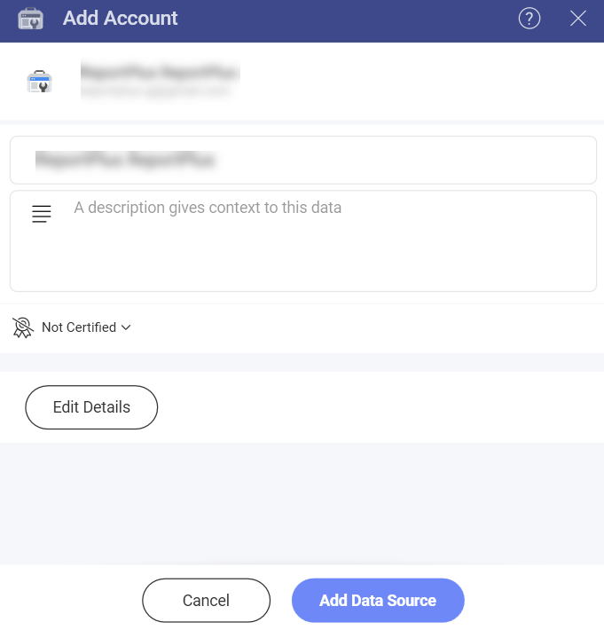
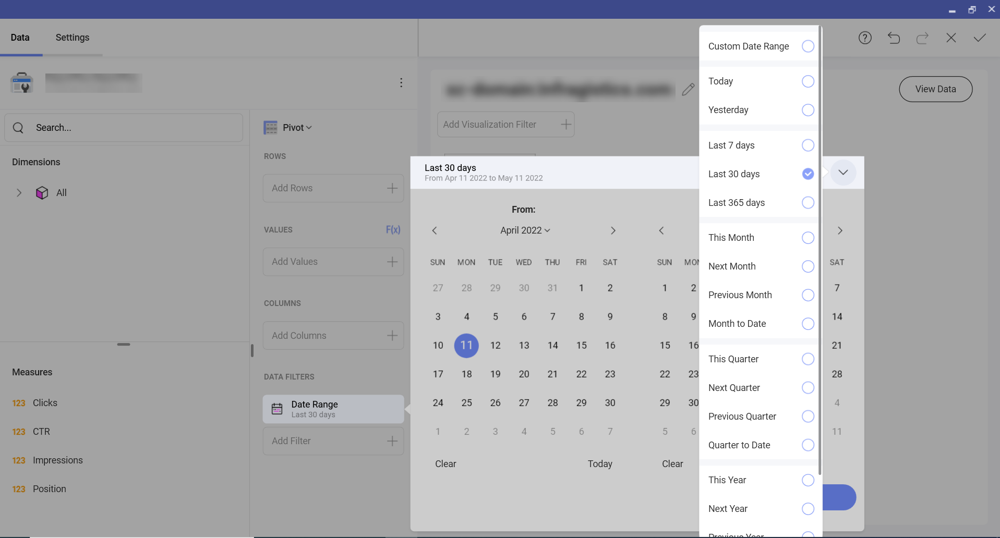
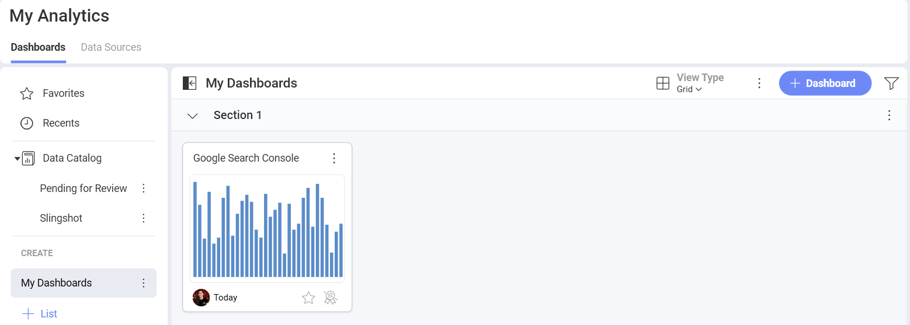

# Google Search Console

The Google Search Console data source allows you to connect your Google Search Console account to Slingshot. 

With the help of structured and insightful dashboards, you can see how your SEO techniques perform and get a better overview on the areas of your site that need to be improved. 

## Connecting to Google Search Console

1.	Select **Google Search Console** that is under **Marketing, Sales and CRMs** section in the data source list. 
2.	In case there are multiple accounts listed, choose the one that stores the data you want to access. You can also add a new Google Search Console account if the one that you need is not in the list of accounts. In case you don’t have a Google Search Console account, you can head [here](https://search.google.com/search-console/about) for more information about how you can create one.
3.	If you haven’t signed in yet, you will be prompt to enter your credentials.
4.	Before adding the account to your data sources, you can choose to edit the name, give a description or edit the details.

 

5.	Choose the sites you want to use for your dashboard and then click/tap on **Select Data**.
6.	Once you have saved the changes, you will see the file in your **Data Sources** list.

## Working in the Visualizations Editor

When you use Google Search Console as a data source, you will see that the fields in the *visualization editor* appear differently.

Instead of “Fields” heading on the left, you’ll see two sections in their own query field.

1.	**Dimensions**: They are the attributes of your data.  
2.	**Measures** (depicted by123 icon): They consist of numeric data. For example, you can see the number of clicks by country names.

## The Date Range Data Filter

This filter can’t be removed but you can change the default date range. The date filter is set to *Last 30 days* by default. 

If you want to change it, you can click on the arrow in the upper right corner (see the screenshot below) and pick a date range from the drop-down menu or create a custom one when you click on the first option.

## Settings

Depending on the chart type, you can make different changes in the settings. In this case we used the column chart type where you can adjust the following through the settings menu:

- Show Title
- Show Legend
- Start Color
- Show Totals on Tooltip
- Chart Trendline
- Axis and Axis Bounds
- Connect this visualization to another dashboard or a URL. You can check [this](https://www.slingshotapp.io/en/help/docs/analytics/dashboards/dashboard-linking) article for more information about how to link dashboards. 

When you are ready with the visualization editor, you can save the dashboard in **My Analytics>My Dashboards** or in a specific workspace. 

If you want to find more information about the data sources, you can head [here](https://www.slingshotapp.io/en/help/docs/analytics/datasources/overview). 