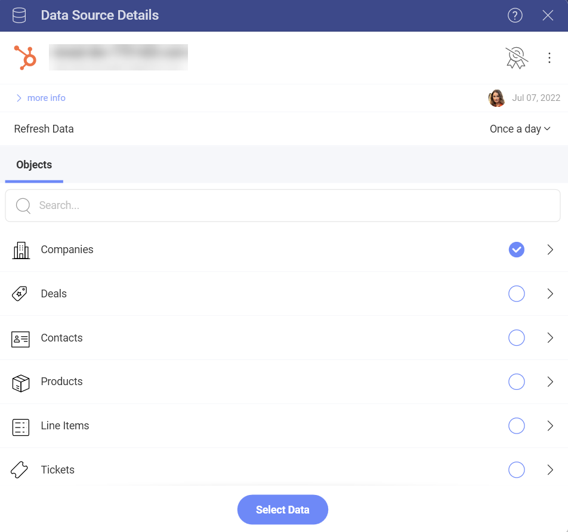

# Hubspot

Upon connecting Hubspot, you will see the following login prompt:

You can enter your login credentials and click on *Log In*.

>[!Note] In case you have activated [2-factor authentication](https://knowledge.hubspot.com/account/how-can-i-set-up-two-factor-authentication-for-my-hubspot-login), you will need to enter a verification code.

## Setting Up Your Data

After logging in, you can set up your Hubspot data in the following dialog:

Here you will find a list of your Hubspot **Objects**. In big lists, use the *Search* to find quickly the object you need.

>[!NOTE]
>**Calendar Objects**.
>Calendar Events objects require you to set two parameters - *from* and *to* (dates) to query the data, before you can continue to the Visualization editor. 

To change the data 