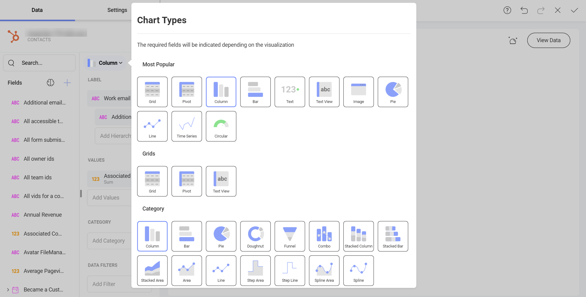

# Hubspot

Upon connecting Hubspot, you will see the following login prompt:

You can enter your login credentials and click on *Log In*.

>[!Note] In case you have activated [2-factor authentication](https://knowledge.hubspot.com/account/how-can-i-set-up-two-factor-authentication-for-my-hubspot-login), you will need to enter a verification code.

## Setting Up Your Data

After logging in, you can set up your Hubspot data in the following dialog:

Here you will find a list of your Hubspot **Objects**. In big lists, use the *Search* to find quickly the object you need.

>[!NOTE]
>**Calendar Objects**.
>Calendar Events objects require you to set two parameters - *from* and *to* (dates) to query the data, before you can continue to the Visualization editor. 

## Working in the Visualization editor

Once your data source has been added, you will be taken to the *Visualization Editor*. Note that the *Column* visualization will be selected by default. You can click/tap on it in order to choose another chart type from the drop-down menu.

Based on the vusialization that you have chosen, you will see different types of fields.

When you are ready with your visualization, you can click/tap on the checkmark in the top right corner to save it as a dashboard. 