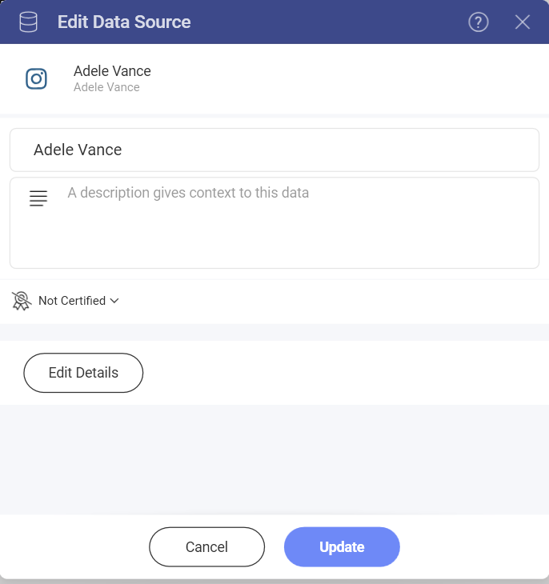
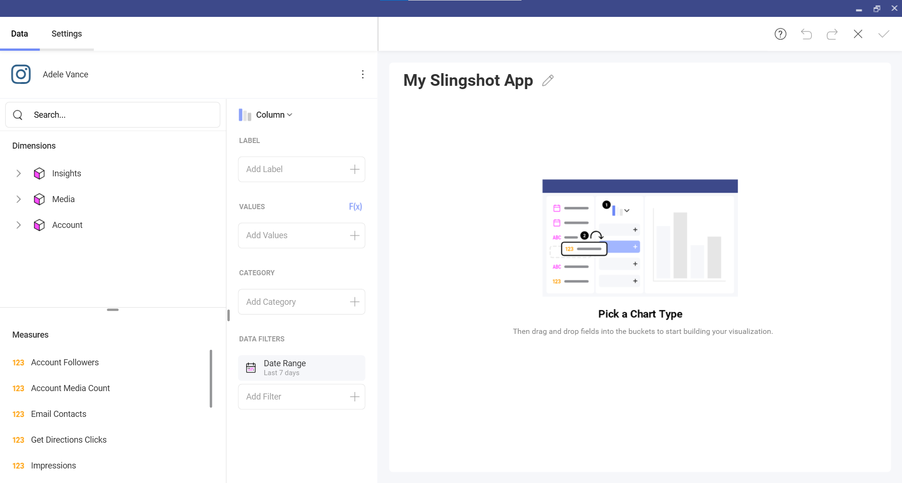
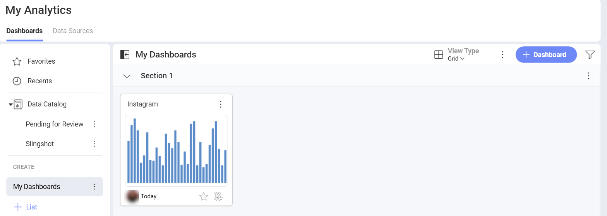

# Instagram

The Instagram data source allows you to connect your Instagram Business account data to Slingshot. With the help of insightful dashboards, you can have a better overview of the brand awareness of your company.

## Connecting an Instagram Business account to Slingshot

1.	Select **Instagram** as your data source. You can find it under **Social Media** in the data sources list.
2.	Log in to your Instagram Business account. If you don’t have one, you can head [here](https://business.instagram.com/getting-started) to find more information about how you can create a new account. Keep in mind that you need to connect a Facebook page to the Instagram Business account first. You can click [here](https://help.instagram.com/399237934150902) to find more information about how you can do that.
3.	A dialog will open, where you can change the name of the data source, add a description, see if the data source is certified and edit the details. 

4. Choose the pages you want to use for your dashboard and click on **Select Data**.

## Working in the visualization editor

Once you have chosen/added your data source, in this case the Instagram Business account, you’ll be able to manage the data in the visualization editor. 

You will be presented with two sections in their own query field:

- **Dimensions (depicted by a cube icon with a pink side)**: Here you can find the attributes of your data that you want to measure.
- **Measures (depicted by 123 icon)**: Measures consist of numeric data. For example, you can see how many account followers your website (under the Account cube with a pink side) has.

## The date range data filter

You can filter your data by selecting a specific date range. Keep in mind that the data filter can’t be removed but you can change the default date range (*Last 7 days*).

To change the date range, you can click on the filter and then click on the arrow in the upper right corner.

## Settings

You can adjust the following through the settings menu:
- Show Title
- Show Legend
- Start color
- Show Totals on Tooltip
- Chart Trendline
- Axis and Axis Bounds
- Connect this visualization to another dashboard or a URL

When you are ready with the visualization editor, you can save the dashboard in **My Analytics**>**My Dashboards** or in a specific workspace. 

If you want to find more information about the data sources, you can head [here](https://www.slingshotapp.io/en/help/docs/analytics/datasources/overview). 