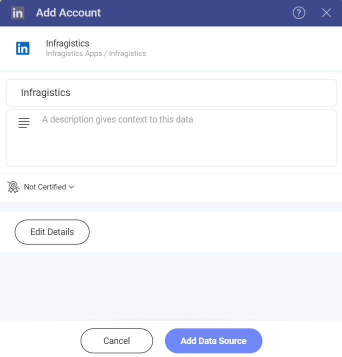
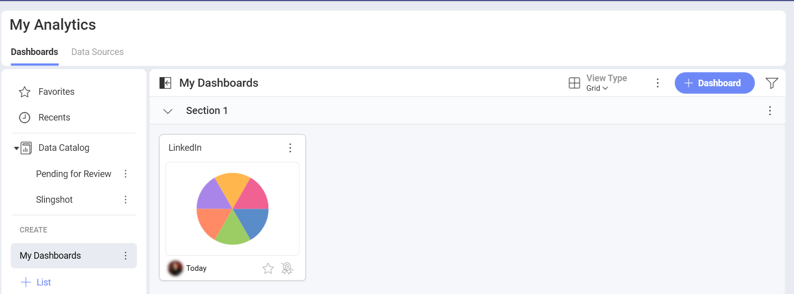

# LinkedIn

The LinkedIn data source allows you to connect your LinkedIn Ads account to Slingshot. In order to have a better overview on how your advertising campaigns perform on the platform, you can create insightful dashboards with the help of the visualization editor.

## Connecting a LinkedIn Ads account to Slingshot

1.	Click on the **+Dashboard** button under the **My Analytics** section.
2.	Click on the **+Data Source** button.
3.	Select LinkedIn that is under **Social Media** in the **Data Sources** list.
4.	Log in to your LinkedIn Ads account. In case you don’t have one, you can check [this](https://www.linkedin.com/help/linkedin/answer/a426102/create-an-ad-account?lang=en) article for more information about how you can create an Ads account.
5.	If you have different LinkedIn Ads accounts, you can choose **+Add** in order to include another account.
6.	In the dialog that opens, you can change the LinkedIn Ads Account name, add a description, or choose which details you want to see included in the dashboard.

7. Click on **Add Data Source** to connect the account to your Slingshot account.

## Working in the Visualizations editor

When you create a dashboard with information coming from a LinkedIn Ads account, you will see that there are two sections in their own fields.    

1.	**Dimensions**: They are the attributes of your data.
2.	**Measures** (depicted by 123 icon): They consist of numeric data. For example, you can see the number of clicks by regions.

## The Data Range Data Filter

This filter can’t be removed but you can change the date range. The date filter is set to *Last 30 days* by default.

If you want to change it, you can click on the arrow in the upper right corner (see the screenshot below) and pick a date range from the dropdown menu or create a custom one when you click on the first option.

## Settings

Depending on the chart type that you are using, you will be able to make different changes in the settings. You can find more information about the different chart types in the data visualizations section [here](https://www.slingshotapp.io/en/help/docs/analytics/data-visualizations/visualizations-editor).

- Show or hide the title
- Align the text fields, number fields and the date fields
- Choose the font size (small, medium, large)
- Activate Show Grand totals
- Connect this visualization to another dashboard or a URI. You can check [this](https://www.slingshotapp.io/en/help/docs/analytics/dashboards/dashboard-linking) article for more information about how to link dashboards.

When you are ready with the visualization editor, you can save the dashboard in **My Analytics**>**My Dashboards** or in a specific workspace.

If you want to find more information about the data sources, you can head [here](https://www.slingshotapp.io/en/help/docs/analytics/datasources/overview). 