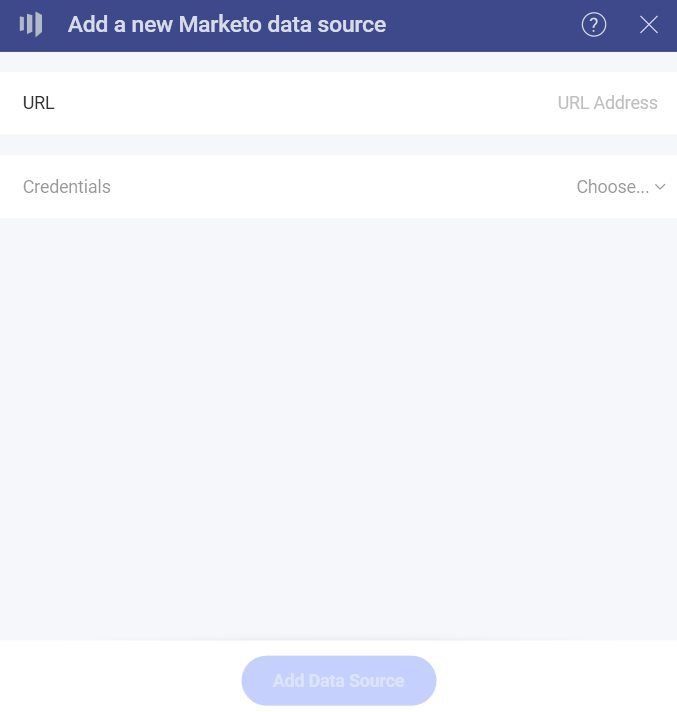
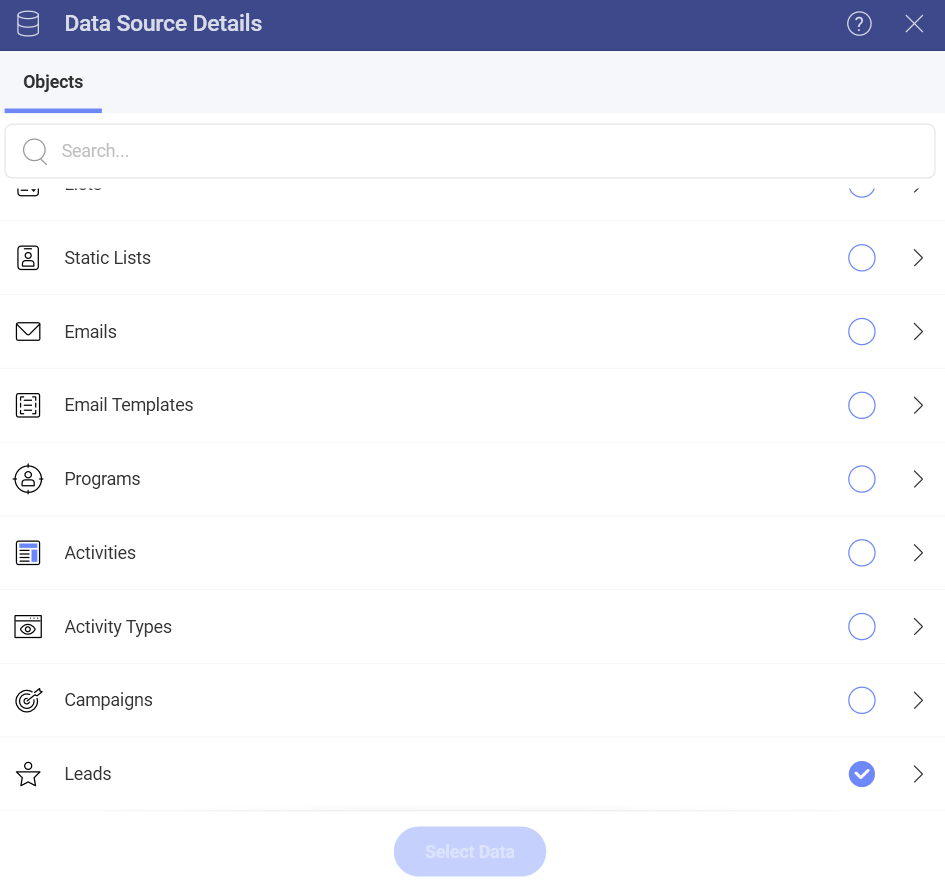

# Marketo 

## Connecting to Marketo 

Upon selecting the Marketo data source, you will see the following screen:

Marketo’s REST APIs are authenticated with 2-legged OAuth 2.0, so you need to complete the following information to configure your connection:

1. **URL** - paste here the *Identity URL* you will find in your Marketo Admin panel. 
2. **Credentials**:
- **Client ID** 
-  **Client Secret**

Your *Admin* panel in Marketo contains the authentication elements listed above. For more information on how to find them, check the article about [Authentication](https://developers.marketo.com/rest-api/authentication/) in Marketo's documentation. 

If you need details about how to create the OAuth credentials you need from Marketo to connect, see the article about [Custom Services](https://developers.marketo.com/rest-api/custom-services/?_fsi=oP2ZRHsM) in Marketo's docs. 

## Setting Up Your Data

After logging in, you can set up your Marketo data in the following dialog:

**Activities* and *Leads** objects require you to set two parameters - *From* and *To* (dates) to query the data, before you can continue to the *Visualization editor*. The date range must be no more than 31 days, incl. the first and the last day. 

> [!NOTE]
> Please, note that you may need to wait up to several minutes until your data from the **Activities** and **Leads** objects is loaded in the *Visualization Editor*.  
