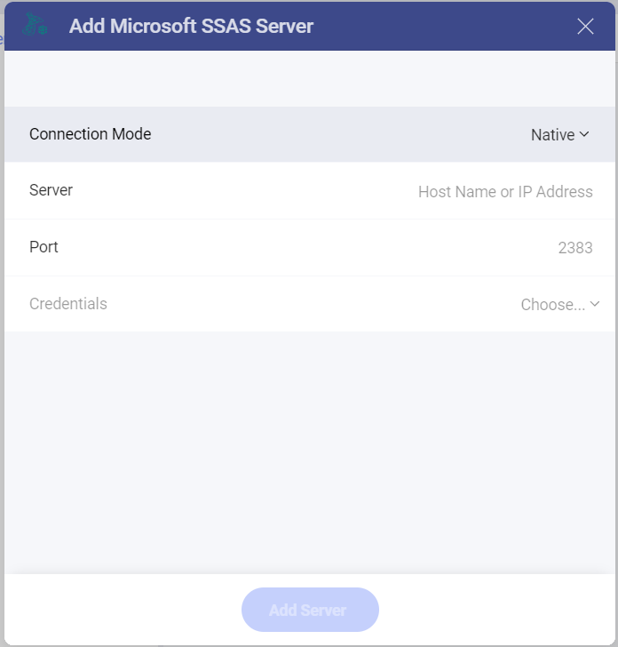
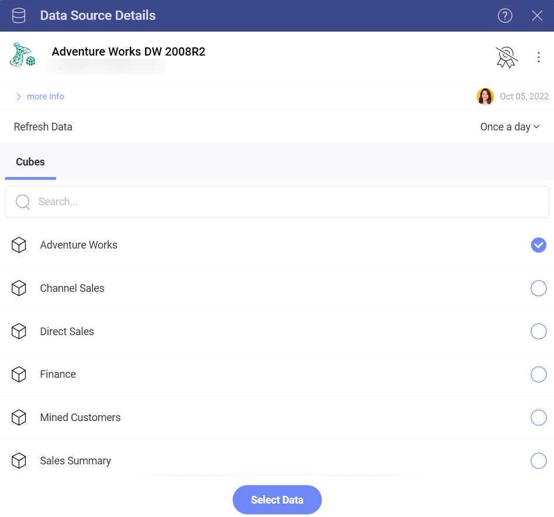
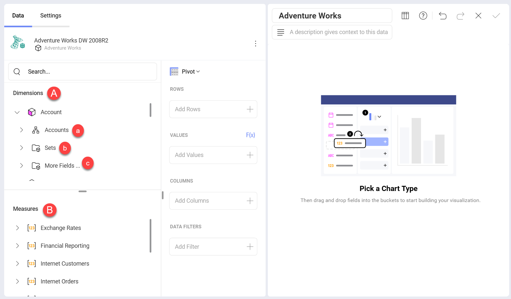
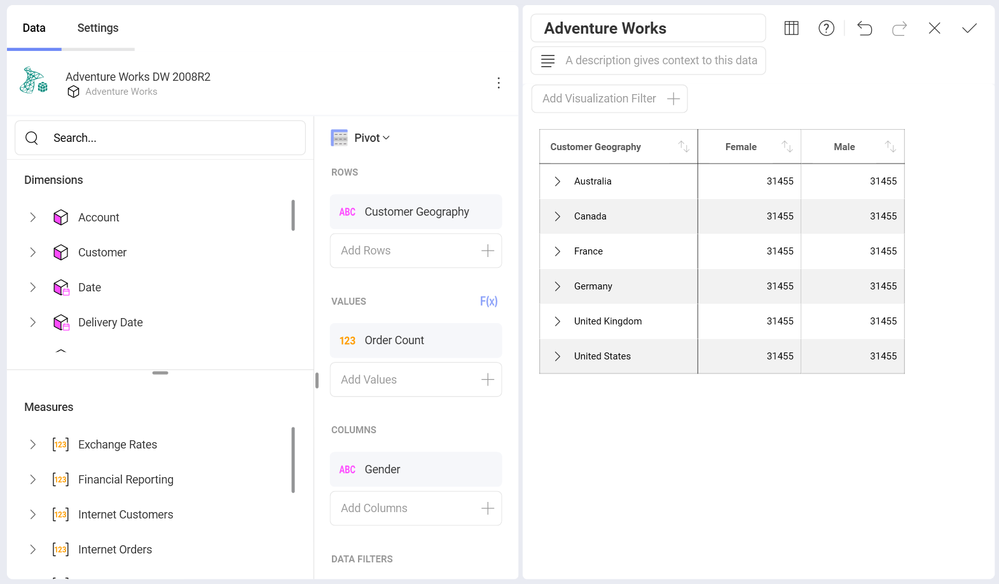
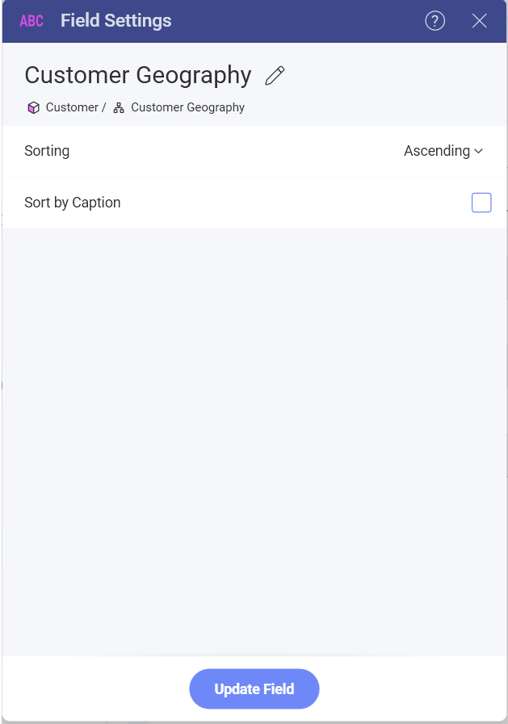
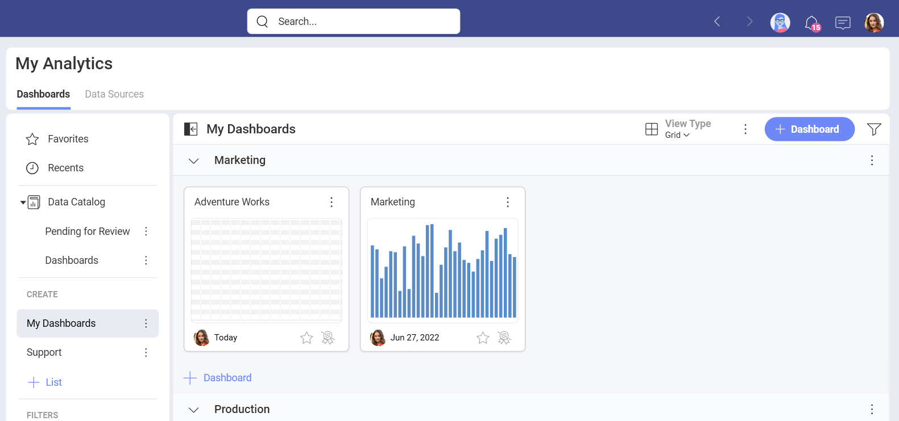
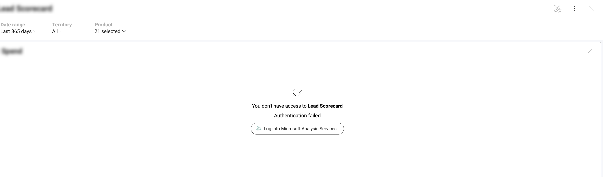

# Microsoft Analysis Services

Microsoft SQL Analysis Services (SSAS) is an OLAP (online analytical
processing of information from multiple database systems at the same
time) and data mining tool in Microsoft SQL Server.

>[!NOTE] **Limitations in Web**. In the *Reveal Web* app, you can connect only to publicly accessible Microsoft Analysis Services addresses. If your Analysis Services address is restricted for the general public (private or hosted in the company's intranet, for example), you can use *Reveal Desktop*, *iOS* or *Android* to connect to it. The device where you're running Reveal needs to have access to the Analysis Services address. This limitation does not apply to *Reveal Embedded*.

## Connecting to Microsoft Analysis Services

There are two modes you can use when configuring a Microsoft Analysis
Services data source depending on your server's settings -
[*Native*](#native) and [*HTTP*](#http).

For more information on both Native and HTTP mode, visit the [Microsoft Instance Management help](https://docs.microsoft.com/en-us/sql/analysis-services/instances/connect-to-analysis-services?view=sql-server-2017).

### Using Native

To configure the Microsoft Analysis Services data source for *Native*
mode, you will need to enter the following information:

1. **Connection Mode**: two options to chose from: HTTP or Native.

2.  **Server**: this is the hostname or IP address of the computer on
    which the server is running.

    You can find the *hostname* by following the steps below. Please
    note that the commands should be executed on the server machine.

    | WINDOWS                                                                                                         | LINUX                                                                                                         | MAC                                                                  |
    | --------------------------------------------------------------------------------------------------------------- | ------------------------------------------------------------------------------------------------------------- | -------------------------------------------------------------------- |
    | 1\. Open the File Explorer.                                                                                     | 1\. Open a Terminal.                                                                                          | 1\. Open System Preferences.                                         |
    | 2\. Right Click on My Computer \> Properties.                                                                   | 2\. Type in **$hostname**                                                                                     | 2\. Navigate to the Sharing Section.                                 |
    | Your Hostname will appear as "Computer Name" under the *Computer name, domain and workgroups settings* section. | Your Hostname will appear along with your DNS domain name. Make sure you only include **Hostname** in Reveal. | Your Hostname will be listed under the "Computer Name" field on top. |

    You can find the *IP address* by following the steps below. Please note that the commands should be executed on the server machine.

      | WINDOWS                              | LINUX                             | MAC                                                           |
      | ------------------------------------ | --------------------------------- | ------------------------------------------------------------- |
      | 1. Open a Command Prompt.            | 1. Open a Terminal.               | 1. Launch your Network app.                                   |
      | 2. Type in **ipconfig**              | 2. Type in **$ /bin/ifconfig**    | 2. Select your connection.                                    |
      | **IPv4 Address** is your IP address. | **Inet addr** is your IP address. | The **IP Address** field will have the necessary information. |

3.  *(Optional)* **Port**: server port details. If no information is
    entered, Reveal will connect to the port in the hint text (2383) by
    default.

4.  **Credentials**: after selecting *Credentials*, you will be able to
    enter the credentials for your Microsoft Analysis Services or select
    existing ones if applicable.

### Using HTTP

To configure the Microsoft Analysis Services data source for *HTTP*
mode, you will need to provide the following information:

1. **Connection Mode**: two options to chose from: HTTP or Native.

2.  **URL**: the HTTP eService URL to the server. For example,
    *10.1.0.15/olap/msmdpump.dll*.

3.  **Credentials**: credentials of your user account for the Analysis Services server.

## Configuring Databases

After your credentials for the Analysis Services server are verified,
Reveal will load and show the databases on the server. Select a database and click/tap on **Select and continue** to set it up.

Choose a database *cube* and click/tap on **Select Data** to continue to the *Visualizations Editor*.

## Working in the Visualization Editor

When you create a dashboard using a cube data source like Microsoft Analysis Services, you will see fields organized differently in the  *Visualizations Editor* (see screenshot below). Cube data sources consist of hierarchies and aggregations, which have been created by the cubes' designers in advance.

In the screenshot above, you may notice that there is no "Fields" heading on the left. Instead, there are two sections in their own query field:

1.  **Dimensions** (depicted by a cube icon with a pink side):
    Dimensions are structures used to categorize data that can be
    measured. Elements in a dimension can be organized by:

    a.  **Hierarchies** - when elements in a dimension are organized by
        hierarchy, you can use the whole hierarchy or part of it,
        starting from an element at any lower level. For example, if you have a "Geography" dimension organized in "Country → State → City" hierarchy, you are allowed to drag and use only the "State → City" part of this hierarchy.

    b.  **Named Sets** (depicted by a folder icon and named "Sets") - an arbitrary collection of elements with a name (e.g. "Top 50 Customers").

    c.  **Attributes** - elements are organized in single-level
        hierarchies (e.g. a "Demographic" attribute, containing groups
        of elements like "Gender," "Marital Status," etc.)

2.  **Measures** (depicted by *[123]* icon): Measures consist of numeric data.

For more information on dimensions and measures, please visit this
[Technet article](https://docs.microsoft.com/en-us/previous-versions/sql/sql-server-2012/ms174527\(v=sql.110\)).

## Sort by Caption Setting

There is also a Sort by Caption option which defines whether the filter
will be applied to the dimension's labels or to the corresponding
values. When enabled, *Sort by Caption* sorts the dimensions
alphabetically by their label.

To enable it, select a dimension in *Rows* or *Columns*. Enable
*Sorting* for the field by choosing *Ascending* or *Descending* to have
the *Sort by Caption* option show up:

## Settings 

Depending on the chart type, you can make different changes in the settings. In this case we used the pivot chart type where you can adjust the following through the settings menu:
- Show Title
- Text Fields Alignment
- Number Fields Alignment
- Date Fields Alignment
- Font Size
- Show Grand Totals
- Connect the visualization to another dashboard or a URL

When you are ready with the visualization editor, you can save the dashboard in **My Analytics** > **My Dashboards** or in a specific workspace. 

In case you've entered wrong credentials, you will get an error message (screenshot below). You can click on *Log into Microsoft Analysis Services* and update your credentials. That should fix the issue. 
 