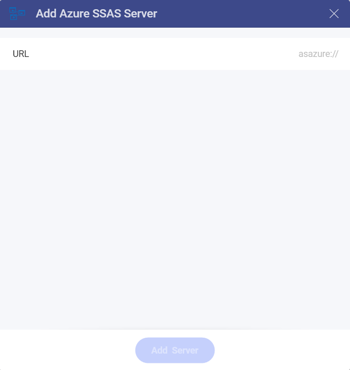
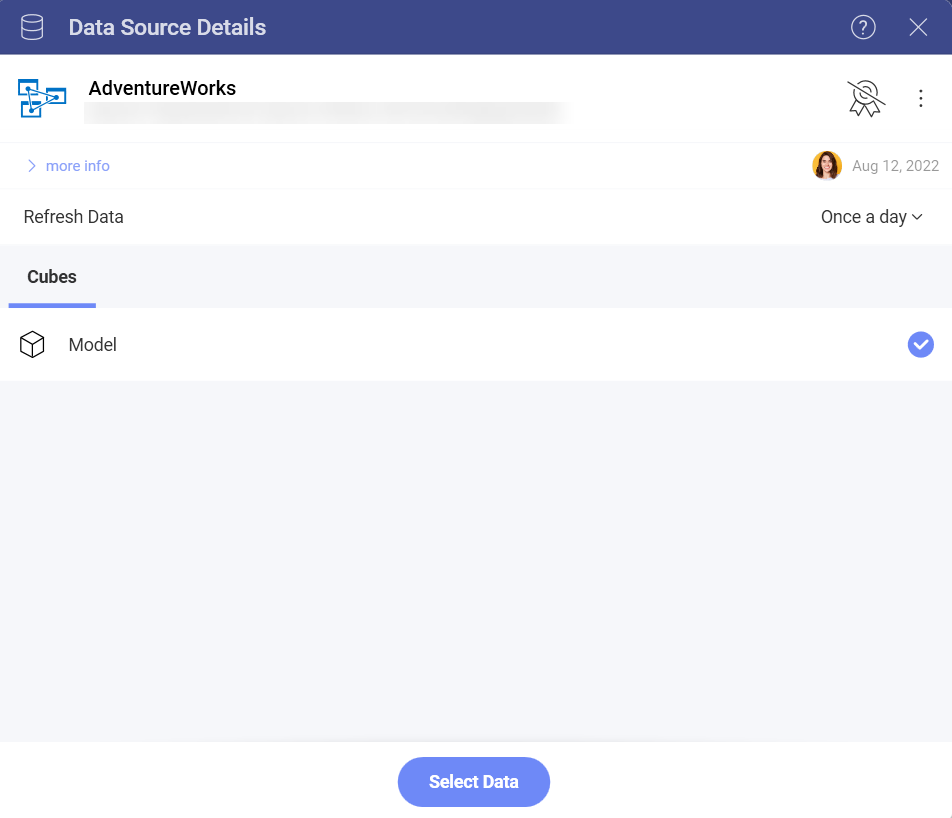
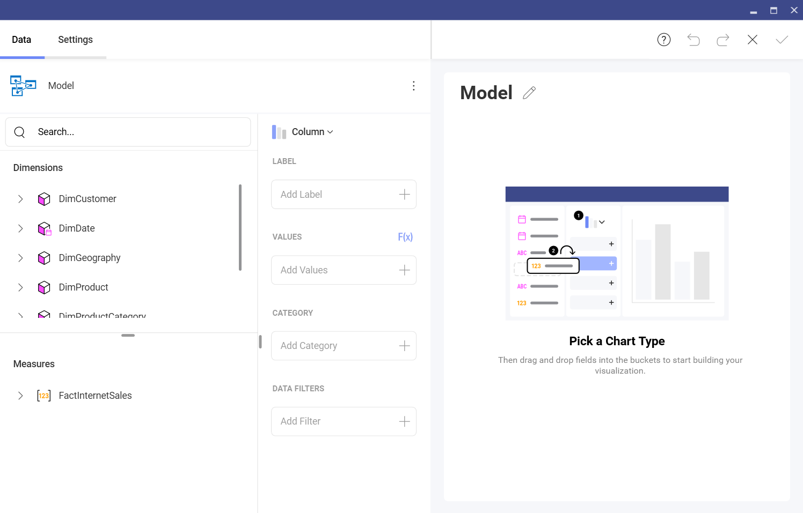
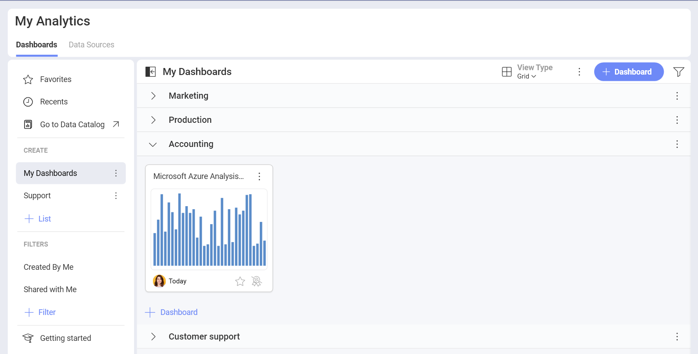

# Microsoft Azure Analysis Services

Azure Analysis Services is a fully managed platform as a service (PaaS) that provides enterprise-grade data models in the cloud. Now, you can use the Azure Analysis data models in Reveal to create dashboards and perform data analysis.
## Configuring an Azure Analysis Services data source

Unlike other databases used in Reveal (Microsoft Analysis Services, MySQL, Oracle, etc.), MS Azure Analysis Services can be used in Reveal Web.

>[!NOTE]
>**Limitations in Web when first connecting to your Azure Analysis Services.**
>Due to security restrictions, the process of initial configuration and authentication of your Azure Analysis Services cannot be done in Reveal Web. You can initially connect to this data source in the iOS, Android, or Desktop app. After the initial connection, you can create or edit dashboards using data from this Azure Analysis Services with no further limitations.

To configure your Azure Analysis Services data source, you will need to perform the steps below.

1. Provide the credentials to your Microsoft account (the account associated with the Azure Analysis server).  

2. Provide a *URL* to your server in the **Add Azure SSAS Server** dialog:

    

    The requested **URL** is the full name of the server, which contains the database with the data models you want to connect. You can *copy the server name* from the Azure Portal. To do this, go to:

    *Azure portal* > selected server > *Overview* > *Server name*

3. Go back to Reveal and paste the server name in *URL* field. Click/tap on the **Add Server** button, which is now enabled.  

4. Once you have added the server, Analytics will load and show the databases on the server. Here you will find a list of all  the available semantic models in your database. Choose a model and click/tap on **Select Data** to continue to the *Visualizations Editor*.

   

## Working in the Visualization editor

 Here you will see the data from your model presented in two categories: 

- *Dimensions* contain qualitative data ("Country", "Name", "Product", etc). 

- *Measures* consist of numeric data.

By default, the *Column* visualization will be selected. You can click/tap on it in order to choose another chart type from the drop-down menu.

When you are ready with your visualization, you can save it as a dashboard by clicking/tapping on the checkmark in the top right corner. In this case we saved the dashboard in **My Analytics** > **My Dashboards** > **Accounting**.

