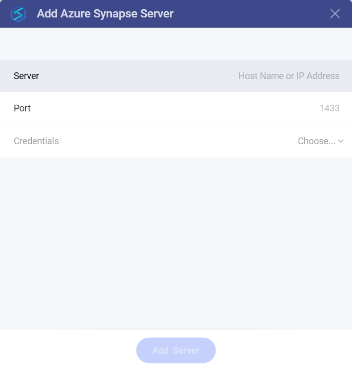
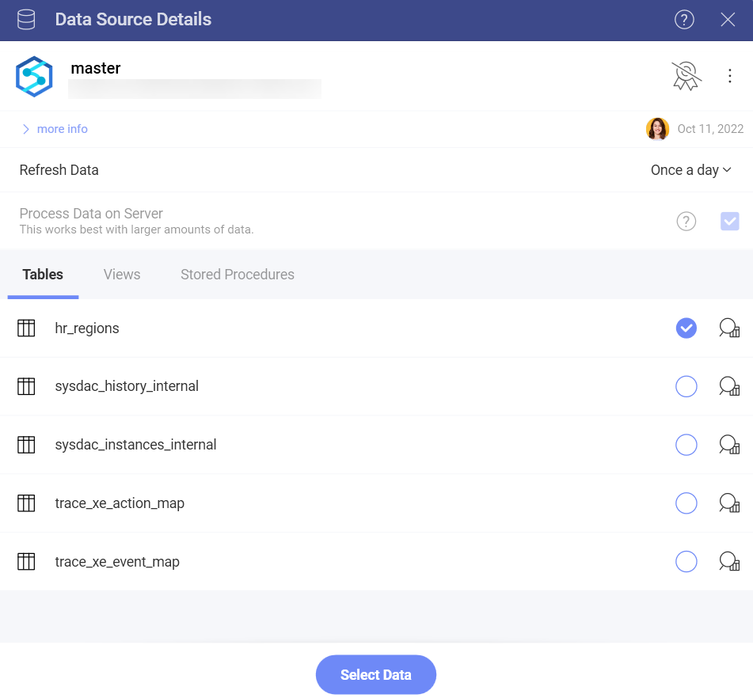
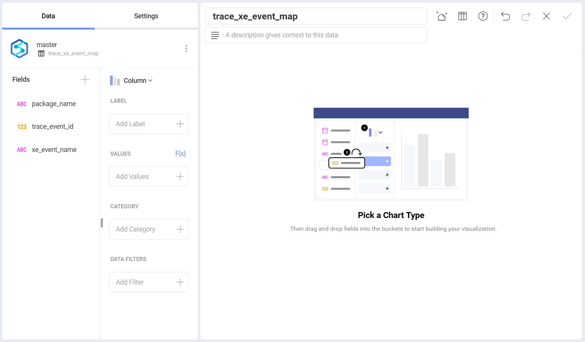

# Microsoft Azure Synapse Analytics

The Microsoft Azure Synapse data source provides a significant speed
increase when processing big data within Reveal. This allows you to use
massive datasets for your visualizations with no slow down.

## Configuring an Azure Synapse Analytics Data Source

To configure a Microsoft Azure Synapse Analytics data source, you will
need to enter the following information:

1.  **Server**: the computer name or IP address assigned to the computer
    on which the server is running.

2.  **Port**: if applicable, the server port details. If no information
    is entered, Reveal will connect to the port in the hint text (1433)
    by default.

3.  **Credentials**: after selecting Credentials, you will be able to
    enter the credentials for your Microsoft Azure Synapse Analytics or
    select existing one if applicable.

4.  **Database**: Once you have connected to your account, you will get your databases to choose from. When you are ready, click/tap on **Select and Continue**.

## How to find your Server Information

You can find your server by following the steps below. Please note that
the commands should be executed on the server.

| WINDOWS                                                                                                         | LINUX                                                                                                         | MAC                                                                  |
| --------------------------------------------------------------------------------------------------------------- | ------------------------------------------------------------------------------------------------------------- | -------------------------------------------------------------------- |
| 1\. Open the File Explorer.                                                                                     | 1\. Open a Terminal.                                                                                          | 1\. Open System Preferences.                                         |
| 2\. Right Click on My Computer \> Properties.                                                                   | 2\. Type in **$hostname**                                                                                     | 2\. Navigate to the Sharing Section.                                 |
| Your Hostname will appear as "Computer Name" under the *Computer name, domain and workgroups settings* section. | Your Hostname will appear along with your DNS domain name. Make sure you only include **Hostname** in Reveal. | Your Hostname will be listed under the "Computer Name" field on top. |

You can find your *IP address* by following the steps below. Please note
that the commands should be executed on the server.

| WINDOWS                              | LINUX                             | MAC                                                           |
| ------------------------------------ | --------------------------------- | ------------------------------------------------------------- |
| 1\. Open a Command Prompt.           | 1\. Open a Terminal.              | 1\. Launch your Network app.                                  |
| 2\. Type in **ipconfig**             | 2\. Type in **$ /bin/ifconfig**   | 2\. Select your connection.                                   |
| **IPv4 Address** is your IP address. | **Inet addr** is your IP address. | The **IP Address** field will have the necessary information. |

## Setting Up Your Data 

Once you connect to a database in MS Azure Synapse Analytics, you can
choose to retrieve data from an entire table, a particular view or stored procedure.

Working with tables, views and stored procedures when using Azure Synapse Analytics closely resembles
working with data from MS SQL Server. For more information,
please refer to [this section](https://wp-staging.slingshotapp.io/en/help/docs/analytics/datasources/supported-data-sources/microsoft-sql-server#setting-up-your-data)
of the **MS SQL Server data source** topic.

## Working in the Visualization editor

Once your data source has been added, you will be taken to the *Visualizations Editor*. Here you can build your dashboard. 

Keep in mind tha the *Column* visualization will be selected by default. You can click/tap on it in order to choose another chart type.

## Limitations in the Visualization Editor

When working with big data in Reveal, there are a couple of limitations
in the *Visualization Editor* due to the specific approach used to handle
data sources storing millions of records.

### Limitations in Functions Available for Calculated Fields

Currently, only a limited number of **functions** are available for
*Calculated Fields* using data from Azure Synapse Analytics:

- [Date](https://www.slingshotapp.io/en/help/docs/analytics/data-visualizations/fields/calculated-fields/date) - day; month; year; quarter;monthname; applytimezone; currenttimezone.

- [Logic](~/en/data-visualizations/fields/calculated-fields/logic.md) - false; true; if; not.
- [Math](~/en/data-visualizations/fields/calculated-fields/math.md) - abs; log; log10; sign; sqrt.
- [Strings](~/en/data-visualizations/fields/calculated-fields/string.md) - find; len; trim; lower; mid; upper.

### Limitations in Data Blending

Currently, Data Blending ([combining data sources in one visualization](~/en/datasources/data-blending.md)) is **not available** when using data from the Azure Synapse Analytics data source.
