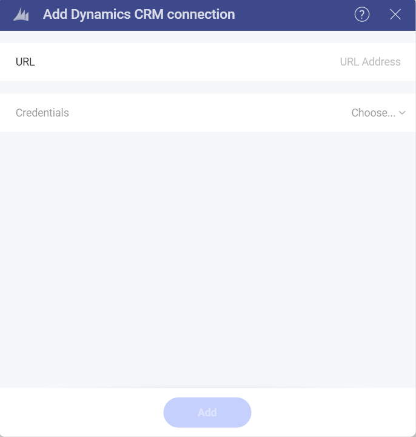
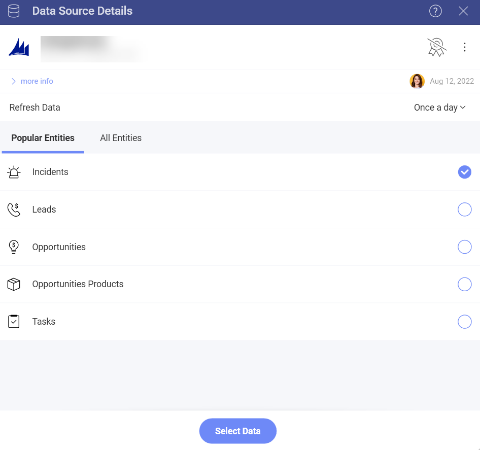
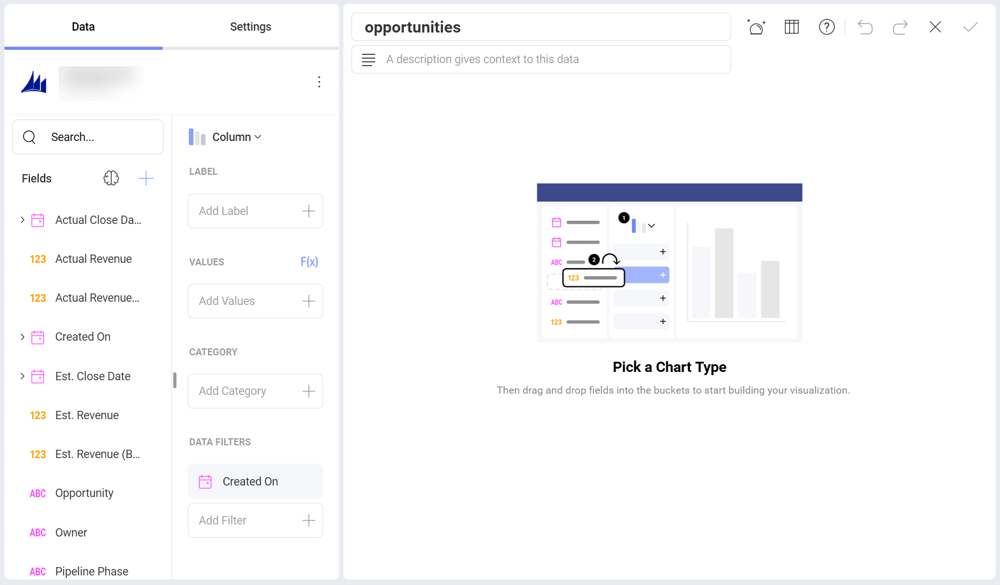

# Microsoft Dynamics CRM

To configure a Microsoft Dynamics CRM data source, you will need to
enter the following information:

1.  **Default name** of the data source: Your data source name will be displayed in the list of accounts in the previous dialog. By default, Reveal names it *Microsoft Dynamics CRM*. You can change it to your preference.

2.  **URL** the URL for the Dynamics CRM site (for example,
    <http://crm.YourCompany.local>).

3.  **Credentials**: after selecting *Credentials*, you will be able to
    enter the credentials for your Microsoft Dynamics CRM site or select
    existing ones if applicable.

     - **Username**: the user account for the Dynamics CRM website or the name of the domain.

      - **Password**: the password for the Dynamics CRM website.

      - **Alias**: the name for your data source account. It will be
        displayed in the list of accounts in the previous dialog.

Once ready, select **Add**.

## Setting Up Your Data

After logging in, you can set up your Microsoft Dynamics CRM data in the following dialog:

Here you can choose the Microsoft Dynamics CRM entities you need from:

- Popular Entities - this category allows quick selection between the most used entities among users;
- All Entities- this category displays the full list of entities contained in your Microsoft Dynamics CRM account. You can use the provided search to find quickly the entity you need.

## Working in the Visualization editor

Once you have chosen your entity, you will be taken to the *Visualizations Editor*. Here you can build your dashboard. 

By default, the *Column* visualization will be selected. You can select it in order to choose another chart type.

