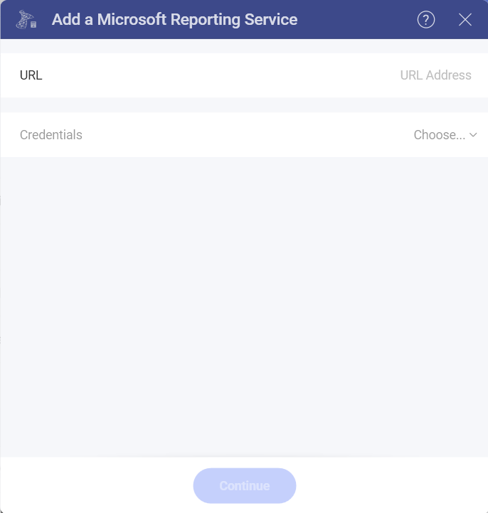
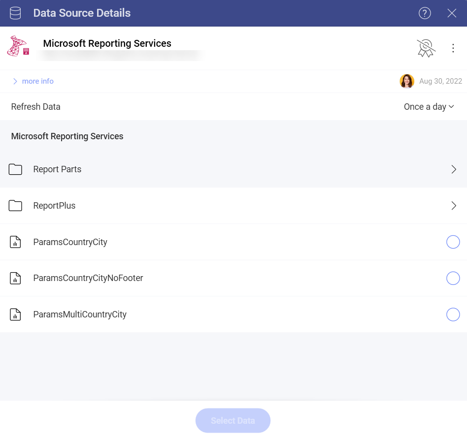
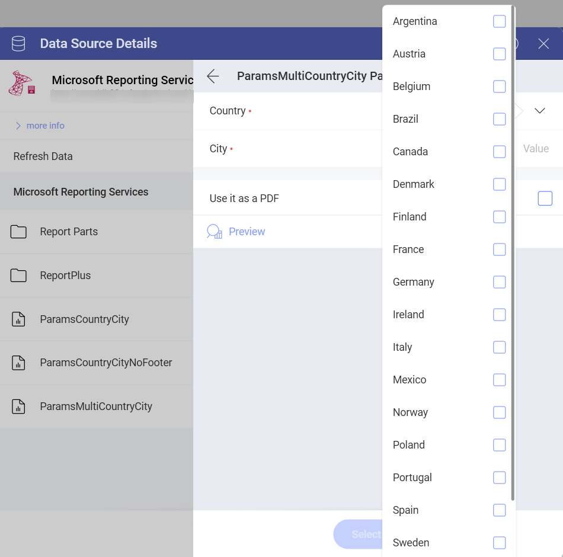
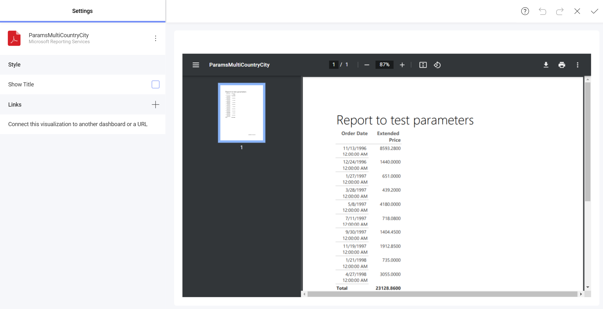
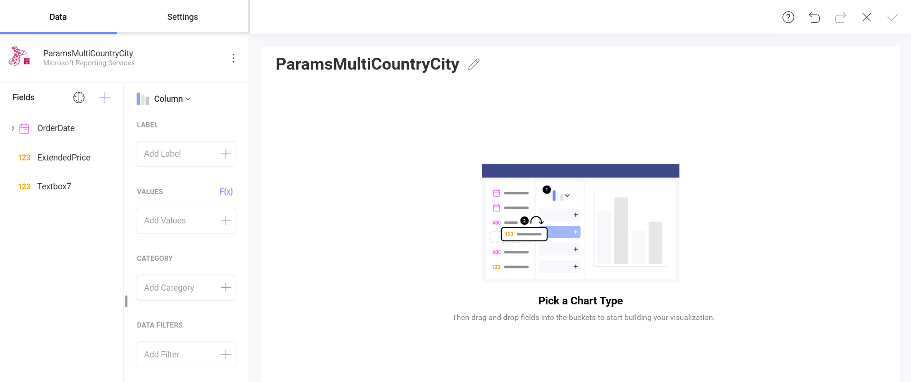
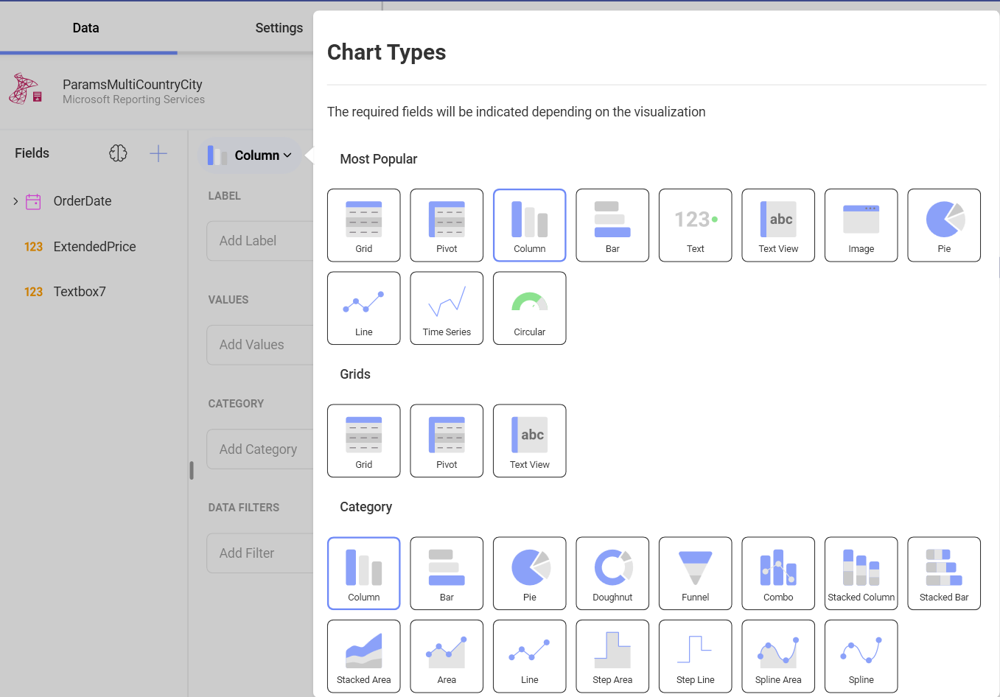
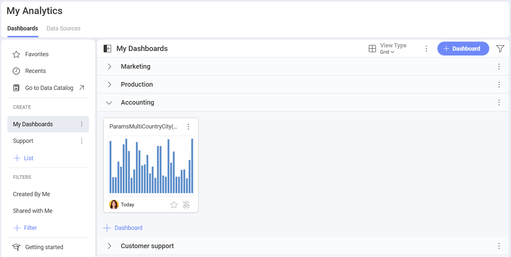

# Microsoft Reporting Services

You can now use your existing Microsoft Reporting Services (SSRS)
reports in Reveal by embedding them as PDF files in your dashboards or
simply getting the data from the reports to create a visualization.

## Connecting to Microsoft Reporting Services

To configure a Microsoft Reporting Services (SSRS) Data Source, you will
need to enter the following information:

1.  **URL**: the URL to the server.

2.  **Credentials**: a new dialog will be displayed. You can either
    enter new credentials for Microsoft Reporting Services or select
    existing ones if applicable.

## Setting Up Your Report

After configuring the connection to your Microsoft Reporting Services
reports, the following dialog will open, prompting you to choose the data you want to work with:

The order of reports and folders closely resembles the one in your
Microsoft Reporting Services account.

Depending on your data, you will need to configure specific
**parameters** for your Reports, as shown below:

After selecting/filling the parameters for your report, you can choose
the format in which the report will load in the *Visualization editor*:

  - *Load as PDF* - You will have your report embedded as a PDF document
    in the visualization editor. You will be able to scroll, zoom,
    download or print the pdf inside the Visualization editor.

  

  - *Load Data* - Your report data will be loaded in the standard
    format, providing you with fields to build your visualization.

  

>[!NOTE] **Editing the Data Source in the Visualization editor.**
>Carefully choose the report format (pdf or data) because once loaded, you will not be able to change it. When you *Edit* your data source, you will only be able to change the configuration of the report's parameters.

## Working in the Visualization editor

By default, the *Column* visualization will be selected. You can select it in order to choose another chart type. 

Based on the vusialization that you have chosen, you will see different types of fields.

Once you are ready with your visualization, click/tap on the checkmark in the top right corner to save it as a dashboard. 

In this case we saved the dashboard in **My Analytics** > **My Dashboards** > **Accounting**.

