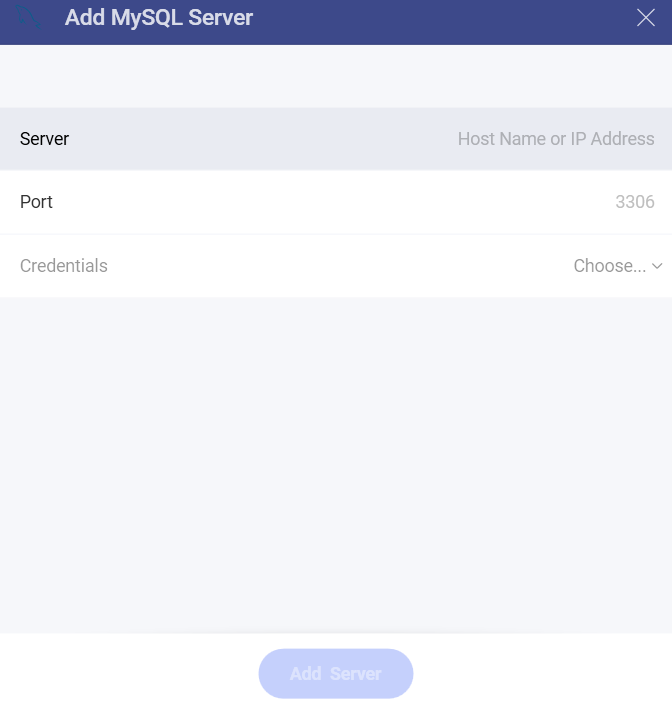
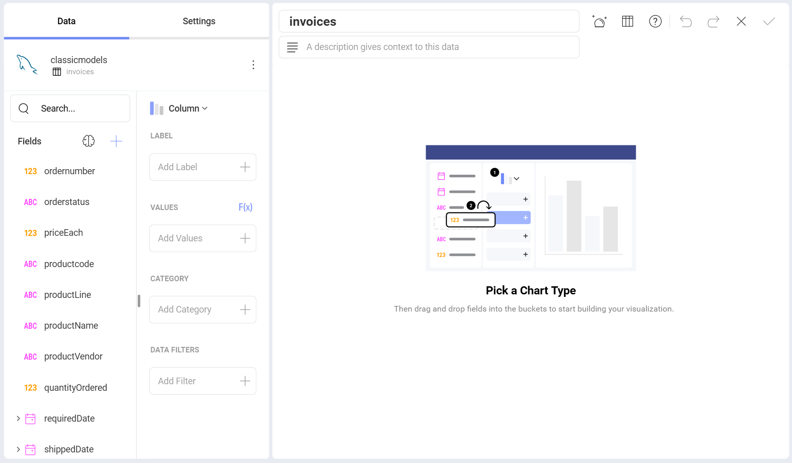
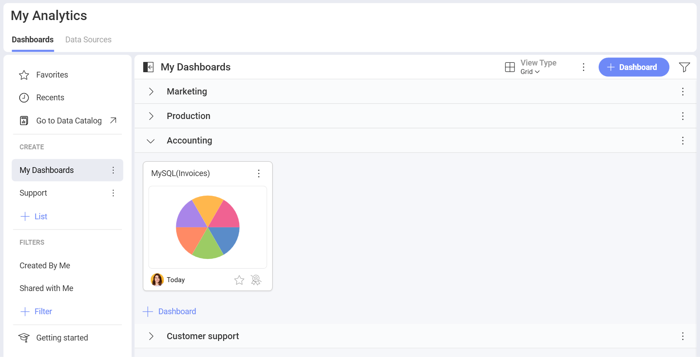

>[!NOTE] **Limitations in Web**. In the *Reveal Web* app, you can connect only to publicly accessible MySQL addresses. If your MySQL address is restricted for the general public (private or hosted in the company's intranet, for example), you can use *Reveal Desktop*, *iOS* or *Android* to connect to it. The device where you're running Reveal needs to have access to this MySQL address. This limitation does not apply to *Reveal Embedded*.

## Connecting to MySQL

To configure a MySQL server data source, you will need to enter the
following information:

1. [**Server**](#how-to-find-server): the computer name or IP address
    assigned to the computer on which the server is running.

2.  **Port**: if applicable, the server port details. If no information
    is entered, Reveal will connect to the port in the hint text (3306)
    by default.

3.  **Credentials**: after selecting *Credentials*, you will be able to
    enter the credentials for your MySQL server or choose existing ones
    if applicable.

      - **Username**: the user account for the MySQL server or the name of the domain.

      - **Password**: the password to access the MySQL server.

      - **Alias**: the name for your data source account. It will be
        displayed in the list of accounts in the previous dialog.

    Once ready, select **Add** and then **Add Server**.

## How to find your Server Information

You can find your server by following the steps below. Please note that
the commands should be executed on the server.

| WINDOWS                                                                                                         | LINUX                                                                                                         | MAC                                                                  |
| --------------------------------------------------------------------------------------------------------------- | ------------------------------------------------------------------------------------------------------------- | -------------------------------------------------------------------- |
| 1\. Open the File Explorer.                                                                                     | 1\. Open a Terminal.                                                                                          | 1\. Open System Preferences.                                         |
| 2\. Right Click on My Computer \> Properties.                                                                   | 2\. Type in **$hostname**                                                                                     | 2\. Navigate to the Sharing Section.                                 |
| Your Hostname will appear as "Computer Name" under the *Computer name, domain, and workgroups settings* section. | Your Hostname will appear along with your DNS domain name. Make sure you only include **Hostname** in Reveal. | Your Hostname will be listed under the "Computer Name" field on top. |

You can find your *IP address* by following the steps below. Please note
that the commands should be executed on the server.

| WINDOWS                              | LINUX                             | MAC                                                           |
| ------------------------------------ | --------------------------------- | ------------------------------------------------------------- |
| 1\. Open a Command Prompt.           | 1\. Open a Terminal.              | 1\. Launch your Network app.                                  |
| 2\. Type in **ipconfig**             | 2\. Type in **$ /bin/ifconfig**   | 2\. Select your connection.                                   |
| **IPv4 Address** is your IP address. | **Inet addr** is your IP address. | The **IP Address** field will have the necessary information. |

## Setting Up Your Data

With Reveal, you can retrieve MySQL data from entire tables. Still, you can also select a particular view that returns a subset of data from a table or a set of tables instead.

In the sample above, the **invoices** view contains a modified version
of the data in the **products**,**customers**, **orderdetails** and **orders** tables in the MySQL server.

For more information on views and MySQL, visit [this documentation page](https://dev.mysql.com/doc/refman/8.0/en/views.html).

## Working in the Visualization editor

Once you have chosen your table or view, you will be taken to the *Visualizations Editor*. Here you can build your dashboard. By default, the *Column* visualization will be selected. You can select it in order to choose another chart type.

When you are ready with the visualization editor, you can save the dashboard in **My Analytics** > **My Dashboards** or in a specific workspace. 

