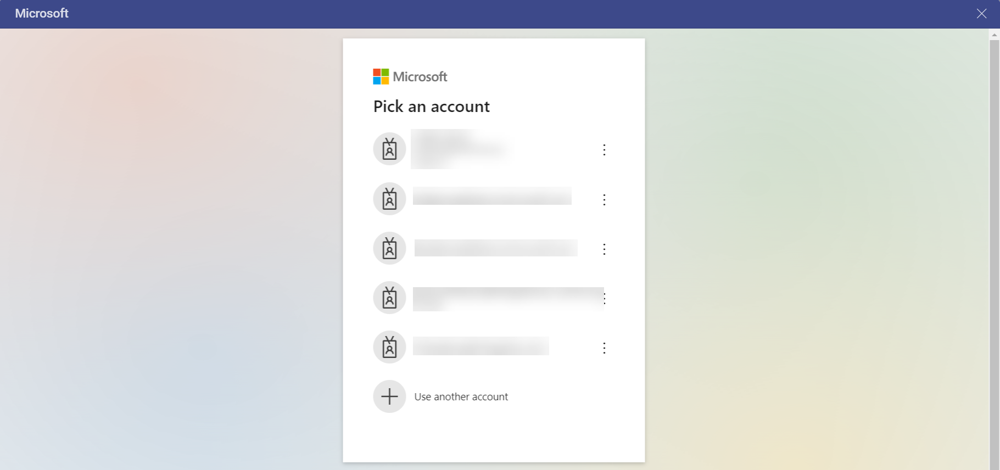
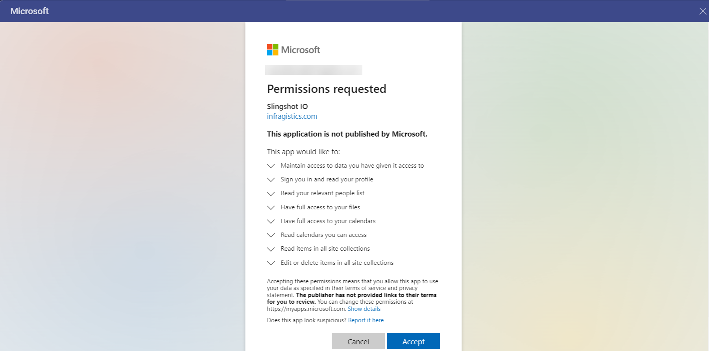

# OneDrive

If you sign in with your Office365 account, you will have your OneDrive automatically added to your data sources.

To use your OneDrive data, follow the steps below:

1. Upon selecting your OneDrive, you will be prompt to enter your **account and password** for Microsoft. Once you have entered the crendetials, select **Sign in**.

  

2. By clicking *Continue*, you will be redirected to an *authorization prompt*. Click/tap on **Accept** to continue.

  

After authorizing Reveal to use your data, you can use your *OneDrive* files to build visualizations.

## Supported Files

When working within Reveal, you will be able to use a wide variety of
files:

  - **Spreadsheets**: Excel (.xls, .xlsx) or CSV, which you can use
    dynamically within Reveal.

  - **Other files** (including images or document files such as PDFs,
    texts, etc.), which will be displayed in a preview mode only.
