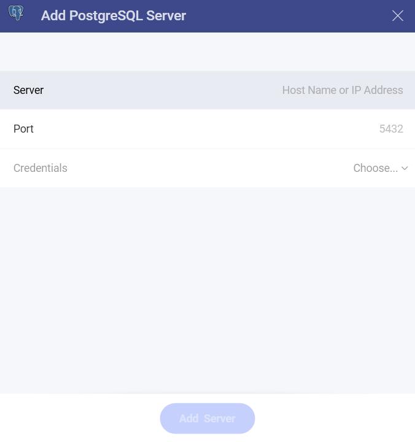
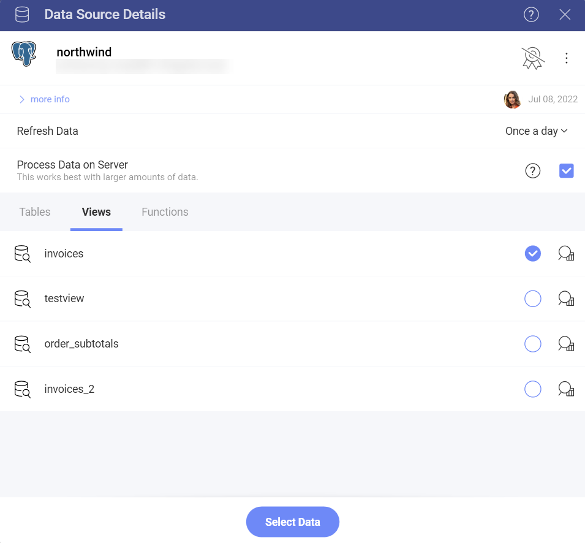
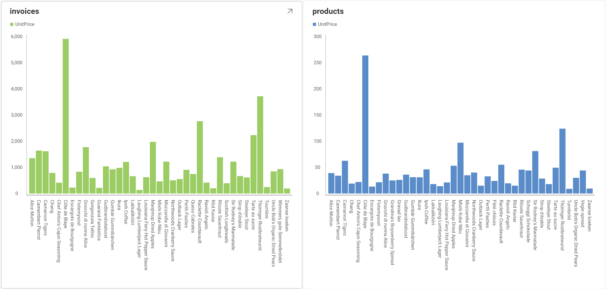
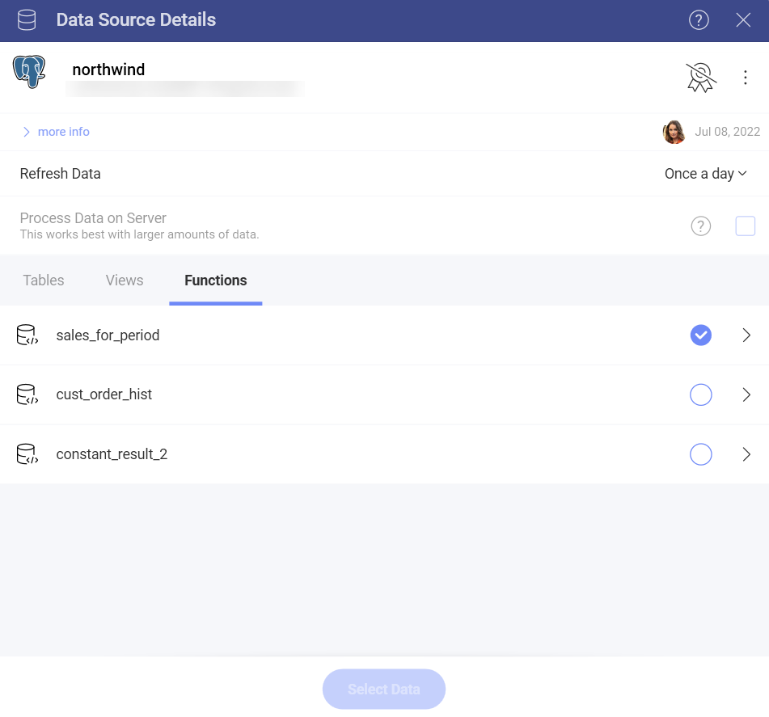
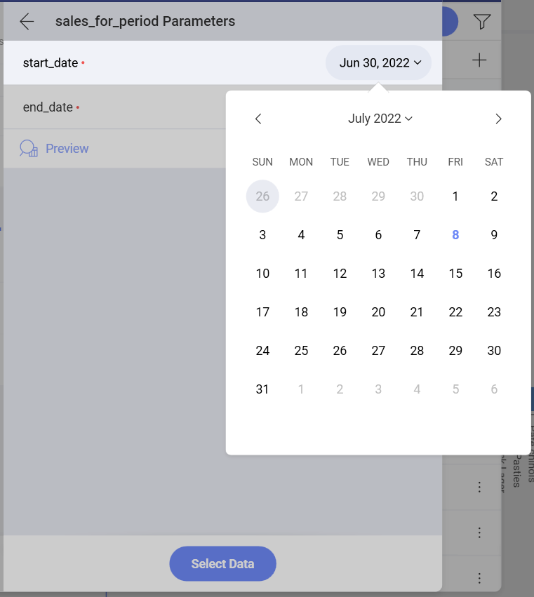
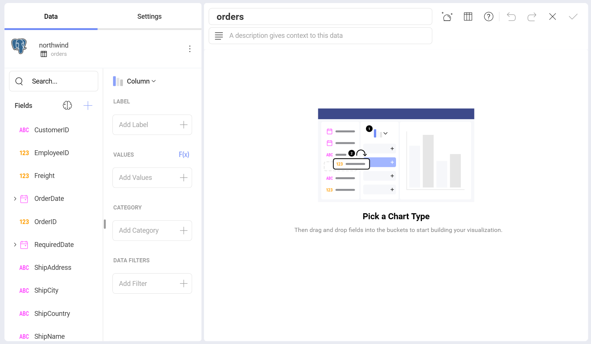
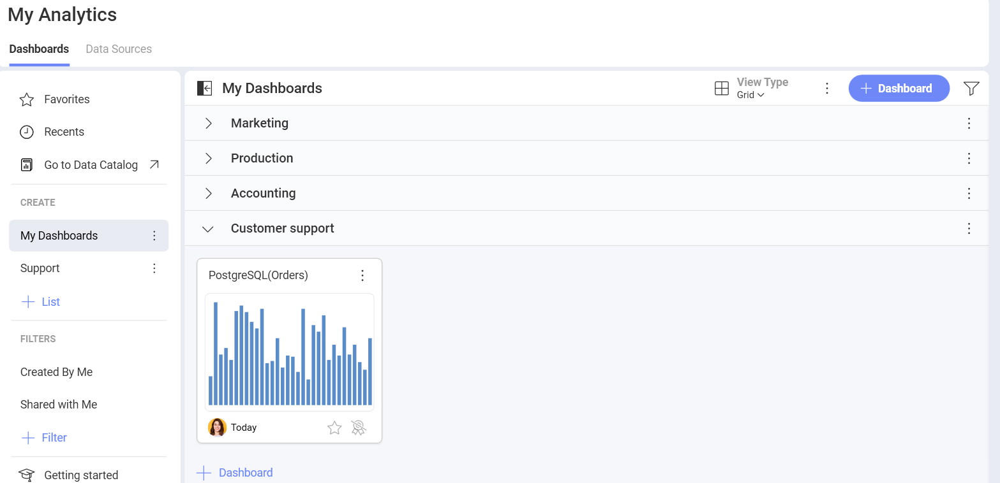

# PostgreSQL

>[!NOTE] **Limitations in Web**. In the *Reveal Web* app, you can connect only to publicly accessible PostgreSQL addresses. If your PostgreSQL address is restricted for the general public (private or hosted in the company's intranet, for example), you can use *Reveal Desktop*, *iOS* or *Android* to connect to it. The device where you're running Reveal needs to have access to this PostgreSQL address. This limitation does not apply to *Reveal Embedded*.

## Connecting to PostgreSQL

To configure a PostgreSQL server data source, you will need to enter the
following information:

1.  [**Server**](#how-to-find-server): the computer name or IP address
    assigned to the computer on which the server is running.

2.  **Port**: if applicable, the server port details. If no information
    is entered, Reveal will connect to the port in the hint text (5432)
    by default.

3.  **Credentials**: after selecting *Credentials*, you will be able to
    enter the credentials for your PostgreSQL server or select existing
    ones if applicable.

      - **Username** or **Domain**: the name of the user account for the PostgreSQL server or the name of the domain.

      - **Password**: the password to access the PostgreSQL server.

      - **Alias**: the name for your data source account.

 Once ready, select **Add Server**.

## How to find your Server Information

You can find your server by following the steps below. Please note that
the commands should be executed on the server.

| WINDOWS                                                                                                         | LINUX                                                                                                         | MAC                                                                  |
| --------------------------------------------------------------------------------------------------------------- | ------------------------------------------------------------------------------------------------------------- | -------------------------------------------------------------------- |
| 1\. Open the File Explorer.                                                                                     | 1\. Open a Terminal.                                                                                          | 1\. Open System Preferences.                                         |
| 2\. Right Click on My Computer \> Properties.                                                                   | 2\. Type in **$hostname**                                                                                     | 2\. Navigate to the Sharing Section.                                 |
| Your Hostname will appear as "Computer Name" under the *Computer name, domain and workgroups settings* section. | Your Hostname will appear along with your DNS domain name. Make sure you only include **Hostname** in Reveal. | Your Hostname will be listed under the "Computer Name" field on top. |

You can find your *IP address* by following the steps below. Please note
that the commands should be executed on the server.

| WINDOWS                              | LINUX                             | MAC                                                           |
| ------------------------------------ | --------------------------------- | ------------------------------------------------------------- |
| 1\. Open a Command Prompt.           | 1\. Open a Terminal.              | 1\. Launch your Network app.                                  |
| 2\. Type in **ipconfig**             | 2\. Type in **$ /bin/ifconfig**   | 2\. Select your connection.                                   |
| **IPv4 Address** is your IP address. | **Inet addr** is your IP address. | The **IP Address** field will have the necessary information. |

## Setting Up Your Data
### Working with Views
With Reveal, you can not only retrieve PostgreSQL data from entire tables, but
you can also select a particular
[view](https://www.postgresqltutorial.com/postgresql-views/) that
returns a subset of data from a table or a set of tables instead.

In the sample above, the **invoices** view contains a modified version
of the data in the **Products** table in the PostgreSQL server.

### Working With Functions

PostgreSQL functions allow you to carry out operations that would normally take several queries and round trips in a single function within the database.

The following are just a set of sample functions running on a test server with [Northwind](https://docs.microsoft.com/en-us/dotnet/framework/data/adonet/sql/linq/downloading-sample-databases) data:

After you select a function, you will need to set up some additional parameters. 

In this case, the function requires you to configure the start and end date to display the Sales for period information.

For more information on Functions and PostgreSQL, visit this [documentation website](https://www.postgresql.org/docs/9.0/sql-createfunction.html).

## Working in the Visualization editor

Once your data source has been added, you will be taken to the *Visualizations Editor*. Here you can build your dashboard. Note that based on the vusialization that you have chosen, you will see different types of fields.

When you are ready with your visualization, you can click/tap on the checkmark in the top right corner to save it as a dashboard. In the example below we saved the dashboard in **My Analytics** > **My Dashboards** > **Customer support**.

## Limitations for Functions in Reveal

* Output parameters in functions are ignored.
* Functions that return no result sets will be listed in the Data Sources list, but will fail.
