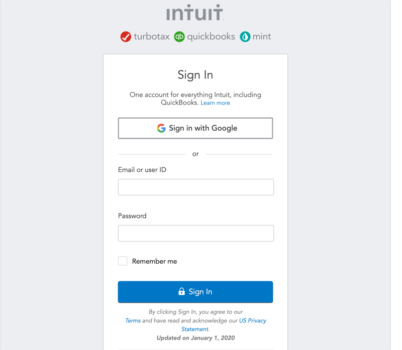

## Quickbooks

Upon connecting Quickbooks, you will see the following login prompt:

Enter your login credentials, or select _Sign in with Google_ and click _Sign In_.

If you have Identity Confirmation activations enabled, you will see a prompt to enter the *verification code* sent to you.

### Setting Up Your Data

After logging in you can set up your Quickbooks data in the following dialog:

Here you can choose the Quickbooks entities you need from:

- _Common Entities_ - this category allows quick selection between the  most used entities among our users;
- _All Entities_ - this category displays the full list of entities contained in your Quickbooks account. You can use the provided search to find quickly the entity you need.
