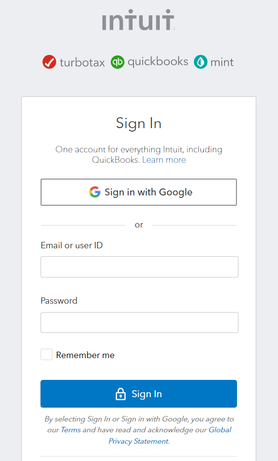
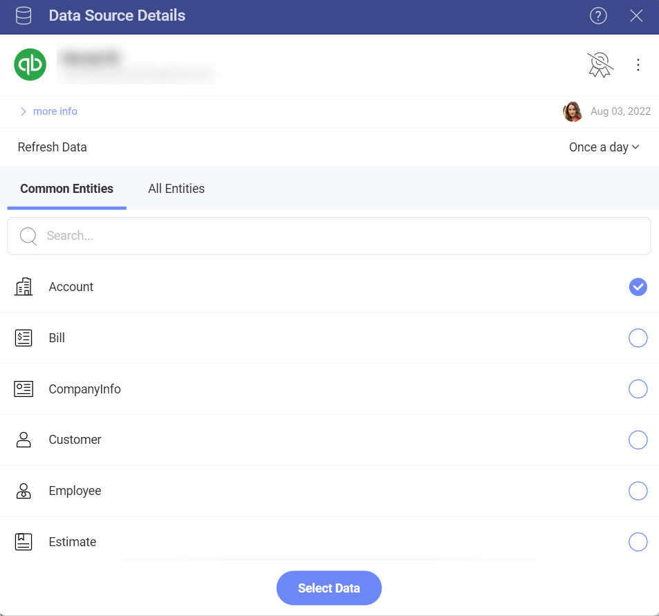
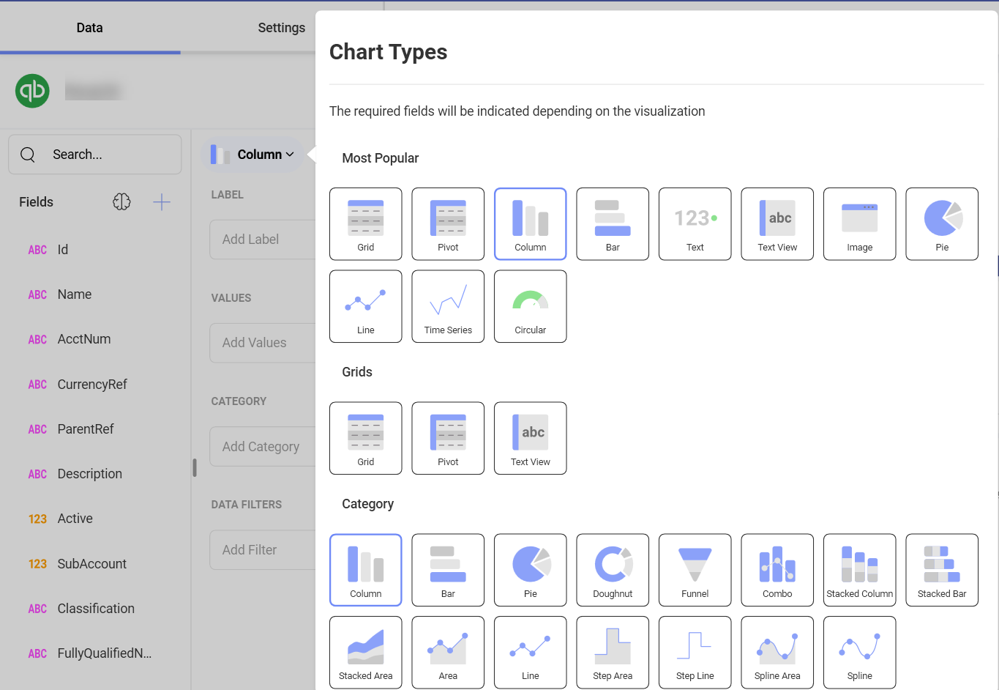
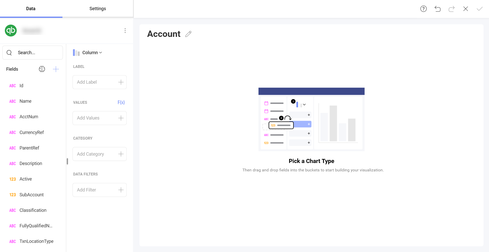
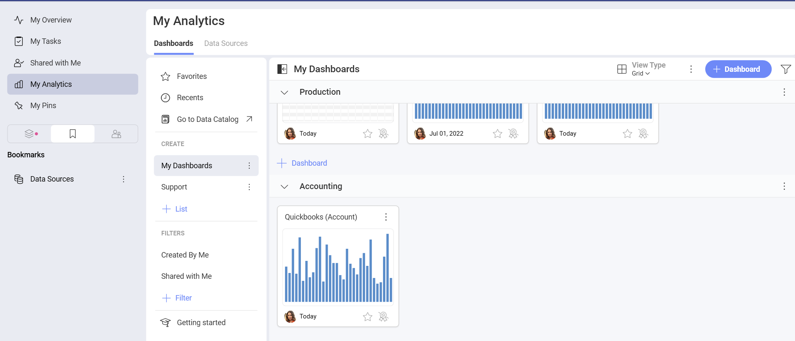

# Quickbooks

Upon connecting Quickbooks, you will see the following login prompt:

Enter your login credentials, or select *Sign in with Google* and click *Sign In*.

>[!Note] If you have Identity Confirmation activations enabled, you will see a prompt to enter the *verification code* sent to you.

## Setting Up Your Data

After logging in, you can set up your Quickbooks data in the following dialog:

Here you can choose the Quickbooks entities you need from:

- *Common Entities* - this category allows quick selection between the  most used entities among our users;
- *All Entities*- this category displays the full list of entities contained in your Quickbooks account. You can use the provided search to find quickly the entity you need.

## Working in the Visualization editor

Once your data source has been added, you will be taken to the *Visualizations Editor*. By default, the *Column* visualization will be selected. You can select it in order to choose another chart type. 

Based on the vusialization that you have chosen, you will see different types of fields.

When you are ready with your visualization, you can click/tap on the checkmark in the top right corner to save it as a dashboard. In this case we saved the dashboard in **My Analytics** > **My Dashboards** > **Accounting**.

