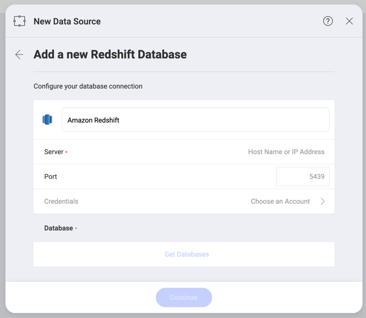
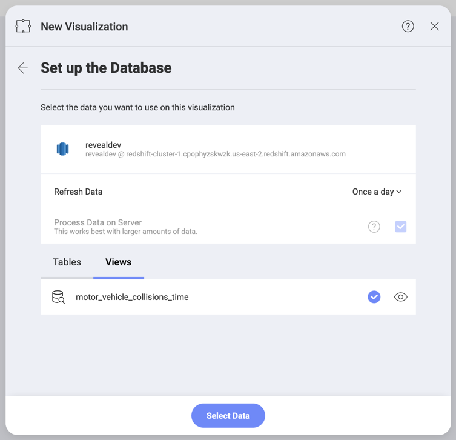
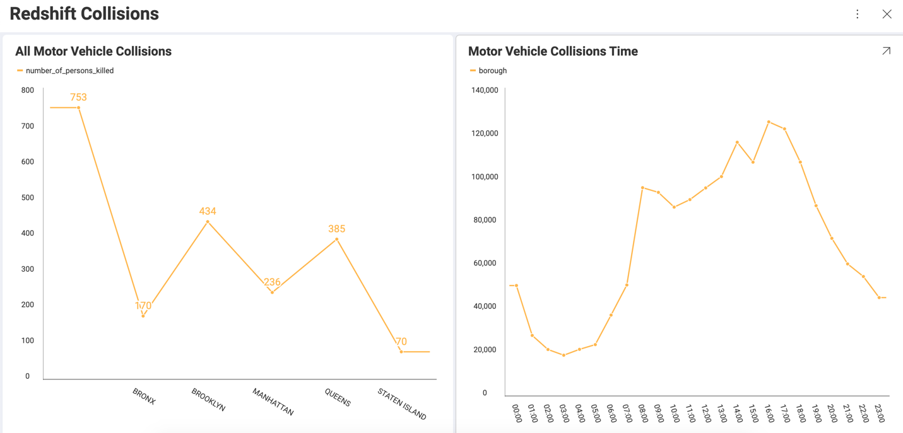

## Amazon Redshift

To configure an Amazon Redshift data source, you will need to enter the following information:

1.  **Default name** of the data source: Your data source name will be displayed in the list of accounts in the previous dialog. By default, Reveal names it *Amazon Redshift*. You can change it to your preference. 

2.  [**Server**](#how-to-find-server): the computer name or IP address assigned to the computer on which the server is running.

3.  **Port**: if applicable, the server port details. If no information is entered, Reveal will connect to the port in the hint text (5432) by default.

4.  **Credentials**: after selecting *Credentials*, you will be able to
    enter the credentials for your *Redshift* server or select existing
    ones if applicable.

      - **Name**: the name for your data source account. It will be
        displayed in the list of accounts in the previous dialog.

      - *(Optional)* **Domain**: the name of the domain, if applicable.

      - **Username**: the user account for the *Redshift* server.

      - **Password**: the password to access the *Redshift* server.

### How to find your Server Information

You can find your server by following the steps below. Please note that
the commands should be executed on the server.

| WINDOWS                                                                                                         | LINUX                                                                                                         | MAC                                                                  |
| --------------------------------------------------------------------------------------------------------------- | ------------------------------------------------------------------------------------------------------------- | -------------------------------------------------------------------- |
| 1\. Open the File Explorer.                                                                                     | 1\. Open a Terminal.                                                                                          | 1\. Open System Preferences.                                         |
| 2\. Right Click on My Computer \> Properties.                                                                   | 2\. Type in **$hostname**                                                                                     | 2\. Navigate to the Sharing Section.                                 |
| Your Hostname will appear as "Computer Name" under the *Computer name, domain and workgroups settings* section. | Your Hostname will appear along with your DNS domain name. Make sure you only include **Hostname** in Reveal. | Your Hostname will be listed under the "Computer Name" field on top. |

You can find your *IP address* by following the steps below. Please note
that the commands should be executed on the server.

| WINDOWS                              | LINUX                             | MAC                                                           |
| ------------------------------------ | --------------------------------- | ------------------------------------------------------------- |
| 1\. Open a Command Prompt.           | 1\. Open a Terminal.              | 1\. Launch your Network app.                                  |
| 2\. Type in **ipconfig**             | 2\. Type in **$ /bin/ifconfig**   | 2\. Select your connection.                                   |
| **IPv4 Address** is your IP address. | **Inet addr** is your IP address. | The **IP Address** field will have the necessary information. |

### Working with Views

With Reveal, you can retrieve *Redshift* data from entire tables, but you can also select a particular
[view](https://docs.aws.amazon.com/redshift/latest/dg/r_CREATE_VIEW.html) that returns a subset of data from a table or a set of tables instead.

In the screenshot above, the **motor_vehicle_collisions_time** view contains a modified version of the data in the **motor_vehicle_collisions** table in Redshift. 
In the screenshot below, the visualization on the left is built with the data in the table, and the the one on the right uses the data contained in the view.  

