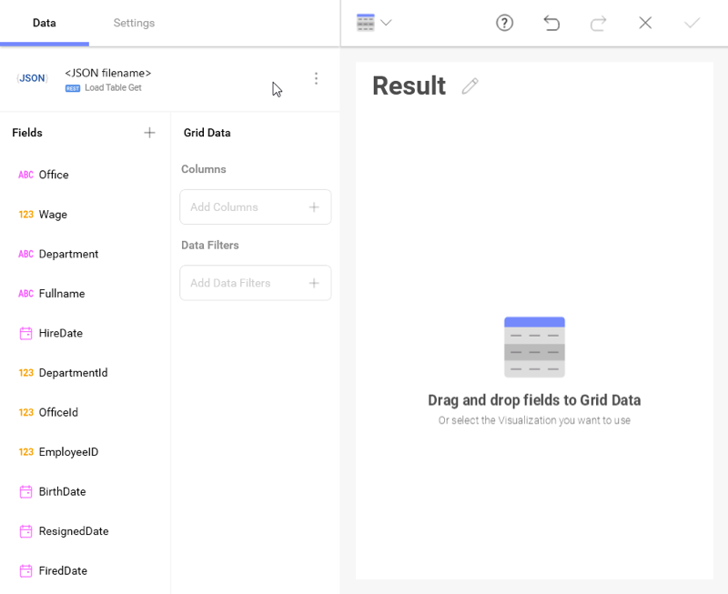
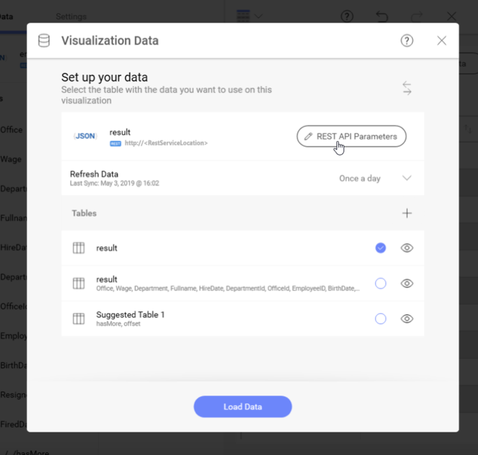

## REST API

The REST API data source in Reveal enables you to send GET, POST, and PUT
HTTP requests to a unique URL in order to manipulate data via a web
service.

The REST API data source also provides the possibility to change the
received data by simply changing parameters' values in the URL in the
midst of creating your visualization without losing your progress.

### What is a REST API?

An **API** (Application Program Interface) allows two software programs
to communicate with each other. All web services are APIs accessed
through the web environment.

REST APIs (also referred to as REST web services) are based on **REST**
(Representational State Transfer) - a group of architectural
constraints, providing standards for communication between computer
systems on the web. In the REST architecture, clients send requests to
retrieve or modify resources, and servers send responses to these
requests.

### Configuring a REST API Data Source

To configure a REST API data source, you will need to enter the
following information:

1. 1.  **Default name** of the data source: Your data source name will be displayed in the list of accounts in the previous dialog. By default, Reveal names it *REST API*. You can change it to your preference.

2.  **URL**: the URL where the service is located.

3.  **Method**: from the dropdown menu, you can choose your preferred request type - *GET*, *POST* or *PUT*.
    > [!NOTE] **Unsupported method**.
    > If the REST service does not support your method (e.g., POST), you will receive an error message.

4. **Result Type**: You can specify the file type you expect to be retrieved from the REST API. For example, if you choose *.csv* and the REST API responds with a *JSON*, Reveal will try to parse the file as a *.csv*.

    If you choose *Auto Detect*, Reveal will use the information about the file (content) type, coming from the REST API to parse the file.  

5.  **Credentials**: after selecting *Credentials*, you will be able to
    enter the credentials for your REST API or select existing ones if
    applicable. You can also pick the *No Account* option.

### Working with URL Parameters

Parameters are options you can pass in your URL to influence the
response from the web service. You can provide path and query parameters
in your URL when configuring the REST API data source.

To use parameters effectively follow the procedure below:

1.  **Provide parameters in the URL**. You must put path parameters in
    *curly braces* and specify query parameters after a *question mark
    (?)*. You can see in the example below both path, and query
    parameters are color-coded in *blue* to make them more easily
    identifiable.

    

2.  **Add parameters' values**. In the following screen specify the
    value of each parameter you have added in the URL.

    

    As a result, the REST API service will respond with the data on the
    provided URL in a REST compliant format. Generally, you will receive
    a JSON file:

    

    For more information on how to work with a JSON file, please refer
    to [this topic](working-with-json-files.md).

    After loading the data, you will continue to the Visualization Editor
    screen.

    

    **Unsupported File Formats**

    If the REST API responds with a file format, which is not supported
    by Reveal (e.g., XML), you will not be able to create visualizations
    with the data in this file.

    

3.  **Change the parameters' values without losing your visualization data**. Changing the parameters' values after you have started building your visualization offers a variety of possibilities. For example, you can access new data to add to your visualization or directly change the displayed data in the visualization you have already created.

To do this, click on the file icon in the upper-left corner of the
    *Visualization Editor* screen.

In the screen that opens, *click/tap* the *REST API Parameters* button.

You will be redirected to the screen in *step 2* where you can provide new values to your parameters.

> [!NOTE]
> **Losing Your Data Warning**
Sometimes when you change the values of your parameters, there might be a chance to lose the visualization you already created in the Editor. In this case, the following warning message will appear when you *click/tap* the *Load Data* button:
>

### Choosing a Method

The *Method* in your REST API data source configuration represents a
request used to interact with resources in a REST system. The request
generally consists of:

1.  A path to a resource (**URL**)

2.  **HTTP verb**:

      - *GET* - to retrieve a specific resource

      - *POST* - to create a new resource

      - *PUT* - update a specific resource

3.  A **Header**: allows the client to pass along information about the
    request

4.  A **Body**: an optional message (when using *POST* and *PUT*
    methods) containing data

    

For more information about the Header and Body of a request, please
refer to [this link](https://developer.mozilla.org/en-US/docs/Web/HTTP/Messages#Headers).
