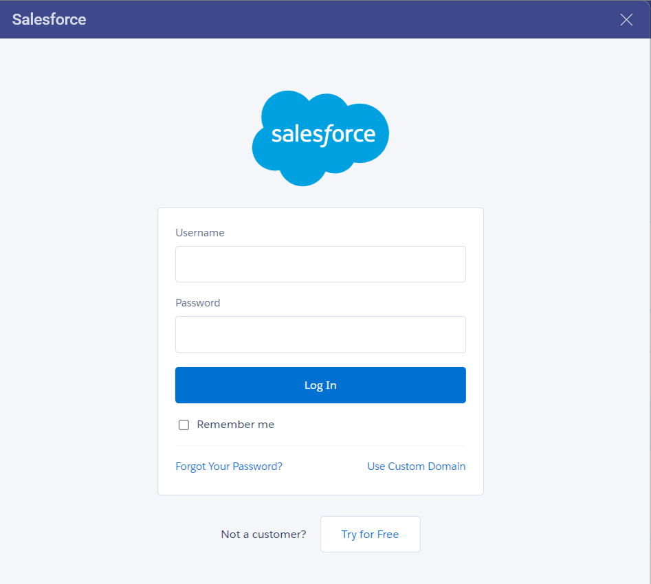
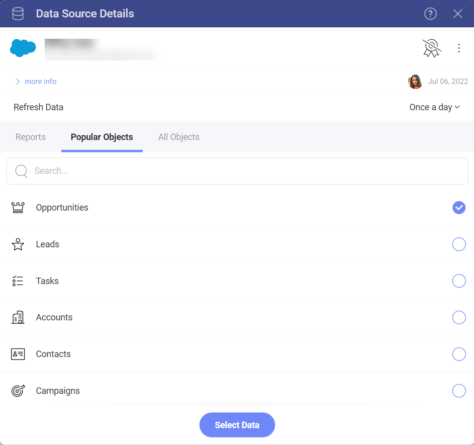
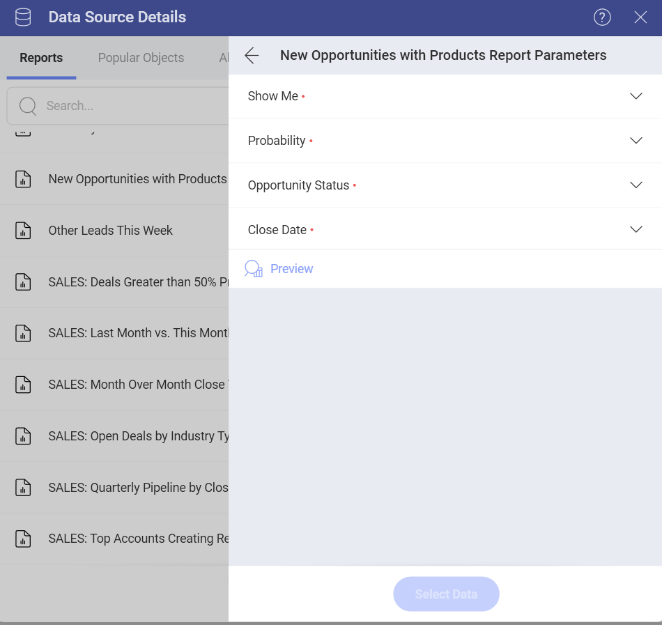
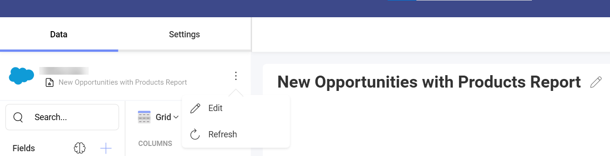
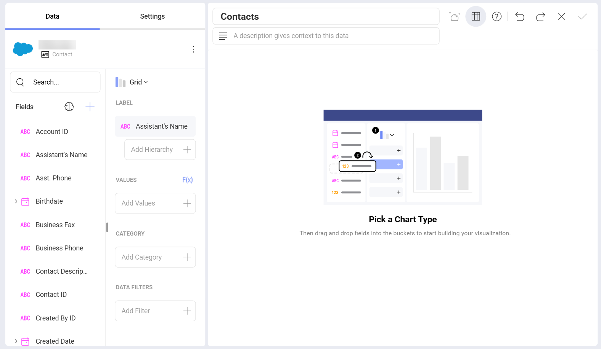
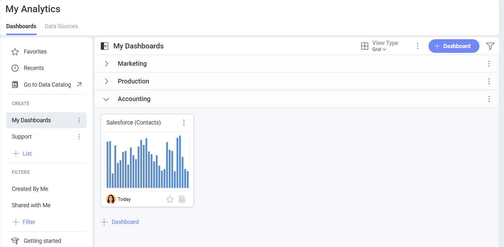

# Salesforce

Upon selecting the Salesforce data source, you will see the following login prompt:

Enter your login credentials and click on **Log In**.

>[!NOTE] If you have Identity Confirmation activations enabled, you will see a
prompt to enter the **verification code** sent to you. For more
information on Identity Confirmation Activations, visit the [Salesforce help](https://help.salesforce.com/articleView?id=security_activation_about.htm&type=5).

## Setting Up Your Data

After logging in, you can set up your Salesforce data in the following
dialog:

Here you can choose from:

  - **Reports** - this category displays all the reports that come from your Salesforce account. 

  - **Popular Objects** - this category allows quick selection between the
    seven most used objects among our users.

  - **All Objects** - this category displays the full list of objects
    contained in your Salesforce account.  You can use the provided search to find quickly the object you need.

## Using Reports

After selecting which report you want to use in the visualization editor, you need to set the values for the parameters:

The parameters you see in the list (**Show me**, **Probability**, etc.) are the filters for your report. Report filters are criteria set to control the data a user sees in their report. In Reveal, the filtered data will be used in your charts in the *Visualization editor*.

In the dialog above, filters are preconfigured with the default values from Salesforce. Use the dropdown menu next to each filter to change these values.

You can change the report filters' values later in the *Visualization editor* by choosing to **Edit** your data source (as shown below):

## Working in the Visualization editor 

Once your data source has been added, you will be taken to the *Visualizations Editor*. Here you can build your dashboard.Note that based on the vusialization that you have chosen, you will see different types of fields.

When you are ready with your visualization, you can click/tap on the checkmark in the top right corner to save it as a dashboard. In this case we saved the dashboard in **My Analytics** > **My Dashboards** > **Accounting**.

