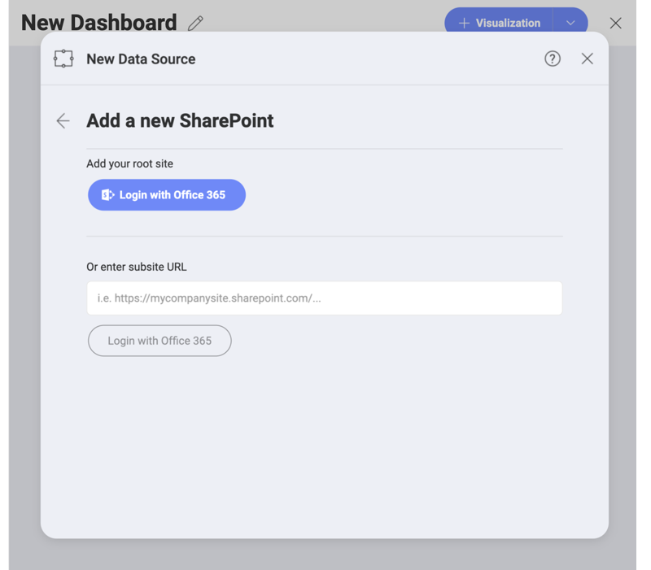
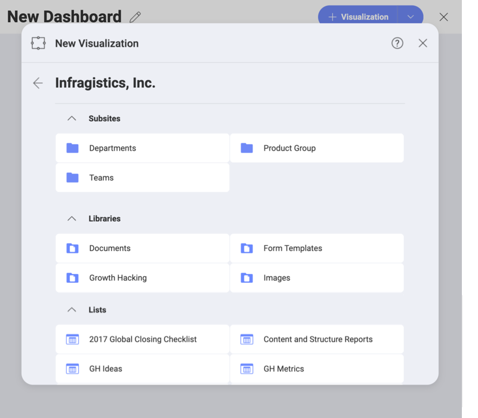
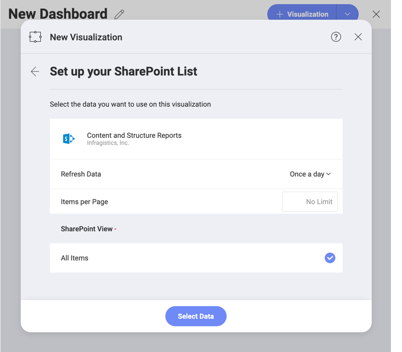

## SharePoint Online

Upon selecting SharePoint, you will see the following log in prompt.

Here you can choose to use the root SharePoint site in your Office365 account. You can also add a _subsite URL_ to directly start browsing its contents. Once connected to a SharePoint subsite, you will be able to quickly access it through your list in the _Select a Data Source_ dialog.

### Supported Files

When working within Reveal, you will be able to use a wide variety of files from your SharePoint site (subsites):

* *Spreadsheets, JSON files & tabular data* (Excel - .xls, .xlsx; CSV, TSV), which you can use dynamically within Reveal to create chart visualizations.
* *Other files* (including images or document files such as PDFs, texts, etc.), which will be displayed in a preview mode only.

### Setting Up Your Data

After logging in, you can start browsing your SharePoint data - subsites, libraries, folders, lists, and files (as shown below).

To create a dashboard, you can use the SharePoint data types, listed below.

1. *Files* stored in your SharePoint site - see
[Supported files](#supported-files) above.

2. *SharePoint lists* - you can use the items from all types of SharePoint lists. Set up a SharePoint list by selecting a _SharePoint View_.

  

  >[!NOTE]
  >**Advanced settings - Items per Page.**
  >In case you experience an unexpected slowdown or other disturbance while loading the data from your SharePoint list, you may try to configure the _Items per Page_ setting. This is an advanced setting, which allows you to control the data retrieval rate. To improve the speed, you can provide a higher number of items per page. A lower value may help if the information fails to load. The default value of items per page is 5000.

3. *Metadata of Document Libraries* - the metadata of a SharePoint library is data about files stored in this library, e.g. files' size, names, type, date of creation/upload. It can be used for analysis of the library.

    For example, you may want to provide insight in which period of the year your IT department receives the highest interest from job applicants? Find the document library, where you have uploaded the resumes of the applicants, and use its metadata to create a chart displaying how files in that library evolved over time.

    To do this, you need to open the library and click the _Use Metadata_ button at the top right corner.

    

    Here you will find the metadata of the library presented as SharePoint lists that you can choose from.

>[!NOTE]
>**Do not confuse Libraries' Metadata in Reveal with "managed metadata" in SharePoint!**
Don't confuse the metadata collected from document libraries that you can use as a datasource in Reveal with "managed metadata", which is created by the user in SharePoint and utilized for organizing and filtering large data lists. Learn more about managed metadata from [this SharePoint documentation topic](https://docs.microsoft.com/en-us/sharepoint/managed-metadata).
