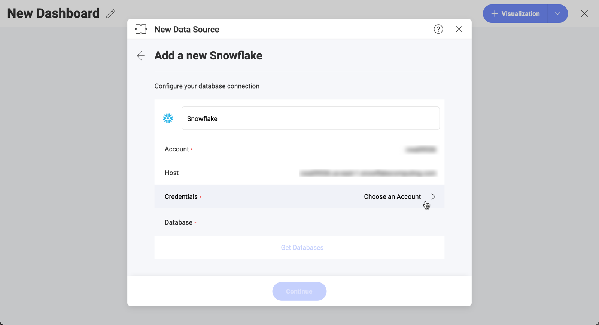
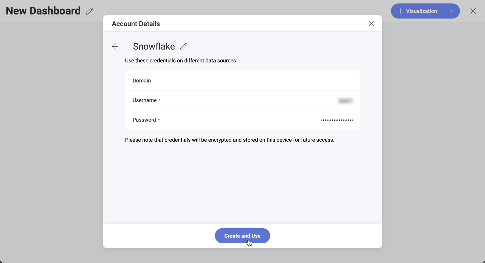
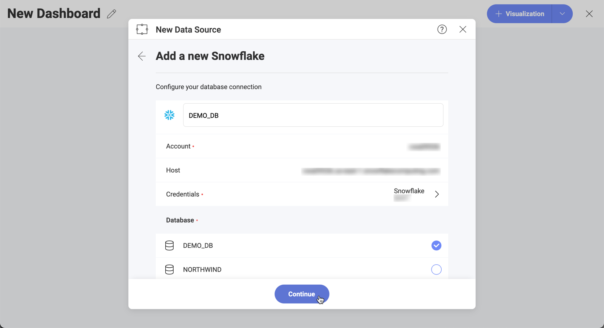
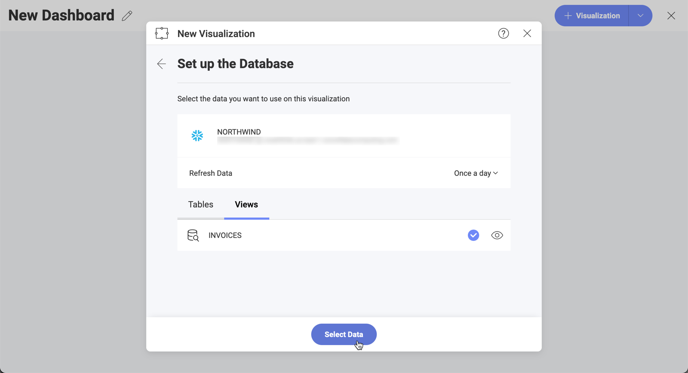

## Snowflake

To configure a Snowflake data source, you first need to connect to the server by entering the following information:

1.  **Default name** of the data source: Your data source name will be displayed in the list of accounts in the previous dialog. By default, Reveal names it *Snowflake*. You can change it to your preference.

2.  **Account**: Your snowflake account without the region or cloud provider information. For example, it should be similar to \<account_name\> instead of _\<account_name\>.us-east-1.snowflakecomputing.com_.

3.  **Host**: Although not required, if no value is specified _\<account_name\>.snowflakecomputing.com_ will be assumed. If you are not in the US West region or want to use a global url, you need to specify a HOST with the format:  _\<account_name\>.\<region_id\>.snowflakecomputing.com_.

4.  **Credentials**: after selecting *Credentials*, you will be able to
    enter the credentials for your *Snowflake* server or select existing
    ones if applicable.

    

    - **Name**: the name for your data source account. It will be
        displayed in the list of accounts in the previous dialog.

    - *(Optional)* **Domain**: the name of the domain, if applicable.

    - **Username**: the user account for the *Snowflake* server.

    - **Password**: the password to access the *Snowflake* server.

### Configuring a Snowflake Data Source

1.  **Select a database** by marking the empty circle next to it:

    

    >[!NOTE]    
    **Snowflake sample data in Reveal**.
    The Northwind database in the screenshot above was created with demo purposes and is not available as part of Snowflake's sample data.

3.  **Select a table or a view** from the database. Use the *eye icon* on the right to preview the data.

    

You are now directed to the *Visualization editor* where you can start building your visualizations with the data retrieved from Snowflake.

#### Limitations in Data Blending

Currently, Data Blending ([combining data sources in one visualization](~/en/datasources/data-blending.md)) is **not available** when using data from the Snowflake data source.
