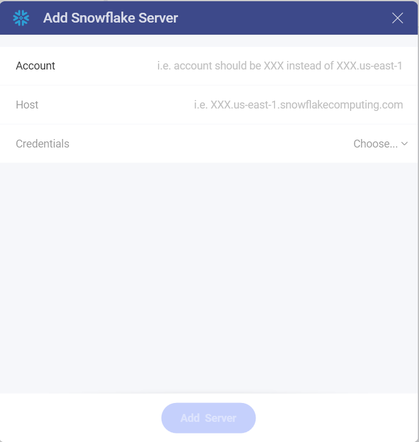
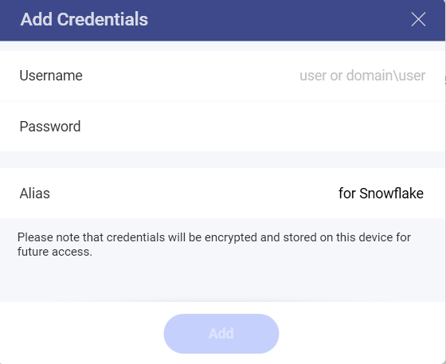
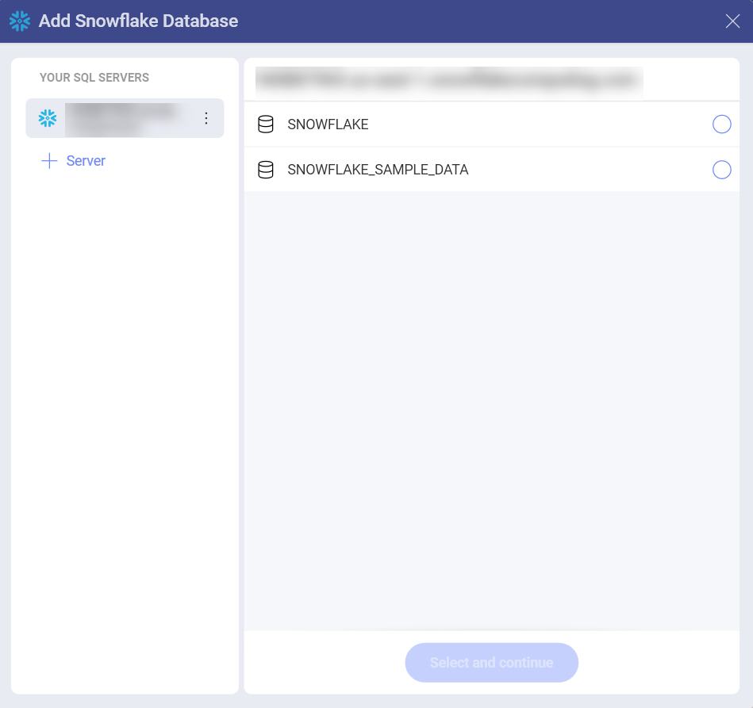
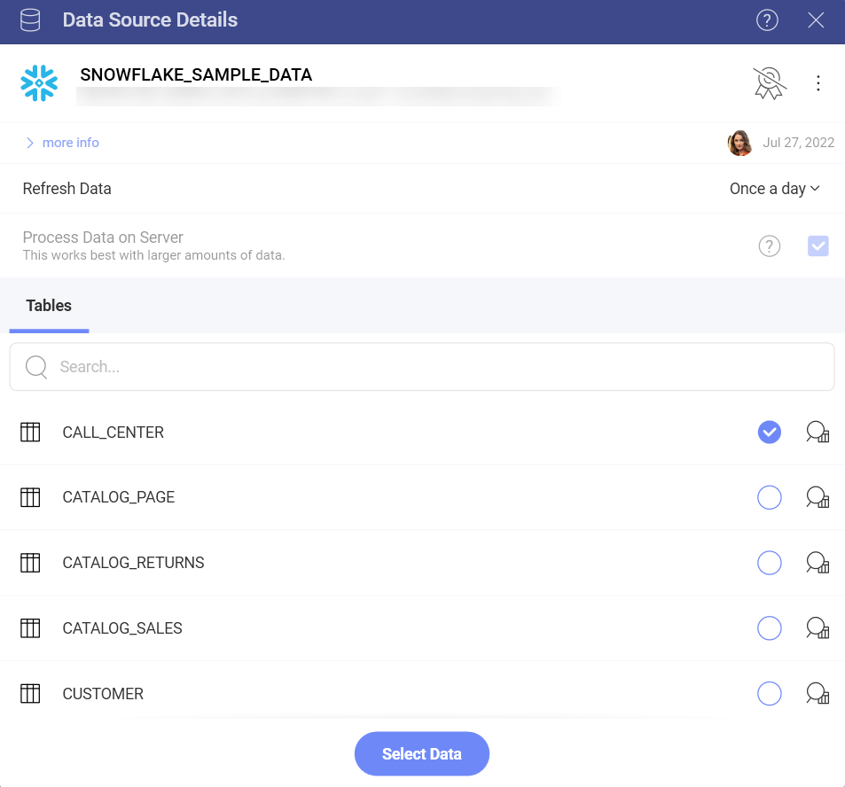

# Snowflake

## Connecting with Snowflake

To configure a Snowflake data source, you first need to connect to the server by entering the following information:

1.  **Account**: Your snowflake account without the region or cloud provider information. For example, it should be similar to \<account_name\> instead of _\<account_name\>.us-east-1.snowflakecomputing.com_.

2.  **Host**: Although not required, if no value is specified _\<account_name\>.snowflakecomputing.com_ will be assumed. If you are not in the US West region or want to use a global url, you need to specify a HOST with the format:  _\<account_name\>.\<region_id\>.snowflakecomputing.com_.

3.  **Credentials**: after selecting *Credentials*, you will be able to
    enter the credentials for your *Snowflake* server or select existing
    ones if applicable.

     

    - **Username**: the user account for the *Snowflake* server or the name of the domain.

    - **Password**: the password to access the *Snowflake* server.

    - **Alias**: the name for your data source account. It will be
        displayed in the list of accounts in the previous dialog.

## Configuring a Snowflake Data Source

1.  **Select a database** by marking the empty circle next to it:

  

2.  **Select a table** from the database. Use the icon on the right, next to the empty circles, to preview the data.

  

You are now directed to the *Visualization editor* where you can start building your visualizations with the data retrieved from Snowflake.
