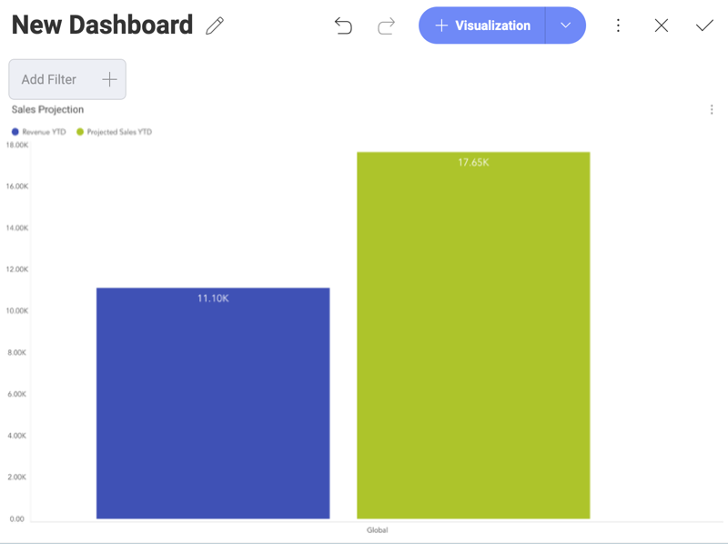

## Sybase

To configure a Sybase server data source, you will need to enter the
following information:

1.  **Default name** of the data source: Your data source name will be displayed in the list of accounts in the previous dialog. By default, Reveal names it *Sybase*. You can change it to your preference.

2.  [**Server**](#how-to-find-server): the computer name or IP address
    assigned to the computer on which the server is running.

3.  **Port**: if applicable, the server port details. If no information
    is entered, Reveal will connect to the port in the hint text (5000)
    by default.

4.  **Credentials**: after selecting *Credentials*, you will be able to
    enter the credentials for your Sybase server or select existing ones
    if applicable.

      - **Name**: the name for your data source account. It will be
        displayed in the list of accounts in the previous dialog.

      - *(Optional)* **Domain**: the name of the domain, if applicable.

      - **Username**: the user account for the Sybase server.

      - **Password**: the password to access the Sybase server.

        Once ready, select **Create Account**. You can verify whether
        the account is reaching the data source or not by selecting
        **Test Connection**.

### How to find your Server Information

You can find your server by following the steps below. Please note that
the commands should be executed on the server.

| WINDOWS                                                                                                         | LINUX                                                                                                         | MAC                                                                  |
| --------------------------------------------------------------------------------------------------------------- | ------------------------------------------------------------------------------------------------------------- | -------------------------------------------------------------------- |
| 1\. Open the File Explorer.                                                                                     | 1\. Open a Terminal.                                                                                          | 1\. Open System Preferences.                                         |
| 2\. Right Click on My Computer \> Properties.                                                                   | 2\. Type in **$hostname**                                                                                     | 2\. Navigate to the Sharing Section.                                 |
| Your Hostname will appear as "Computer Name" under the *Computer name, domain and workgroups settings* section. | Your Hostname will appear along with your DNS domain name. Make sure you only include **Hostname** in Reveal. | Your Hostname will be listed under the "Computer Name" field on top. |

You can find your *IP address* by following the steps below. Please note
that the commands should be executed on the server.

| WINDOWS                              | LINUX                             | MAC                                                           |
| ------------------------------------ | --------------------------------- | ------------------------------------------------------------- |
| 1\. Open a Command Prompt.           | 1\. Open a Terminal.              | 1\. Launch your Network app.                                  |
| 2\. Type in **ipconfig**             | 2\. Type in **$ /bin/ifconfig**   | 2\. Select your connection.                                   |
| **IPv4 Address** is your IP address. | **Inet addr** is your IP address. | The **IP Address** field will have the necessary information. |

### Working with Views

With Reveal, you can retrieve Sybase data from entire tables, but you
can also select a particular
[view](http://infocenter.sybase.com/help/index.jsp?topic=/com.sybase.infocenter.dc32300.1570/html/sqlug/X29678.htm)
that returns a subset of data from a table or a set of tables instead.

The **Category Sales for 1997** view, for example, contains information on sales
projections taken from one of the tables in the database.

For more information on views and Sybase, visit [this documentation website](http://infocenter.sybase.com/help/index.jsp?topic=/com.sybase.infocenter.dc32300.1570/html/sqlug/X29678.htm).

### Working with Stored Procedures

In Sybase, stored procedures allow users to run a set of query
statements in a relational database with specific parameters. The
following are just a set of sample stored procedures running in a test
server with data from the master database:

In this case, for example, the stored procedure requires users to set some time range values.

For more information on Stored Procedures and Sybase, visit [this documentation website](http://infocenter.sybase.com/help/index.jsp?topic=/com.sybase.infocenter.dc32300.1570/html/sqlug/X39397.htm).
