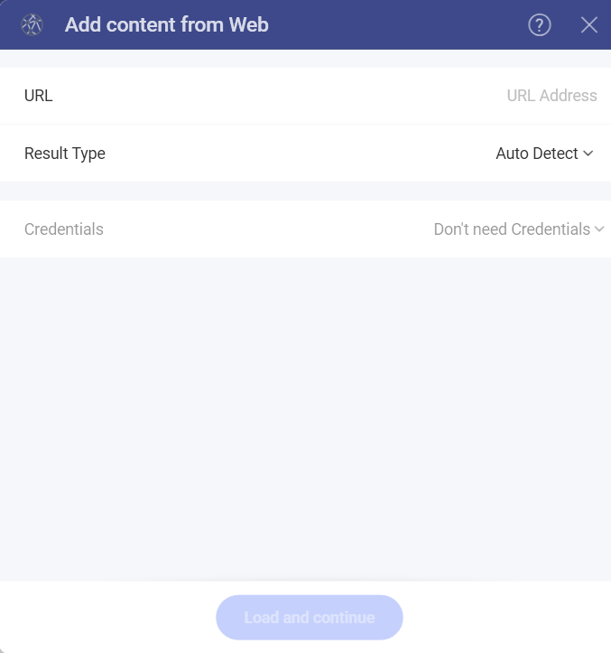

# Web Resource

A web resource, as the name suggests, is any virtual file stored in the
web which you can retrieve by using a unique URL address. It might, for
example, be an excel spreadsheet (for example, [this one](https://download.infragistics.com/reveal/help/samples/Reveal_Dashboard_Tutorials.xlsx)),
or an image (for example, [this one](http://www.infragistics.com/media/442175/home-header-shots.png)).

To configure a Web Resource as a Data Source, you will need to enter the
following information:

1.  **URL**: the URL where the service is located (for example,
    <https://download.infragistics.com/reveal/help/samples/Reveal_Dashboard_Tutorials.xlsx>
    for the Dashboard tutorials).

3. **Result Type**: You can specify the file type you expect to be retrieved from the service. For example, if you choose *.csv* and the service responds with a *json*, Reveal will try to parse the file as a *.csv*.

    If you choose *Auto Detect*, Reveal will use the information about the file (content) type, coming from the service to parse the file.  

4.  **Credentials**: You can click on the drop-down menu and select **+Credential**. After that you can enter the following:

      - **Credential Type**: two options - **Generic Credentials** or **OAuth 2 / OIDC**.

      - **Username or domain**: the user account for the Web Resource or the name of the domain.

      - **Password**: the password to access the Web Resource.

  If you want to make some changes to your credentials, you can select **Manage Credentials** from the drop-down menu.

Once ready, select **Load and Continue**.

To set up an *OAuth 2 / OIDC account* for a protected web resource,
please read [this topic](~/en/datasources/auth-2-oidc-user-authentication.md).
