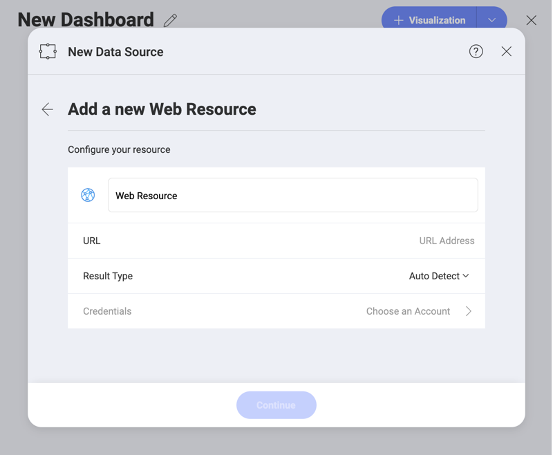

## Web Resource

A web resource, as the name suggests, is any virtual file stored in the
web which you can retrieve by using a unique URL address. It might, for
example, be an excel spreadsheet (for example, [this one](http://download.infragistics.com/reveal/help/samples/Reveal_Dashboard_Tutorials.xlsx)),
or an image (for example, [this one](http://www.infragistics.com/media/442175/home-header-shots.png)).

To configure a Web Resource as a Data Source, you will need to enter the
following information:

1.  **Default name** of the data source: Your data source name will be displayed in the list of accounts in the previous dialog. By default, Reveal names it *Web Resource*. You can change it to your preference.

2.  **URL**: the URL where the service is located (for example,
    <http://download.infragistics.com/reveal/help/samples/Reveal_Dashboard_Tutorials.xlsx>
    for the Dashboard tutorials).

3. **Result Type**: You can specify the file type you expect to be retrieved from the service. For example, if you choose *.csv* and the service responds with a *json*, Reveal will try to parse the file as a *.csv*.

    If you choose *Auto Detect*, Reveal will use the information about the file (content) type, coming from the service to parse the file.  

4.  **Credentials**: after selecting *Credentials*, you will be able to
    enter the credentials for your Web Resource or select existing ones
    if applicable.

      - **Name**: the name for your data source account. It will be
        displayed in the list of accounts in the previous dialog.

      - *(Optional)* **Domain**: the name of the domain, if applicable.

      - **Username**: the user account for the Web Resource, if
        applicable.

      - **Password**: the password to access the Web Resource, if
        applicable.

Once ready, select **Create Account**. You can verify whether the
account is reaching the data source or not by selecting **Test
Connection**.

To set up an *OAuth 2 / OIDC account* for a protected web resource,
please read [this topic](oauth-2-oidc-user-authentication.md).
