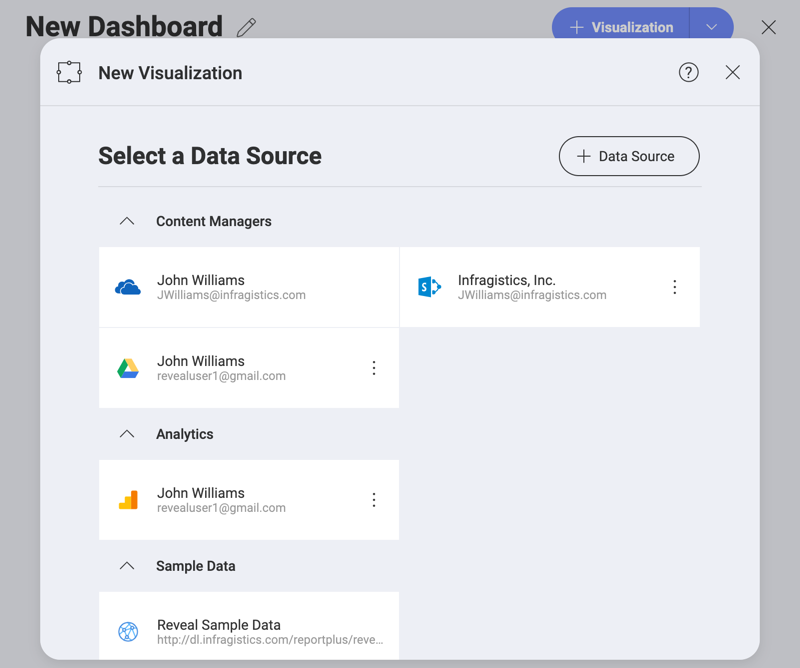
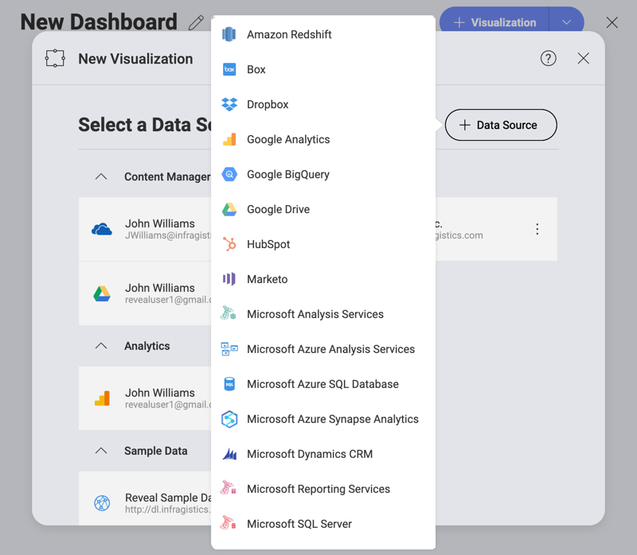

## What is a Data Source?

Data Sources are the places where your data comes from. Reveal provides
users the chance to connect to analytics tools, content managers, CRMs,
databases, spreadsheets, and public data sources. It also
does not require users to have direct access to these sources in their
computers or their network.

The screenshot below displays a number of different data sources one user has connected to in their application.

### How Do You Connect to  Data Sources?

Once you select the *+ Visualization* button to create a dashboard, you will be prompted
to enter a new or existing data source.

Here you will see a list of recently used
Data Sources. To create a new one, **select the  + Data Source button**.

For the complete list of supported data sources and detailed information on how to configure each fo them, access the following topics:

  - [Data Sources](data-sources.md)

  - [Box](box.md)

  - [Dropbox](dropbox.md)

  - [Google Analytics](google-analytics.md)

  - [Google BigQuery](google-bigquery.md)

  - [Google Drive](google-drive.md)

  - [Microsoft Analysis Services](microsoft-analysis-services/configuring-microsoft-analysis-services.md)

  - [Microsoft Azure Synapse Analytics](microsoft-azure-synapse-analytics.md)

  - [Microsoft Azure SQL](azure-sql.md)

  - [Microsoft Dynamics CRM](microsoft-dynamics-crm.md)

  - [Microsoft Reporting Services (SSRS)](microsoft-reporting-services.md)

  - [Microsoft SQL Server](microsoft-sql-server.md)

  - [MySQL](mysql.md)

  - [OData Feed](odata-feed.md)

  - [OneDrive](onedrive.md)

  - [Oracle](oracle.md)

  - [PostgreSQL](postgresql.md)

  - [REST API](rest-api.md)

  - [Salesforce](salesforce.md)

  - [SharePoint](sharepoint.md)

  - [Sybase](sybase.md)

  - [Web Resource](web-resource.md)

  - [JSON file](working-with-json-files.md)

  - [Integration with Azure Machine Learning](azure-machine-learning-models.md)

  - [Integration with BigQuery Machine Learning](bigquery-machine-learning-models.md)
