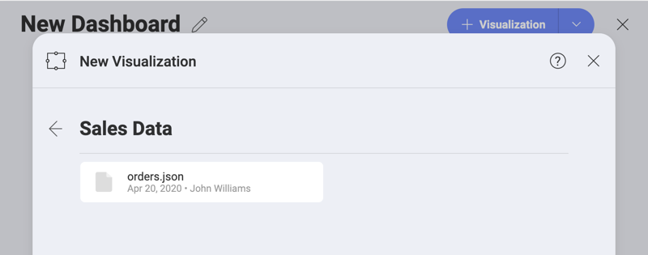
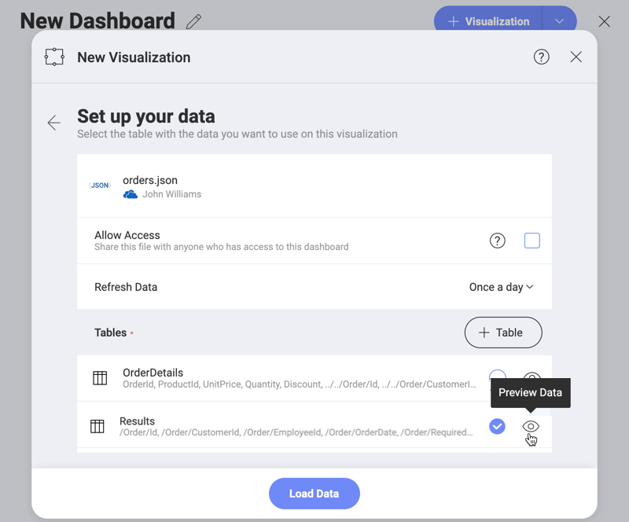
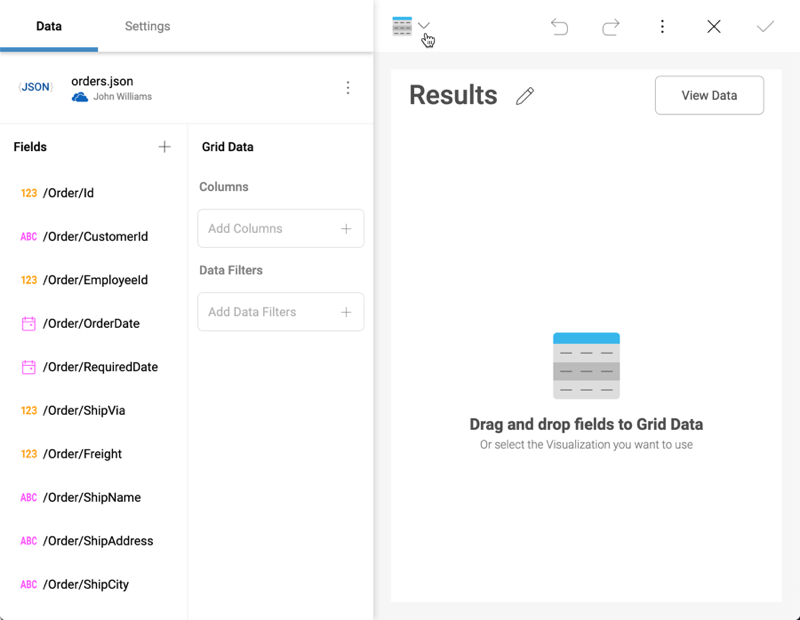
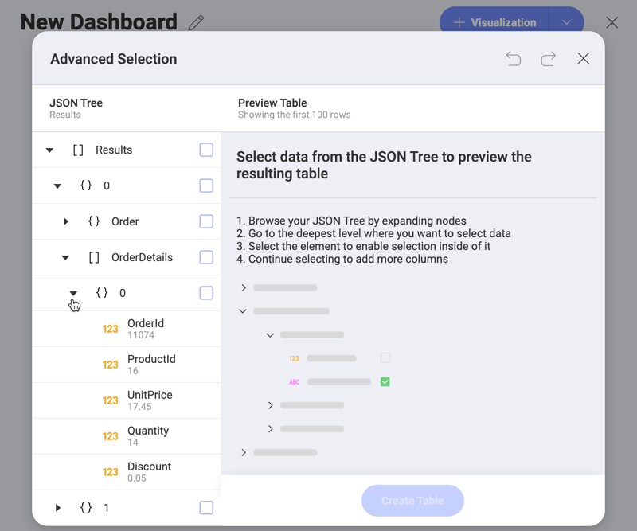
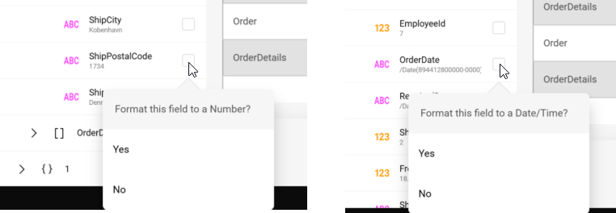

## Working With JSON Files

The JSON format is fully supported in Reveal as your visualizations can
consume data from any JSON file.

After reading your JSON file format, Reveal provides you with possible
data structures you may want to use. In addition, there is an
[**Advanced Selection**](#json-advanced-selection) mode where you can
choose a custom data structure.

### JSON Format Information

JSON (**J**ava**S**cript **O**bject **N**otation) is a self-describing
lightweight format for storing and exchanging data.

Format highlights:

  - JSON, as a format, can be used to **represent many different
    structures of data**.

  - Data is always arranged as **name/value pairs, separated by
    commas**.

  - Data types' notation includes: curly braces **{} for objects** and
    **square brackets \[\] for arrays**.

### Loading a JSON file

Follow these steps to create a new visualization that consumes data from
your JSON file:

1.  **Make your file available**

    Upload the JSON file to one of your storage providers, so you can
    later access it from Reveal. You can choose between the following
    available options: Dropbox, OneDrive, Box, Google Drive, and
    SharePoint.

2.  **Create a new visualization**.

    Within your dashboard, create the visualization that will consume
    data from the JSON file.

3.  **Locate your file**.

    a.  Choose the storage provider with the file and provide your login credentials.

    b.  Navigate the provider and select your JSON file.

    

4.  **Choose the data structure you want**.

    After scanning the file, Reveal will show you a list of possible
    data structures for you to choose.

    

    If the list does not include the data structure you want, use the
    [**Advanced Selection**](#json-advanced-selection) mode where you
    can choose a custom data structure.

5.  **Click/Tap *Load Data***.

    Once you selected the data structure, click/tap the *Load Data*
    button to continue to the *Visualizations Editor*.

    

### Advanced Selection Mode

JSON files can be used to represent many different data structures.
Because of this, Reveal allows you to choose a custom data structure for
you to work with. After selecting the data columns you want to work
with, you are able to build your visualization upon them.

1.  **Open the Advanced Selection mode**.

    Click/Tap the **+ Table** button to get access to the *Advanced Selection*
    screen.

    

2.  **Navigate the JSON Tree**.

    Expand the nodes and select the deepest level where you want to
    select the data.

    

3.  **Select the tree elements and fields you want**.

    You need to select a tree element (object **[ ]** or array **{ }**)
    to enable child selection.

    |                                                                             |                                                                                                                                           |
    | --------------------------------------------------------------------------- | ----------------------------------------------------------------------------------------------------------------------------------------- |
    |  | After selecting one or more children, you can unselect the parent elements (Objects and Arrays) to leave them out of your data structure. |

4.  (*Optional*) **Format text fields to Date/Time or Number**

    When selecting a field, Reveal reads its values, autodetects the
    optimal format, and presents a dialog where you can choose what to
    do.

    

5.  **Click/Tap *Create Table***.

    Once you selected your custom data structure, click/tap the *Create
    Table* button to continue to the *Visualizations Editor*.

    
