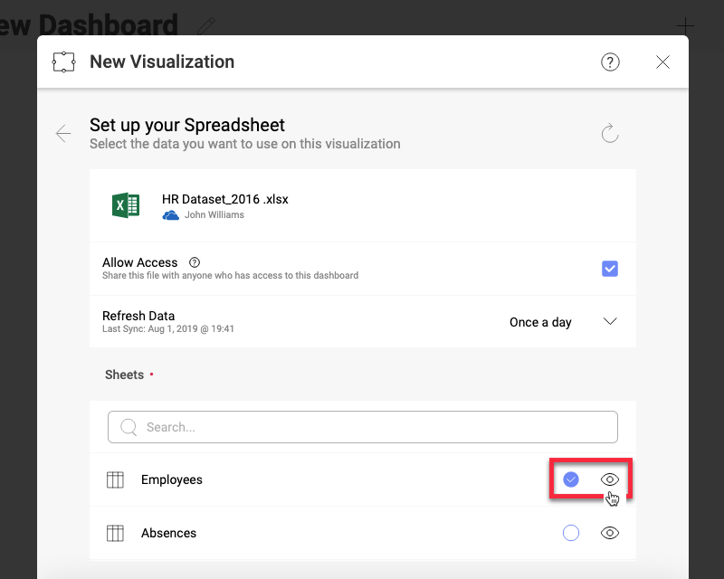
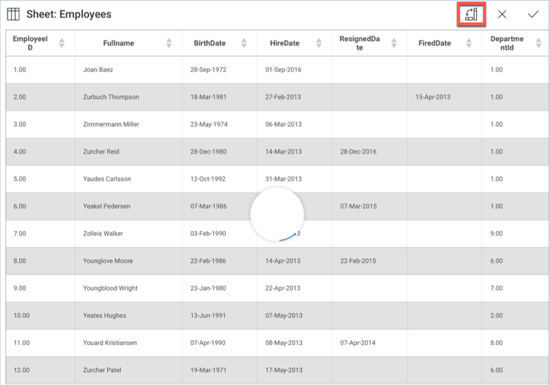
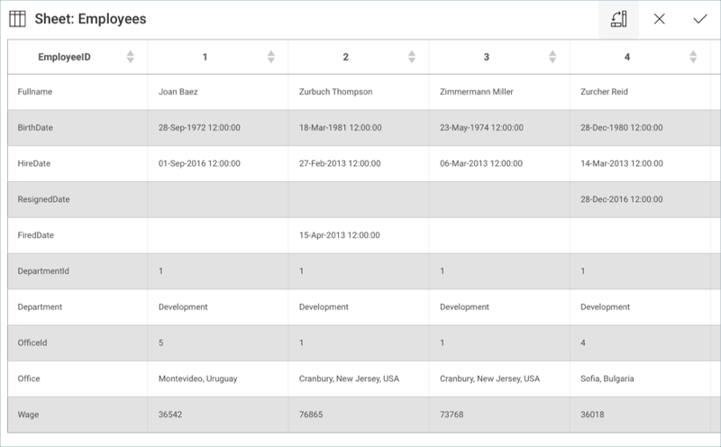
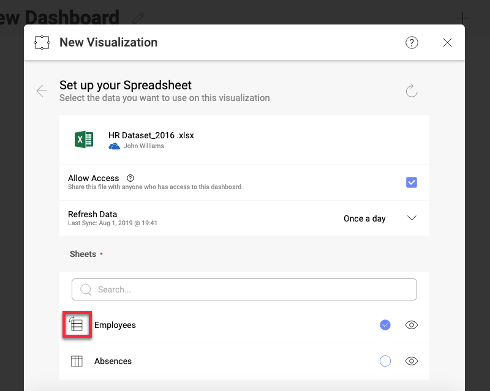

## Working With Spreadsheets in Reveal

Below are a couple of helpful tips and tricks for working with
spreadsheets within Reveal.

<table>
<colgroup>
<col style="width: 33%" />
<col style="width: 33%" />
<col style="width: 33%" />
</colgroup>
<tbody>
<tr class="odd">
<td>
  

<em>Reveal expects your data to be organized in columns</em> and will name fields after the spreadsheet's first row. If your data is organized in rows instead, you can <a href="#transposing-spreadsheets">transpose</a> the fields in Reveal.

<a href="~/en/data-visualizations/visualizations-editor.md">LEARN MORE</a> 

</td>
<td>
 

<strong>When working with CSV files, avoid formatting the spreadsheet</strong>. Instead, apply any necessary formatting (1000 comma separators, currency signs, etc.) through Reveal.

<a href="~/en/fields/field-settings.md">LEARN MORE</a> 

</td>
<td>
 

<strong>For 2 or more series charts, the order in which you drop fields</strong> in "Columns", "Rows" and "Values" <strong>will determine how the chart is plotted</strong>, regardless of the column order in your Excel file.
</td>
</tr>
<tr class="even">
<td>
  

<strong>If columns have different types of data combined</strong> (strings, numbers, etc.), <strong>Reveal will treat them as a column with strings only</strong>. This will affect, among other things, formatting.
</td>
<td>
 

Password-protected files and hidden ranges are not supported in Reveal.
</td>
<td></td>
</tr>
</tbody>
</table>

### Data Ranges

<table>
<colgroup>
<col style="width: 33%" />
<col style="width: 33%" />
<col style="width: 33%" />
</colgroup>
<tbody>
<tr class="odd">
<td>
  

<em>Excel files allow you to select a custom range of data within your spreadsheet</em>, while CSV do not. If you need to select specific data, make sure you always work with an Excel spreadsheet.
</td>
<td>
 

If you have a spreadsheet with a named range, you can <strong>choose that specific Named Range as a data source</strong>.
</td>
<td>
 

If your Excel data is organized in <strong>non-adjacent columns</strong>, Reveal will pick up the <strong>column with most data</strong>.
</td>
</tr>
</tbody>
</table>

### Dates, Numbers and Percentages

<table>
<colgroup>
<col style="width: 33%" />
<col style="width: 33%" />
<col style="width: 33%" />
</colgroup>
<tbody>
<tr class="odd">
<td>
 

By default, <strong>numbers will have 2 fraction digits</strong>. To change this, access the <em>Formatting</em> menu for the field.

<a href="~/en/fields/field-settings.html#numeric-fields">LEARN MORE</a> 

</td>
<td>
 

The 1000 separator is disabled by default, even for large numbers. To turn it on, access the <em>Formatting</em> menu.

<a href="~/en/fields/field-settings.html#numeric-fields">LEARN MORE</a> 

</td>
<td>
 

If you need to show percentages or currencies, you will need to select that option from the Formatting menu.

<a href="~/en/fields/field-settings.html#numeric-fields">LEARN MORE</a> 

</td>
</tr>
<tr class="even">
<td>
 

If you want a date as a column header, make sure you include a ' so Excel will respect your format. The default date format for headers is the full-length format (YYYY-MM-DD 00:00:00 +0000).
</td>
<td>
 

Percentages in Excel sheets will be shown in a 0 to 1 scale unless the format is changed to "Percentage". For example, 39% will be displayed as 0.39.
</td>
<td></td>
</tr>
</tbody>
</table>

### Transposing Columns to Rows

When working with Microsoft Excel and Google Sheets, you can use the
transpose functionality to switch columns from rows.

>[!NOTE]**Only the first 200 rows in the spreadsheet will be transposed.**
>You can access the transpose menu in the **Visualization Data** menu when expanding the sheet in your data source.

You will see a transpose icon in the top right-hand corner next to the
cross button. Once you press it, Reveal will switch columns to rows and
vice-versa.

In the example above, the information in the spreadsheet will be
organized in columns expressing the EmployeeID for each employee in the
company.

Once you are ready, select the tick icon. This will take you back to the
**Visualization Data** menu, where you will now see the name of the
sheet with a new icon to its left indicating that the sheet has been
modified.

### See Also

A common use case is building dashboards with spreadsheets located in a
cloud file sharing service. To learn how to successfully share those
dashboards with other users, please read [Sharing Dashboards with Cloud Files as a DataSource](~/en/dashboards/sharing-dashboards/sharing-dashboards-datasource-files-cloud-provider.md).
