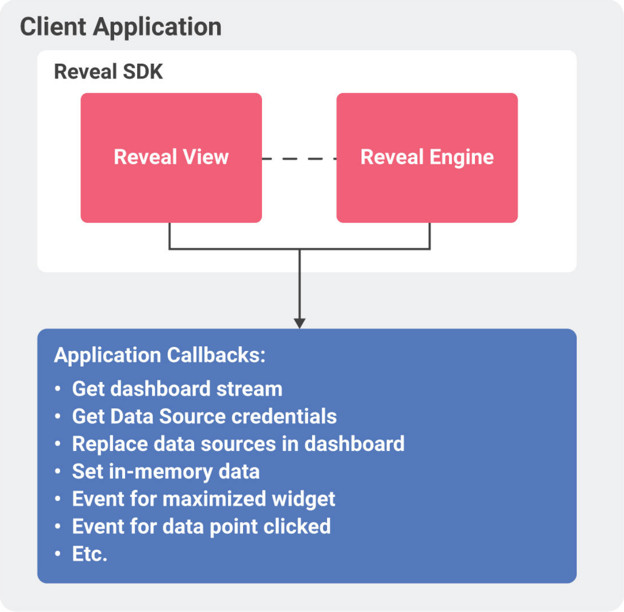

# Overview

When you embed Reveal in another application (Windows WPF, Windows
Forms, iOS or Android), the Reveal SDK is provided as a library or
framework that is integrated into the app (the integration steps are
different for each platform).

## The RevealView Component

The containing app creates a RevealView object configured with the
dashboard to render, this view is displayed in the containing app and
then a set of callbacks can be used to customize how the dashboard is
rendered and what data is used.

The RevealView component provides rendering and data transformation
capabilities (automatically through the Reveal Engine), but it does not
handle the storage of dashboards or credentials. The binary contents
(.rdash file) holding the definition of the dashboard must be provided
by the containing app. This allows the container app to handle how
dashboards are used and shared by end users (for example they can be
downloaded from an internal server, bundled as resources in the app’s
binary, stored in file system, etc.).

## About Credentials

When getting data from databases (or other data sources requiring
authentication), usually the containing app already handles these
credentials by loading them from configuration files, or storing them in
a secure storage. This means that Reveal delegates the storage and
handling of these credentials to the container. The app might decide to
return internal credentials or prompt the user for them, if needed.
