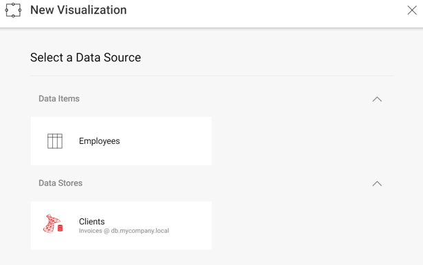

## Creating New Visualizations and Dashboards

### Overview

As described in [**Editing & Saving Dashboards**](editing-saving-dashboards.md), there are two ways to handle how you save changes to dashboards: **client-side and server-side**. Those scenarios work fine when users make minor changes to existing dashboards such as:

  - Adding/modifying filters
  - Changing the type of visualization (chart, gauge, grid, etc.)
  - Changing the theme

However, to add new visualizations the user needs to **select the data source** to be used. To do that, the containing application needs to provide information to the SDK, so it can display the list of data sources available for a new visualization.

### Displaying a List of Data Sources

The callback you need to use to display a list of data sources is
__DataSourcesRequested__.
In the case that you don’t set your own method to this callback, when a new visualization is created, Reveal will display all data sources used in the dashboard (if any).

#### Code

The code below shows how to configure the *data source selection* screen to show an “in-memory” item and a SQL Server data source.

``` csharp
private void RevealView_DataSourcesRequested(object sender, DataSourcesRequestedEventArgs e)
{
    var inMemoryDSI = new RVInMemoryDataSourceItem("employees");
    inMemoryDSI.Title = "Employees";
    inMemoryDSI.Description = "Employees";

    var sqlDs = new RVSqlServerDataSource();
    sqlDs.Title = "Clients";
    sqlDs.Id = "SqlDataSource1";
    sqlDs.Host = "db.mycompany.local";
    sqlDs.Port = 1433;
    sqlDs.Database = "Invoices";

    e.Callback(new RevealDataSources(
            new List<RVDashboardDataSource> { sqlDs },
            new List<RVDataSourceItem> { inMemoryDSI },
            false));
}
```

The previous code assumes that you attached the following method to
handle the “DataSourcesRequested” event:

``` csharp
revealView.DataSourcesRequested += RevealView_DataSourcesRequested
```

The “false” value in the third parameter prevents existing data sources on the dashboard from being displayed. So, when creating a new widget using the “+” button, you should get the following screen:



Please note that the “employees” parameter passed to the
“RVInMemoryDataSourceItem” constructor, is the same dataset id used in [**In-Memory Data Support**](in-memory-data.md) and identifies the dataset to be returned.

### Creating New Dashboards

Creating dashboards from scratch is really simple. You just need to
initialize __RevealView__. Usually when providing the users the capability to create a dashboard from scratch you would want to open the empty dashboard directly in edit mode so the user could start editing it straight away. 
``` csharp
revealView = new RevealView();
revealView.StartInEditMode = true;
revealView.DataSourcesRequested += RevealView_DataSourcesRequested;

revealView.Dashboard = new RVDashboard();
```

You can find a working example in the **EmptyDashboard.xaml.cs** view in the *UpMedia* WPF application distributed with the SDK.
