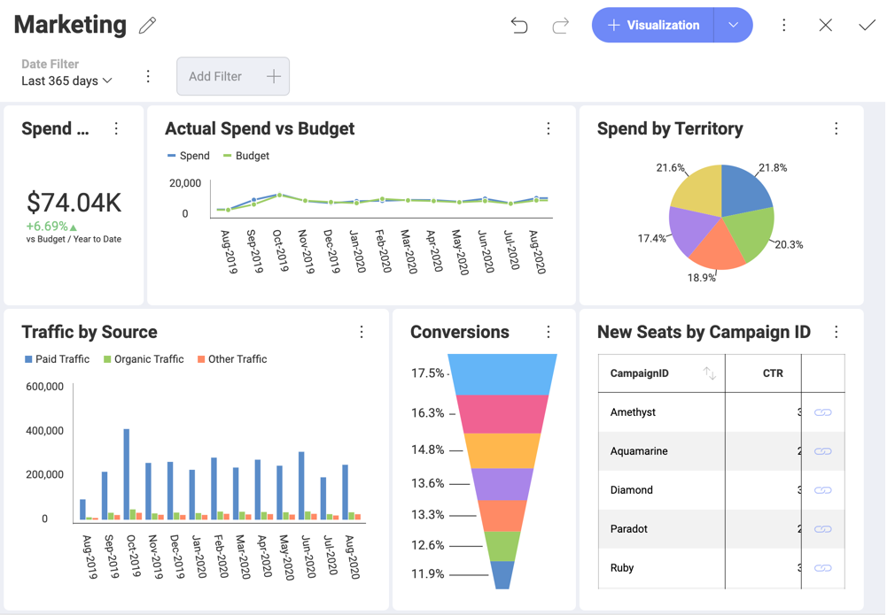
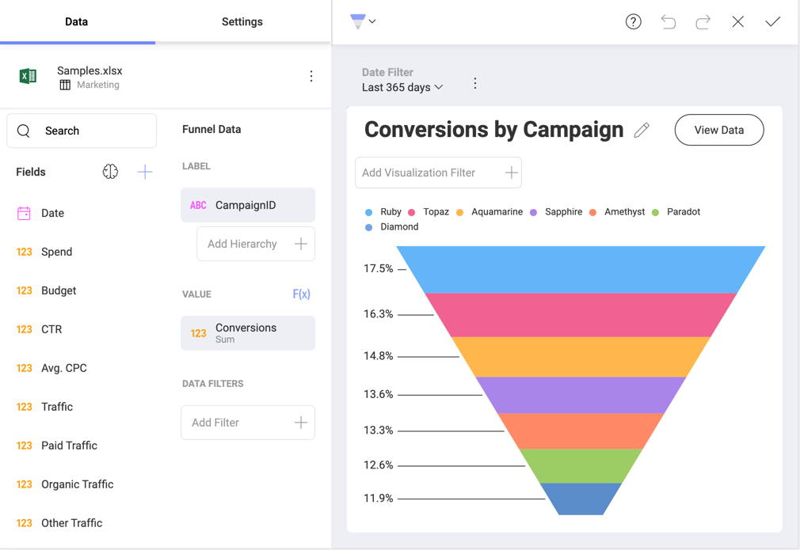
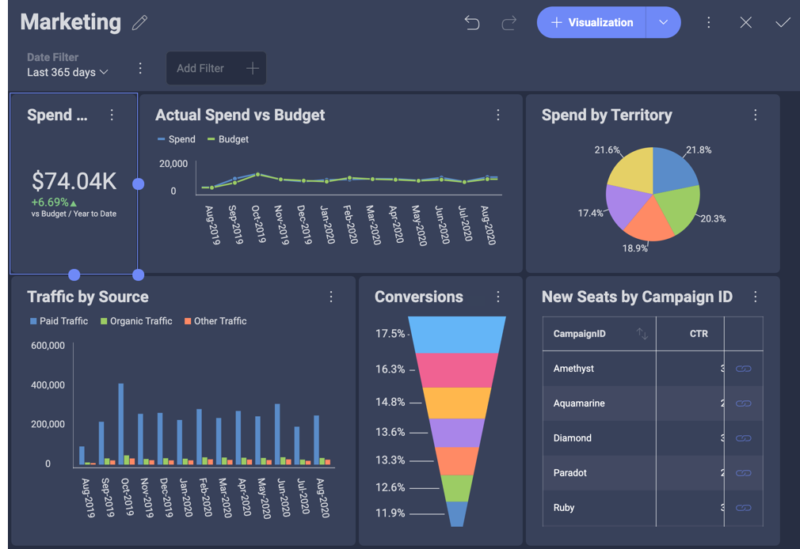
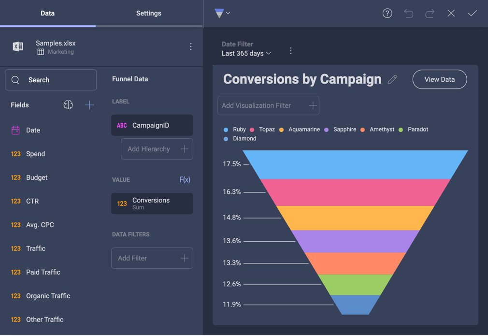
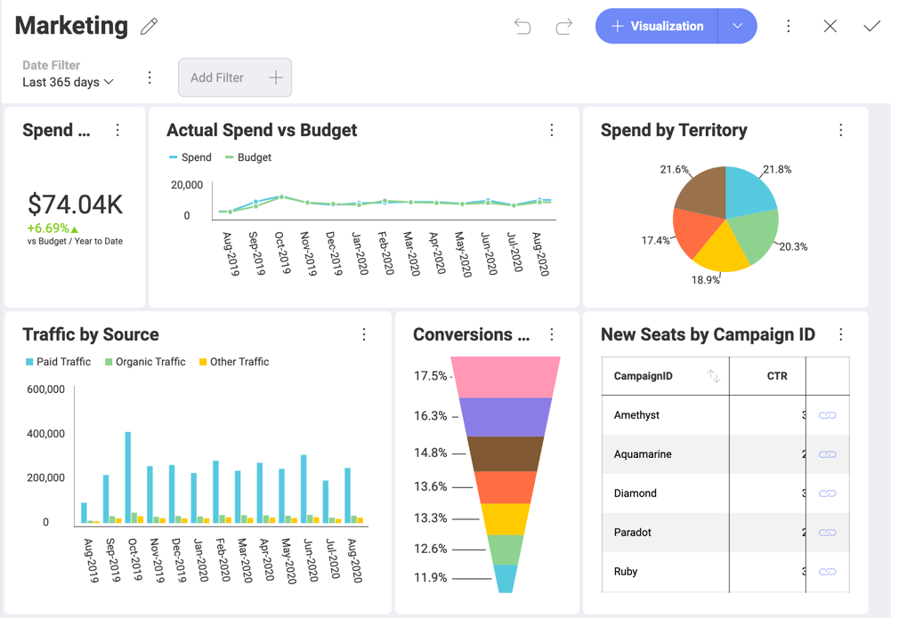
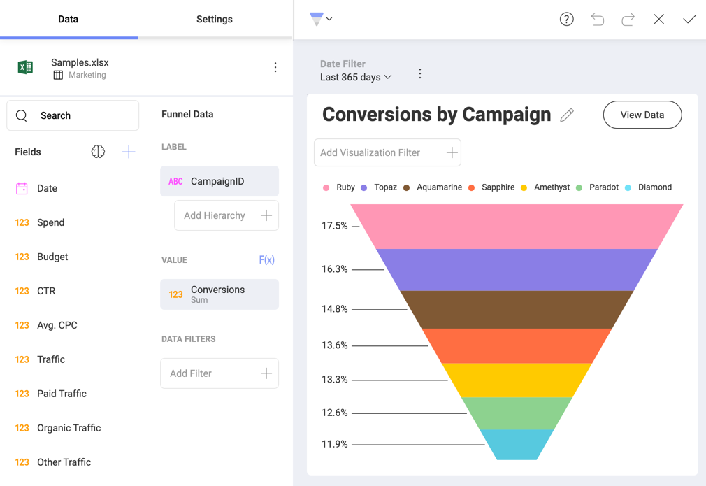
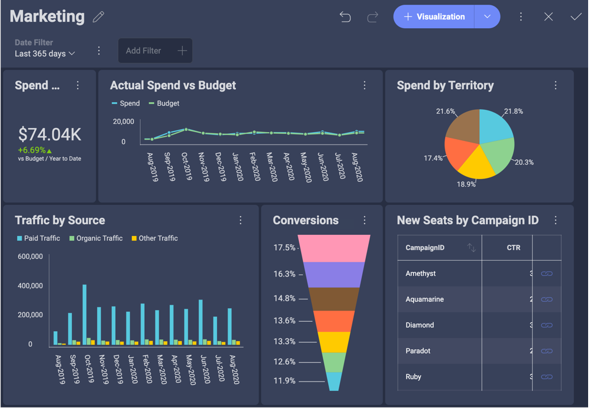
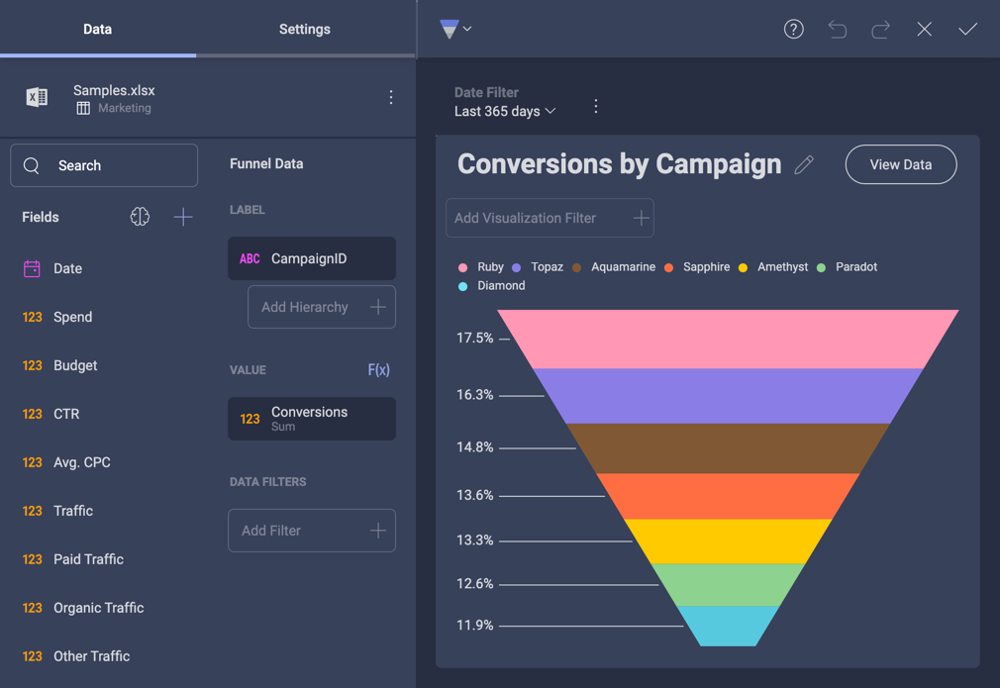

## Creating Custom Themes

### Overview

When embedding analytics into your existing applications it is key that those dashboards match your app's look and feel. That's why you have full control over the Reveal dashboards through our SDK.

Creating your own theme in Reveal is done by modifying the **Theme** property. 

``` csharp

var regularFont = new FontFamily(new Uri("pack://application:,,,/ [Your ProjectName];component/[pathToFonts]/"), "./#Verdana Italic");
var boldFont = new FontFamily(new Uri("pack://application:,,,/ [Your ProjectName];component/[pathToFonts]/"), "./#Verdana Bold");
var mediumFont = new FontFamily(new Uri("pack://application:,,,/ [Your ProjectName];component/[pathToFonts]/"), "./#Verdana Bold Italic");

var currentTheme = RevealSdkSettings.Theme;
currentTheme.ChartColors.Clear();
currentTheme.ChartColors.Add(Color.FromRgb(192, 80, 77));
currentTheme.ChartColors.Add(Color.FromRgb(101, 197, 235));
currentTheme.ChartColors.Add(Color.FromRgb(232, 77, 137);

currentTheme.BoldFont = new FontFamily("Gabriola");
currentTheme.MediumFont = new FontFamily("Comic Sans MS");
currentTheme.FontColor = Color.FromRgb(31, 59, 84);
currentTheme.AccentColor = Color.FromRgb(192, 80, 77);
currentTheme.DashboardBackgroundColor = Color.FromRgb(232, 235, 252);

RevealSdkSettings.Theme = currentTheme;

```

> [!NOTE]
> You first need to clear your chart colors list default values to have the new set of colors added.

If you have a dashboard or another Reveal component already displayed on your screen, you will need to render it again in order to see the applied changes.

### Customizable Theme Settings

In the table below, you will find all settings you can customize, followed by a short description, type and the default values for each one. 

| Name                              | Description                                                                                                                                                                                                                                                                       | Type        | Default |
| --------------------------------- | --------------------------------------------------------------------------------------------------------------------------------------------------------------------------------------------------------------------------------------------------------------------------------- | ----------- | ------- |
| **ChartColors**                | The colors used to show the series in your visualizations. You can add an unlimited number of colors. Once all colors are used in a visualization, Reveal will autogenerate new shades of these colors. This way your colors won’t repeat and each value will have its own color. | List\<Color> |         |
| **AccentColor**                  | Sets the Accent Color                                                      | Color |   *Accent color RGB values*      |
| **DashboardBackgroundColor**                  | Sets the background color                                                     | Color |   *background color RGB values*      |
| **ConditionalFormatting** | Change the default colors of the bounds you can set when using conditional formatting                                                                                                                                                                                             |  List\<Color>           |         |
| **BoldFont**                      | Sets the bold font                                                                                                                                                                                                                                                                | FontFamily | *Verdana Italic*
| **MediumFont**                    | Sets the medium font                                                                                                                                                                                                                                                              | FontFamily | *Verdana Bold*
| **RegularFont**                   | Sets the regular font                                                                                                                                                                                                                                                             |   FontFamily          |   *Verdana Bold Italic*      |

### Pre-Built Themes 

Reveal SDK comes with four pre-built themes: *Mountain Light*, *Mountain Dark*, *Ocean Light*, and *Ocean Dark*. You can set the one that best matches your application's design, or you can also use it as the basis for your custom theme modifications.    

Apply the settings of a chosen pre-built theme by creating a new instance.

***Mountain Light Theme***
``` csharp
RevealSdkSettings.Theme = new MountainLightTheme();
```
> [NOTE]
> Mountain Light contains the default values for the customizable settings shown in the table above. 

***Mountain Dark Theme***
``` csharp
RevealSdkSettings.Theme = new MountainDarkTheme();
```

***Ocean Light Theme***
``` csharp
RevealSdkSettings.Theme = new OceanLightTheme();
```

***Ocean Dark Theme***
``` csharp
RevealSdkSettings.Theme = new OceanDarkTheme();
```

#### How Pre-Built Themes Look? 

Below, you will find a table showing how the *Visualization Editor* and *Dashboard Editor* look when each of the pre-built themes is applied. 

<style type="text/css">
.tg  {border-collapse:collapse;border-spacing:0;}
.tg td{border-color:black;border-style:solid;border-width:1px;font-family:Arial, sans-serif;font-size:14px;
  overflow:hidden;padding:10px 5px;word-break:normal;}
.tg th{border-color:black;border-style:solid;border-width:1px;font-family:Arial, sans-serif;font-size:14px;
  font-weight:normal;overflow:hidden;padding:10px 5px;word-break:normal;}
.tg .tg-fymr{border-color:inherit;font-weight:bold;text-align:left;vertical-align:top}
.tg .tg-0pky{border-color:inherit;text-align:left;vertical-align:top}
</style>
<table class="tg">
<thead>
  <tr>
    <th class="tg-fymr">Theme</th>
    <th class="tg-0pky"><span style="font-weight:bold">Dashboard Editor</span></th>
    <th class="tg-0pky"><span style="font-weight:bold">Visualization Editor</span></th>
  </tr>
</thead>
<tbody>
  <tr>
    <td class="tg-0pky">Mountain Light (Default?)</td>
    <td class="tg-0pky"></td>
    <td class="tg-0pky"></td>
  </tr>
  <tr>
    <td class="tg-0pky">Mountain Dark </td>
    <td class="tg-0pky"></td>
    <td class="tg-0pky"></td>
  </tr>
  <tr>
    <td class="tg-0pky">Ocean Light</td>
    <td class="tg-0pky"></td>
    <td class="tg-0pky"></td>
  </tr>
  <tr>
    <td class="tg-0pky">Ocean Dark</td>
    <td class="tg-0pky"></td>
    <td class="tg-0pky"></td>
  </tr>
</tbody>
</table>