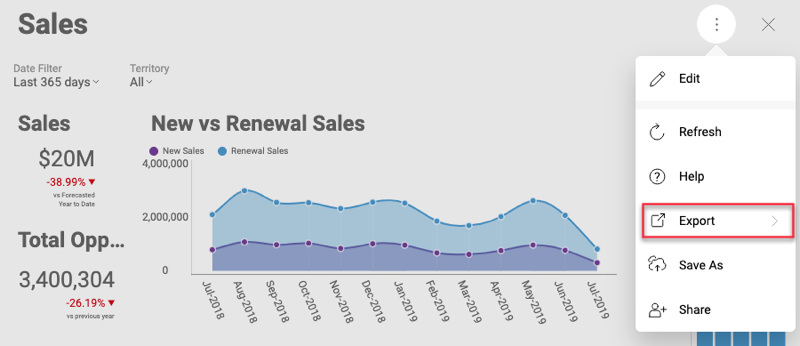

## Exporting a Dashboard or a Visualization

### Overview

If you want to export a dashboard or a particular visualization, you can choose between the following export options:

- as an **image**;
- as a **PDF** document;
- as a **PowerPoint** presentation;
- into **Excel** data format.  

To enable a dashboard or a visualization export, you can:

  - use the export setting [in the
    RevealView](#enable-export-revealview), or

  - initiate export programmatically [outside of the
    RevealView](#programmatically-initiated-export), when exporting **as an image**.

### Prerequisites for Export as an Image Option

To use the Export as an image feature you will need to add a reference to [CefSharp.Wpf NuGet package (\>= 83.4.20)](~/en/developer/setup-configuration/setup-configuration-desktop.md) to your project.

<a name='enable-export-revealview'></a>

### Using the Export Setting

To enable your end users to generate an image, document or a presentation out of a dashboard you simply need to set the relevant property to true when loading the dashboard:

- __RevealView.ShowExportImage__ - for export as an **image**;

- __RevealView.ShowExportToPDF](api-reference__ - for export as a **PDF** document;

- __RevealView.ShowExportToPowerpoint__ - for export as a **PowerPoint** presentation;

- __RevealView.ShowExportToExcel__ - for export in **Excel** data format.

This will make the *Export* button available in the overflow menu when a dashboard is opened or a particular visualization is maximized.



When the user clicks the *Export* button, they can choose one of the enabled export options.

#### Specifics when using the image export option

If the user chooses the _Export Image_ from the export options, the _Export image_ dialog will open. Here, the user can choose between two options: *Copy to clipboard* and *Export Image*.

If they click the *Export Image* button on the bottom right, the RevealView raises the __ImageExported__ event. To access the image via the __Image
Property__
of the __ImageExportedEventArgs__, you need to have already subscribed to this event through the event handler. If you haven't subscribed to the event the save file dialog will be opened for the user to specify a location to save the image to.

Here’s a sample implementation of the *ImageExported* event handler:

``` csharp
private void RevealView_ImageExported(object sender, ImageExportedEventArgs e)
{
  var image = e.Image;
  if (image == null) return;
  // save to disk just to open it with some app
  var imageFile = Path.GetTempFileName() + ".png";
  using (var fileStream = new FileStream(imageFile, FileMode.Create))

  {
    BitmapEncoder encoder = new PngBitmapEncoder();
    encoder.Frames.Add(BitmapFrame.Create(image));
    encoder.Save(fileStream);
  }

  System.Diagnostics.Process.Start(imageFile);
}
```

The other property of the *ImageExported* event arguments is the
__CloseExportDialog__. Its default value is set to true. If you set it to false, the *Export Image* dialog won’t be closed after finishing of the event handler invocation.

It might be useful to set the *CloseExportDialog* to false in a
scenario, in which you show a save dialog to the end user so they can choose where to save the image. If the user does not pick a location and filename and closes the save dialog, you might want to keep the ExportImage dialog opened.

<a name='programmatically-initiated-export'></a>

### Programmatically Initiated Image Export

To get an image of the RevealView programmatically, you will need to invoke the __ToImage__ method. Calling this method will not result in showing the *Export Image* dialog. This way, you can get a screenshot when the user clicks a button, which is outside of the RevealView. This method will create a screenshot of the RevealView component as it is displayed on the screen.

Keep in mind that if the end user has any dialog opened at the time of the *ToImage* method call, the dialog will appear in be screenshot together with the dashboard.
