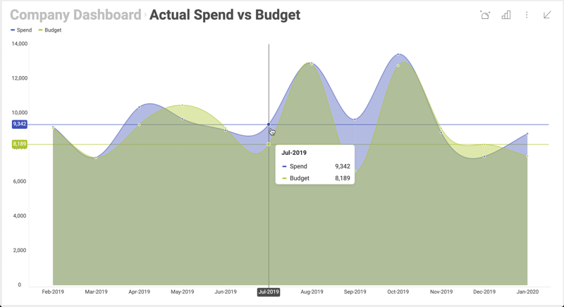

## Maximizing Visualizations and Single Visualization Mode

### Overview

When displaying a dashboard to the user, there are some cases in which
you’d like to display just one maximized visualization. In addition, you
might also want to lock the initial visualization and prevent the user
from accessing the whole dashboard. You can achieve both scenarios using
the Desktop SDK.



#### Example Details

Let’s assume that you have a dashboard with three visualizations, where
each visualization is showing data for a different division of your
company, i.e., “Marketing”, “Sales” and “HR”.


In this example, you’d like to showcase these visualizations in your
corporate application. You want to include them as part of the
information displayed on each division’s home page.

### Maximizing Visualizations

To open a dashboard with a maximized visualization, you need to use the
__MaximizedVisualization__
attribute of
__RevealSettings__. When you
don’t set a visualization in this attribute, the whole dashboard is
displayed.

As shown in [**Configuring the RevealViewobject**](configuring-revealview-desktop.md), you can display a specific dashboard in your page. This time, you also need to set the
__MaximizedVisualization__
attribute. As shown in the code snippet below with the visualization
"Sales".

``` csharp
var revealView = new RevealView();
using (var fileStream = File.OpenRead(path))
{
    var dashboard = await RevealUtility.LoadDashboard(fileStream);

    var settings = new RevealSettings(dashboard);
    settings.MaximizedVisualization = dashboard.GetVisualizationByTitle("Sales");
    revealView.Settings = settings;
}
```

Although the initial maximized visualization will be the one with title
‘Sales’, the end user can still return to the dashboard and see the
rest of the visualizations.

### Single Visualization Mode

You may also want to lock the initial visualization, making it the only
one displayed at all times. This way the dashboard works like a single
visualization dashboard. This is the concept behind “single
visualization mode”.

To turn on the “single visualization mode”, just set the
__SingleVisualizationMode__
property to true, as shown below.

``` csharp
settings.SingleVisualizationMode = true;
```

After adding this single line, the dashboard will work as a single
visualization dashboard. You can do the same for each division’s home
page, just replace the title of the visualization in
__GetVisualizationByTitle__
with the right one.

#### Dynamically changing a locked visualization

It is also possible for you to dynamically change the single
visualization being displayed, without reloading the page. From the
user’s perspective, your app would be a single page application with a
selector of divisions and a maximized visualization. After the user
chooses one division from the list, the maximized visualization is
updated.

You can achieve this scenario by using the
__MaximizeVisualization__
method in __RevealView__, as
shown below:

``` csharp
private void MaximizeVisualization(string title)
        {
            revealView.MaximizeVisualization(revealView.Dashboard.GetVisualizationByTitle(title));
        }
```

Finally, you have to connect your custom control with the method above.
That way the visualization will be maximized when the selection in your
application changes.

To take into account:

  - You can generate the list of buttons dynamically by iterating the
    list of visualizations in the dashboard. For further details see
    __RVDashboard.Visualizations__.
  - There is a working example in the **Manufacturing.xaml.cs** view, in
    the *UpMedia* WPF application distributed with the SDK. That sample
    view shows all visualizations as a list of toggle buttons, at the bottom of the screen.
