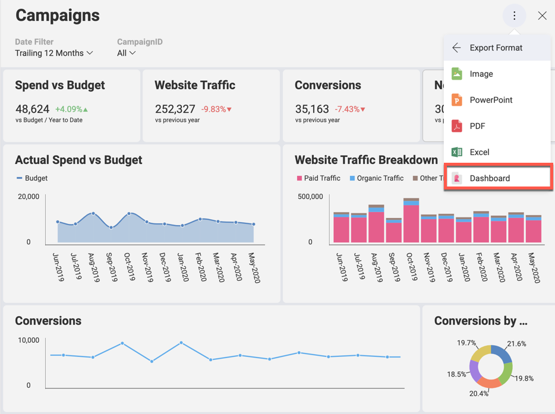

# Getting Dashboards for the SDK

## Introduction

Reveal is a business intelligence platform that was purposely designed to be embedded into applications. Embedded Reveal dashboards are a quick and simple way to display information to communicate the status, metrics, or performance of a business.  

Let's take a look at the differences between Reveal SDK and the Reveal app.

The **Reveal Application** is a self-service business intelligence tool that enables you to make data-driven decisions faster. You can create, view and share dashboards in your workspaces. And it offers you an identical experience no matter what platform you are on: Web, Desktop, iOS, or Android. For further details about the Reveal app, you can access an [**online demo**](https://app.revealbi.io/) or browse the [**Help Documentation**](https://www.revealbi.io/help/).

With **Reveal SDK** developers can embed Reveal into their applications developed in multiple platforms and technologies. And Reveal dashboards can be displayed and even modified by end users.

## Overview

In order to display dashboards in your application you first need to create them using the Reveal Application on your preferred platform.

You can also use the Reveal SDK to create dashboards from scratch, but the recommended approach when you are first evaluating the SDK is to start with dashboards created with the app.

## Getting your Dashboard File

Once you [**created your dashboard**](https://www.revealbi.io/help/creating-dashboards), below you can find how to get it:

1.  **Open your Dashboard in the Reveal app**

    After installing the Reveal Application in any platform, you can either create your own dashboard or use one of the sample dashboards provided with the app.

2.  **Access the Export Options**

    Go to the overflow menu, select *Export*, then *Dashboard*, this will generate a file with extension “.rdash” that you will use later in your application when integrating the SDK.

    

    You can export the dashboard file through email (Android and iOS), or as a .rdash file on your computer (Desktop and Web).
