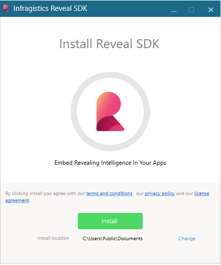
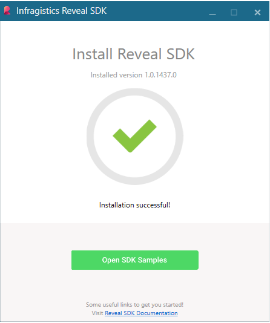

## System Requirements and Installation

### Desktop SDK Requirements

The Reveal SDK requires .NET version 4.6.2+ and Visual Studio 2015 or up.

### Web SDK Requirements

The Reveal Server SDK requires .NET Core 2.2+ server-side projects
targeting .NET framework 4.6.2+.

### Installing Reveal SDK

To get the Reveal SDK for both Web and Desktop platforms, sign up [here](https://www.revealbi.io/#download-sdk).
Once ready, follow through the provided installer:

After a successful installation, you can browse the installed samples by clicking the *Open SDK Samples* link.

### Samples

In case you missed the samples link, you can find them in
“%public%\\Documents\\Infragistics\\Reveal\\SDK\\”.

In this location you will find a solution file (Reveal.Sdk.Samples.sln). This project combines all Web, WPF, and WinForms samples.

For Web you need to restore the node packages in order to run the samples with IIS and change the StartUp project. To restore, just right click the solution in the Solution Explorer and select Restore packages.
