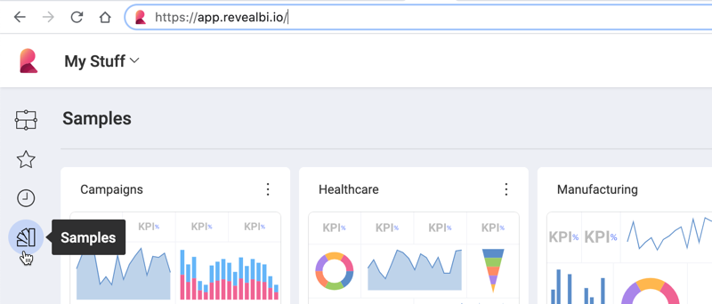
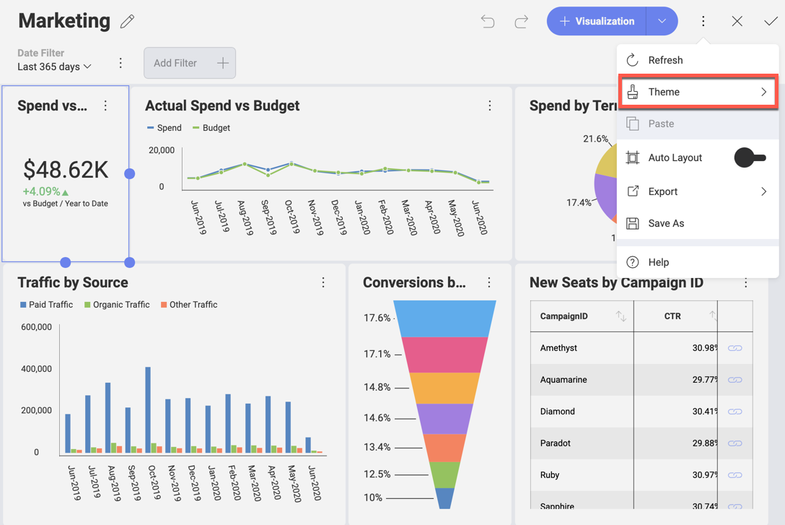
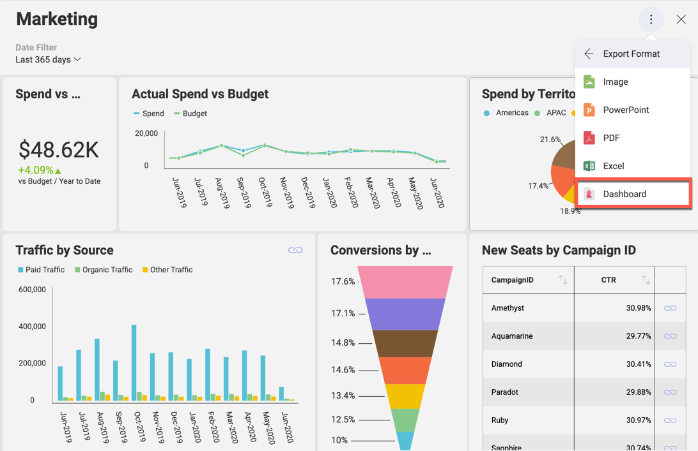

## Creating Your First App

This part aims to guide you through the initial steps of showing a
dashboard on your web page/application for the first time.

### Steps

1.  Creating the Project
2.  Installing Reveal SDK
3.  Working on Server configuration
4.  Embedding Reveal in your Client Application
5.  Using Reveal Fonts
6.  Styling the Client Application

### Step 1 - Create the Project

Open Visual Studio 2017 and create new project of type **ASP.NET Core
Web Application**:


Select **.NET Framework** and **ASP.NET Core 2.2** as follows:


Step 1 sample **[git
commit](https://github.com/Infragistics/reveal-sdk-web-sample/commit/90b5a2952e98e8138751e3c9fd78864acc9c0a4f)**

### Step 2 - Install Reveal SDK

Download the *Infragistics Reveal SDK* from <https://www.revealbi.io/>
and install it on your machine. In **Visual Studio** go to **Tools \>
Options \> Nuget Package Manager \> Package Sources**. Add a new source
pointing to the Nuget folder of the installed SDK:


After that you can install the Nuget by changing the package source to
the one you added:


Step 2 sample **[git
commit](https://github.com/Infragistics/reveal-sdk-web-sample/commit/3308bd229c1b50efd12e553e1e54d5ac4d36b6e3)**.

### Step 3 - Work on Server Configuration

Create a new *Reveal SDK* folder in the project and add the
**RevealSdkContext.cs** class, which implements the
**IRevealSdkContext** interface:

``` csharp
    using Reveal.Sdk;
    using System;
    using System.IO;
    using System.Reflection;
    using System.Threading.Tasks;

    namespace Demo1.RevealSDK
    {
        public class RevealSdkContext : IRevealSdkContext
        {
            public IRVDataSourceProvider DataSourceProvider => null;

            public IRVDataProvider DataProvider => null;

            public IRVAuthenticationProvider AuthenticationProvider => null;

            public Task<Stream> GetDashboardAsync(string dashboardId)
            {
                var resourceName = $"Demo1.Dashboards.{dashboardId}";
                var assembly = Assembly.GetExecutingAssembly();
                return Task.FromResult(assembly.GetManifestResourceStream(resourceName));
            }

            public Task SaveDashboardAsync(string userId, string dashboardId, Stream dashboardStream)
            {
                throw new NotImplementedException();
            }
        }
    }
```

In the code above **Demo1.Dashboards** indicates the location where the
dashboard files will be contained, so let’s create a new Dashboards
folder in the project and leave it empty for now.

To do this, add the following code to **ConfigureServices** method in
**Startup.cs**:

``` csharp
   services.AddRevealServices(new RevealEmbedSettings
    {
        CachePath = @"C:\Temp"
    }, new RevealSdkContext());

    services.AddMvc().AddReveal();
```

And the necessary references in the same file:

``` csharp
    using Demo1.RevealSDK;
    using Reveal.Sdk;
```

Step 3 sample **[git
commit](https://github.com/Infragistics/reveal-sdk-web-sample/commit/44340ad7154f7101f80fce4aea50153ccbd902d7)**.

If you experience any issues, please refer to the [**Setup
and Configuration (Web)**](~/en/developer/general/setup-configuration-web.md)
topic.

### Step 4 - Embed Reveal in your Client application

Let’s start this step by getting a dashboard ready. For the purpose of
this demo, you can use the **Marketing dashboard** from the **Samples**
section in Reveal, but with a different theme.

Open the Reveal app (<https://app.revealbi.io>) and go to the **Samples**.




Select the Marketing dashboard and enter **edit mode**:


Once in Edit mode click the *Theme* button:




And choose the *Ocean Theme*:


Save the modified dashboard and *Export* it:

> [!NOTE]
> As the Marketing dashboard is part of the Reveal App **Samples**, you cannot save it the same way as a regular dashboard. Instead, you need to use **Save As** and choose a location.



Move the **Marketing.rdash** dashboard file to the Dashboards folder,
which you created in step 3, and set the Build Action for this item to
**Embedded resource** in Visual Studio:


Now let’s add a new page _Marketing.cshtml_ **to the Views folder** in order to visualize the downloaded dashboard:

``` csharp
   @{
        ViewData["Title"] = "Marketing";
    }

    @section Scripts
        {
        <script type="text/javascript">
            // Load dashboard in #revealView element
        </script>
    }

    <section>
        <div id="revealView" style="height:800px;"></div>
    </section>
```

Then, add a new action method in **HomeController.cs**:

``` csharp
   public IActionResult Marketing()
    {
        return View();
    }
```

Let’s add some references to scripts & css files for some third party dependencies of Reveal in **\_Layout.cshtml** :

``` html
   <script src="https://unpkg.com/dayjs"></script>
   <link rel="stylesheet" href="https://code.jquery.com/ui/1.10.2/themes/smoothness/jquery-ui.css" />
   <script type="text/javascript" src="https://ajax.aspnetcdn.com/ajax/jQuery/jquery-3.2.1.min.js"></script>
   <script src="https://code.jquery.com/ui/1.12.1/jquery-ui.min.js"></script>
   <script src="https://cdn.quilljs.com/1.3.6/quill.js"></script>
   <link href="https://cdn.quilljs.com/1.3.6/quill.snow.css" rel="stylesheet">
```

To continue, create a new Reveal folder in the *wwwroot* folder of the
project. Copy there **infragistics.reveal.js**, which you can find in
the **\<InstallationDirectory\>\\SDK\\Web\\JS\\Client** of the *Reveal SDK*:


And then reference this library in **\_Layout.cshtml** after the scripts
for Day.js:

``` html
   <script src="~/Reveal/infragistics.reveal.js"></script>
```

In the same file, also remove the footer section and add a link in the
navigation for the new page:

``` html
   <li class="nav-item">
        <a class="nav-link text-dark" asp-area="" asp-controller="Home" asp-action="Marketing">Marketing</a>
   </li>
```

Let’s update the script in **Marketing.cshtml** with the logic for
loading the dashboard:

``` js
    var dashboardId = "Marketing.rdash";

    $.ig.RVDashboard.loadDashboard(dashboardId, function (dashboard) {
        var revealView = new $.ig.RevealView("#revealView");
        revealView.dashboard = dashboard;
    }, function (error) {
        //Process any error that might occur here
    });
```

Finally, when running the web page, you can see the dashboard:


Step 4 sample **[git
commit](https://github.com/Infragistics/reveal-sdk-web-sample/commit/380d369b46437c3913ed3c61de32a7f607b96b47)**.

If you experience any issues, please refer to the [**Setup and Configuration (Web)**](~/en/developer/general/setup-configuration-web.md)
topic.

### Step 5 - Use Reveal Fonts

Reveal app uses Roboto fonts. In order to achieve the same look as in
the app, download the fonts from
<https://fonts.google.com/specimen/Roboto> and copy the following TTF
files to the **wwwroot/css** folder of your project:

  - Roboto-Regular.ttf

  - Roboto-Bold.ttf

  - Roboto-Light.ttf

  - Roboto-Medium.ttf

Then, add references in the **site.css** as follows:

``` css
@font-face {
   font-family: "Roboto-Regular";
   src: url("Roboto-Regular.ttf");
}

@font-face {
   font-family: "Roboto-Bold";
   src: url("Roboto-Bold.ttf");
}

@font-face {
   font-family: "Roboto-Light";
   src: url("Roboto-Light.ttf");
}

@font-face {
   font-family: "Roboto-Medium";
   src: url("Roboto-Medium.ttf");
}
```

For font loading improvements add a reference to the Google Web Font
Loader in **\_Layout.cshtml** next to the infragistics.reveal.js
reference:

``` html
<script src="https://ajax.googleapis.com/ajax/libs/webfont/1/webfont.js"></script>
```

Finally, modify the script section of the **Marketing.cshtml** page to
take advantage of the font loader:

``` csharp
   WebFont.load({
        custom: {
            families: ['Roboto-Regular', 'Roboto-Bold', 'Roboto-Light', 'Roboto-Medium'],
            urls: ['/css/site.css']
        },
        active: function () {
            var dashboardId = "Marketing.rdash";

            $.ig.RVDashboard.loadDashboard(dashboardId, function (dashboard) {
                var revealView = new $.ig.RevealView("#revealView");
                revealView.dashboard = dashboard;
            }, function (error) {
                //Process any error that might occur here
            });
        },
    });
```

Voila\!


Step 5 sample **[git
commit](https://github.com/Infragistics/reveal-sdk-web-sample/commit/9fd40e047bf6aa4c03258112e6d47f577625a63b)**.

### Step 6 - Style the Client Application

Instead of using the default template, you can style the Client
application.

Remove the Privacy from **HomeController.cs** and modify the Index to
redirect to Marketing:

``` csharp
   public IActionResult Index()
    {
        return RedirectToAction("Marketing");
    }
```

Also, remove the *Index.cshtml* and *Privacy.cshtml* files since they
won’t be used. Remove the style setting for the \<div\> element in
*Marketing.cshtml*.

Create а new img folder in *wwwroot* and copy there the **logo.png**,
which you can download from
[here](https://download.infragistics.com/reveal/help/samples/logo.png?).

In **\_Layout.cshtml** make the following changes:

  - Change the title from *Demo1* to *Overview*

  - Remove the div after the header

  - Modify the header by adding logo, separator and title:

<!-- end list -->

``` html
   <header>
        <div class="header">
            
            <span class="line" />
            <h1>Overview</h1>
        </div>
    </header>
```

In **site.css** remove all the styles, except the ones we added for the
*Roboto* fonts and add styles for the header:

``` css
  /* Header
    -------------------------------------------------- */

    header {
        display: flex;
        width: 100%;
        height: 70px;
        box-shadow: 0 4px 12px 0 rgba(0, 0, 0, 0.2);
        background-color: #37405a;
    }

    img.logo {
        width: 50px;
        height: 50px;
        margin: 10px;
        float: left;
    }

    span.line {
        float: left;
        width: 1px;
        height: 50px;
        margin-top: 10px;
        border: solid 1px #2b2e40;
    }

    h1 {
        float: left;
        padding-top: 12px;
        padding-left: 20px;
        height: 24px;
        font-family: Roboto-Regular;
        font-size: 20px;
        font-weight: 400;
        color: #ffffff;
    }
```

And styles for the body:

``` css
  /* Body
    -------------------------------------------------- */
    body {
        display: flex;
        flex-direction: column;
        background-image: linear-gradient(to bottom, #30365a, #2b2e40);
    }

    html, body {
        width: 100%;
        height: 100%;
    }

        body section {
            display: block;
            width: 100%;
            height: 100%;
            padding: 15px;
        }

    #revealView {
        height: 100%;
    }
```

And this should be your result:


Step 6 sample **[git
commit](https://github.com/Infragistics/reveal-sdk-web-sample/commit/085fd35db4d07eb9130ff72dd3bb96a157f6d4ed)**.
