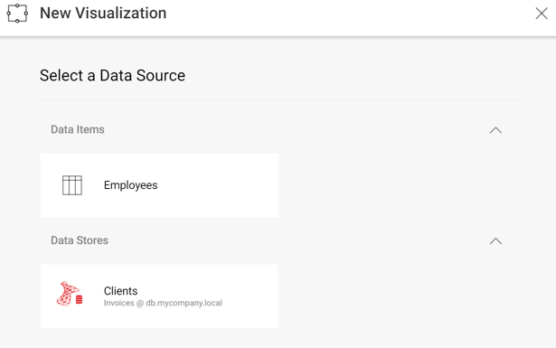

## Creating New Visualizations and Dashboards

### Overview

As described in [**Editing & Saving
Dashboards**](editing-saving-dashboards.md), there are two ways
to handle how you save changes to dashboards: **client-side and
server-side**. Those scenarios work fine when users make minor changes
to existing dashboards like:

  - Adding/modifying filters
  - Changing the type of visualization (chart, gauge, grid, etc.)
  - Changing the theme

However, to add new visualizations the user needs to **select the data source** to be used. To do that, the containing application needs to provide information to the SDK, so it can display the list of data sources available for a new visualization.

### Displaying a List of Data Sources

The callback you need to use to display a list of data sources is
__onDataSourcesRequested__.
In the case that you don’t set your own function to this callback, when a new visualization is created, Reveal will display all data sources used in the dashboard (if any).

#### Code:

The code below shows how to configure the *data source selection* screen to show an “in-memory” item and a SQL Server data source.

``` js
window.revealView.onDataSourcesRequested = function (callback) {
    var inMemoryDSI = new $.ig.RVInMemoryDataSourceItem("employees");
    inMemoryDSI.title("Employees");
    inMemoryDSI.description("Employees");

    var sqlDs = new $.ig.RVSqlServerDataSource();
    sqlDs.title("Clients");
    sqlDs.id("SqlDataSource1");
    sqlDs.host("db.mycompany.local");
    sqlDs.port(1433);
    sqlDs.database("Invoices");

    callback(new $.ig.RevealDataSources([sqlDs], [inMemoryDSI], false));
};
```

The “false” value in the third parameter prevents existing data sources on the dashboard from being displayed. So, when creating a new widget using the “+” button, you should get the following screen:



Please note that the “employees” parameter passed to the “RVInMemoryDataSourceItem” constructor, is the same dataset id used in [**In-Memory Data Support**](~/en/developer/web-sdk/using-the-server-sdk/in-memory-data.md) and identifies the dataset to be returned on the server side.

### Creating New Dashboards

Creating dashboards from scratch is really simple, you just need to:

  - Initialize __$.ig.RevealView__ object, without setting the dashboard property to $.ig.RevealView and without using __$.ig.RVDashboard.loadDashboard__;

  - Set *startInEditMode* to true, to start the dashboard in edit mode:

  - Set the dashboard property to newly created instance of __$.ig.RVDashboard__

<!-- end list -->

``` js
var revealView = new $.ig.RevealView("#revealView");
revealView.startInEditMode = true;
revealView.dashboard = new $.ig.RVDashboard;
```

You can find a working example, **CreateDashboard.cshtml**, in the
*UpMedia* web application distributed with the SDK.
