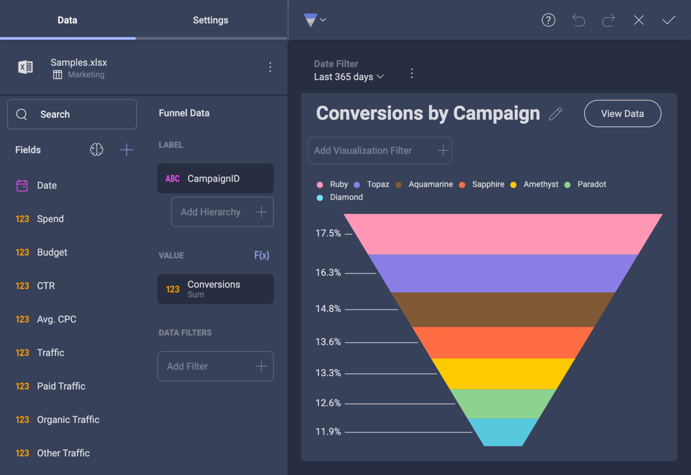

## Creating Custom Themes

### Overview

When embedding analytics into your existing applications it is key that those dashboards match your app's look and feel. That's why you have full control over the Reveal dashboards through our SDK.

Key customizations you can achieve with custom themes:

- **Color palettes**: The colors used to show the series in your visualizations. You can add an unlimited number of colors. Once all colors are used in a visualization, Reveal will autogenerate new shades of these colors. This way your colors won’t repeat and each value will have its own color.
- **Accent color**: The default accent color in Reveal is a shade of Blue that you can find in the **+ Dashboard** button and other interactive actions. You can change the color to match the same accent color you use in your applications.
- **Conditional formatting colors**: Change the default colors of the bounds you can set when using conditional formatting.
- **Font**: Reveal uses three types of text in the application: regular, medium and bold. You can specify the font uses for each of these text groups.
- **Visualization and dashboard background colors**: You can configure separately the background color of your dashboard and the background color of the visualizations.

### Common Use Case: A New Custom Theme
Creating your own theme in Reveal is as easy as creating an instance of the new __$.ig.RevealTheme()__ class. This class contains all the customizable settings listed in the overview.

When creating a new __$.ig.RevealTheme__ instance, you will get the default values for each setting and you can modify them as needed.

Then, pass the theme instance to the __$.ig.RevealSdkSettings__'s class static theme property. If you have a dashboard or another Reveal component already displayed on your screen, you will need to render it again(set the dashboard property again) in order to see the applied changes.

### Common Use Case: Modifying a Custom Theme

You may have already applied your own theme but want to modify some of the settings without losing the changes you made to the others.

In this case, you need to get the theme static property from the __$.ig.RevealSdkSettings__. This enables you to get the last values you have set for your RevealTheme settings. Unlike the case when you create a new instance of the RevealTheme from scratch, after applying your changes and updating your theme again, you will get the current values for each setting you didn’t modify instead of the default values.

### Code Example

First, here's a sample dashboard before we make any changes:


In the following code snippet you can see how to create a new instance of the _revealTheme_ class, apply the changes to the settings you want and update the theme in Reveal Web.

``` js

var revealTheme = new $.ig.RevealTheme();
revealTheme.chartColors = ["rgb(192, 80, 77)", "rgb(101, 197, 235)", "rgb(232, 77, 137)"];

revealTheme.mediumFont = "Gabriola";
revealTheme.boldFont = "Comic Sans MS";
revealTheme.fontColor = "rgb(31, 59, 84)";
revealTheme.accentColor = "rgb(192, 80, 77)";
revealTheme.dashboardBackgroundColor = "rgb(232, 235, 252)";

$.ig.RevealSdkSettings.theme = revealTheme;

```

> [!NOTE]
> When defining the boldFont, regularFont or mediumFont settings of a reveal theme you need to pass the exact font family name. The weight is defined by the definition of the font itself and not in the name. You might need to use @font-face (CSS property) to make sure the font-face name specified in the $.ig.RevealTheme font settings are available.

In addition, for the fonts customization you need to add these lines to the CSS of the page:

``` CSS

<link href="https://fonts.googleapis.com/css?family=Righteous" rel="stylesheet">
<link href="https://fonts.googleapis.com/css?family=Domine" rel="stylesheet">
<link href="https://fonts.googleapis.com/css?family=Caveat" rel="stylesheet">

```

After implementing the theme changes, below you can see the results for both the Dashboard and Visualization Editors.


### Using Color Types

You can use either RGB (red, green, blue) or HEX colors to specify the color settings.

``` js

revealTheme.dashboardBackgroundColor = "rgb(232, 235, 252)";
revealTheme.dashboardBackgroundColor = "#E8EBFC";

```

### Built-In Themes 

Reveal SDK comes with four pre-built themes: *Mountain Light*, *Mountain Dark*, *Ocean Light*, and *Ocean Dark*. You can set the one that best matches your application's design, or you can also use it as the basis for your custom theme modifications.    

Apply the settings of a chosen pre-built theme by using the *UpdateCurrentTheme* method. 

***Mountain Light Theme***

``` js
$.ig.RevealSdkSettings.theme = new $.ig.MountainLightTheme();
```

> [!NOTE]
> Mountain Light contains the default values for the customizable theme settings. This means Mountain Light and the Reveal Theme look basically the same way. 

***Mountain Dark Theme***
``` js
$.ig.RevealSdkSettings.theme = new $.ig.MountainDarkTheme();
```

***Ocean Light Theme***
``` js
$.ig.RevealSdkSettings.theme = new $.ig.OceanLightTheme();
```

***Ocean Dark Theme***
``` js
$.ig.RevealSdkSettings.theme = new $.ig.OceanDarkTheme();
```

#### How the Built-In Themes Look? 

Below, you will find a table showing how the *Visualization Editor* and *Dashboard Editor* look when each of the pre-built themes is applied. 

<style type="text/css">
.tg  {border-collapse:collapse;border-spacing:0;}
.tg td{border-color:black;border-style:solid;border-width:1px;font-family:Arial, sans-serif;font-size:14px;
  overflow:hidden;padding:10px 5px;word-break:normal;}
.tg th{border-color:black;border-style:solid;border-width:1px;font-family:Arial, sans-serif;font-size:14px;
  font-weight:normal;overflow:hidden;padding:10px 5px;word-break:normal;}
.tg .tg-fymr{border-color:inherit;font-weight:bold;text-align:left;vertical-align:top}
.tg .tg-0pky{border-color:inherit;text-align:left;vertical-align:top}
</style>
<table class="tg">
<thead>
  <tr>
    <th class="tg-fymr">Theme</th>
    <th class="tg-0pky"><span style="font-weight:bold">Dashboard Editor</span></th>
    <th class="tg-0pky"><span style="font-weight:bold">Visualization Editor</span></th>
  </tr>
</thead>
<tbody>
  <tr>
    <td class="tg-0pky">Mountain Light (Default)</td>
    <td class="tg-0pky"></td>
    <td class="tg-0pky"></td>
  </tr>
  <tr>
    <td class="tg-0pky">Mountain Dark </td>
    <td class="tg-0pky"></td>
    <td class="tg-0pky"></td>
  </tr>
  <tr>
    <td class="tg-0pky">Ocean Light</td>
    <td class="tg-0pky"></td>
    <td class="tg-0pky"></td>
  </tr>
  <tr>
    <td class="tg-0pky">Ocean Dark</td>
    <td class="tg-0pky"></td>
    <td class="tg-0pky"></td>
  </tr>
</tbody>
</table>

