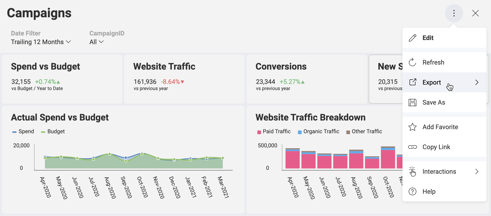

## Exporting a Dashboard or a Visualization

### Overview

If you want to export a dashboard or a particular visualization, you can choose between the following export options:

- as an **image**;
- as a **PDF** document;
- as a **PowerPoint** presentation;
- into **Excel** data format.  

To enable a dashboard or a visualization export, you can:

  - use the export setting [in the
    $.ig.RevealView](#enable-export-revealview), or

  - initiate export programmatically [outside of the
    $.ig.RevealView](#programmatically-initiated-export), when exporting **as an image**.

### Prerequisites for Export as an Image Option

You need to enable the **export image** functionality in the
server-side. To do this, please refer to [Enabling server-side screenshot generation](~/en/developer/setup-configuration/setup-configuration-web.html#server-side-image-export).

<a name='enable-export-revealview'></a>
### Using the Export Setting

To enable your end users to generate an image, document or a presentation out of a dashboard you simply need to set the relevant property to true:

- __revealView.showExportImage__ - for export as an **image**;

- __revealView.showExportToPDF__ - for export as a **PDF** document;

- __revealView.showExportToPowerpoint__ - for export as a **PowerPoint** presentation;

- __revealView.showExportToExcel__ - for export in **Excel** data format.

This will make the *Export* button available in the overflow menu when a dashboard is opened or a particular visualization is maximized.



When the user clicks the *Export* button, they can choose one of the enabled export options.

#### Specifics when using the image export option

If the user chooses the _Export Image_ from the export options, the _Export image_ dialog will open. Here, the user can choose between two options: *Copy to clipboard* and *Export Image*. If they click the *Export Image* button on the bottom right, the image will be sent to the end user.

In case the containing application needs to process the exported image in a different way it could provide __onImageExported__ callback where the output image could be accessed.
Here’s a sample implementation of the onImageExported callback:

``` js
  revealView.onImageExported = function (img) {
  var body = window.open("about:blank").document.body;
  body.appendChild(img);
}
```

<a name='programmatically-initiated-export'></a>
### Programmatically Initiated Image Export

To get an image of the $.ig.RevealView programmatically, you will need to invoke the
__ToImage__ method. Calling this method will not result in showing the *Export
Image* dialog. This way, you can get a screenshot when the user clicks a button, which is outside of the $.ig.RevealView. This method will create a screenshot of the revealView component as it is displayed on the screen.

``` js
  var image = revealView.toImage();
```

Keep in mind that if the end user has any dialog opened at the time of the *ToImage* method call, the dialog will appear in the screenshot together with the dashboard.

This could be useful in a scenario where the containing application would want to hide the expert button in the reveal view and trigger an export to image from another interaction that occurs outside of the reveal view.
