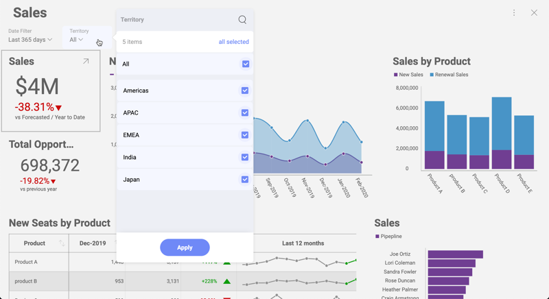

# Setting up Dynamic Filter Selections

## Overview

Sometimes your application will integrate a custom UI, to present the
user with a list of values to select. And you might want that user
selection to be synchronized with a filter in the dashboard.

For example, you can have a Sales dashboard that changes figures based
on the current Territory and a custom UI to select the Territory. After
the user selection changes, you’d want the Sales dashboard to reflect
that change. Most of the times, you would hide the filter selection
normally displayed in the dashboard. This way the user won’t be confused
with two different ways to change the Territory in the screen.



In the following code snippet, you’ll find details about how to achieve
the described scenario:

``` html
<script type="text/javascript">
    var dashboardId = 'Sales';

    $.ig.RVDashboard.loadDashboard(dashboardId, function (dashboard) {
       var revealView = window.revealView = new $.ig.RevealView("#revealView");
        revealView.showFilters = false;
        revealView.dashboard = dashboard;
    }, function (error) {
        console.log(error);
    });
    function setSelectedTerritory(territory) {
        window.revealView.dashboard.filters.getByTitle('Territory').selectedValues = [territory];
    }
</script>

<section style="display:grid;grid-template-rows:30px auto;">
    <section style="display:grid;grid-template-columns:auto auto auto auto auto;">
        <button onclick="setSelectedTerritory('Americas')">Americas</button>
        <button onclick="setSelectedTerritory('APAC')">APAC</button>
        <button onclick="setSelectedTerritory('EMEA')">EMEA</button>
        <button onclick="setSelectedTerritory('India')">India</button>
        <button onclick="setSelectedTerritory('Japan')">Japan</button>
    </section>
    <div id="revealView" style="height:500px;" />
</section>
```

As shown above, five buttons were added at the top of the dashboard, one
button for each of the territories in the dashboard: Americas, APAC,
EMEA, India and Japan.

## Working with Dynamic Lists

Territories like Americas, APAC, India, etc. do not change over time,
but other lists of values might change. In this case, if a new Territory
is added to the list, a new button will not be automatically added.

You can use
__$.ig.RVDashboardFilter.getFilterValues__
method to get the list of values for a given filter, in this case the following
call will leave an array with five
__$.ig.RVFilterValue__
objects in \_window.territories\</emphasis\>:

``` js
var filter = window.revealView.dashboard.getByTitle('Territory');
filter.getFilterValues(function (values) {
    window.territories = values;
}, function (error) {
    console.log(error);
});
```

You can then use the *label* attribute from
__$.ig.RVFilterValue__
to display the name of the territory and the __values__
attribute to set the selection in the filter. The following code snippet
shows how to populate a ComboBox to automatically select the Territory:

``` html
<script type="text/javascript">
    var dashboardId = 'Sales';

    $.ig.RVDashaboard.loadDashboard(dashboardId, function (dashboard) {
        var revealView = window.revealView = new $.ig.RevealView("#revealView");
        revealView.showFilters = false;
        revealView.dashboard = dashboard;

        var filter = revealView.dashboard.filters.getByTitle('Territory');
        filter.getFilterValues(function (values) {
            window.territories = values;
            var buttonsPanel = $('#buttonsPanel')[0];
            for (var i = 0; i < values.length; i++) {
                var button = $('<button onclick="setSelectedTerritory(window.territories[' + i + '].values)">' + values[i].label + '</button>');
                buttonsPanel.append(button[0]);
            }
        }, function (error) {
            console.log(error);
        });
    }, function (error) {
        console.log(error);
    });
    function setSelectedTerritory(territory) {
        var filter = window.revealView.dashboard.getByTitle('Territory');
        filter.selectedValues = [territory]);
    }
</script>

<section style="display:grid;grid-template-rows:30px auto;">
    <section style="display:grid;grid-template-columns:auto auto auto auto auto;" id="buttonsPanel">
    </section>
    <div id="revealView" style="height:500px;" />
</section>
```

As shown above, the section containing the buttons is assigned with the
“buttonsPanel” id. Then, JQuery is used to dynamically create the
buttons and append them to the DOM document.

The variable *window.territories* holds the list of territories, and is
later used when selecting the values in the “onclick” code for each
button.
