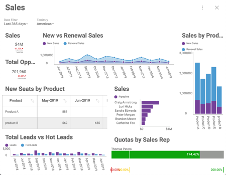

## Setting Up Initial Filter Selections

### Overview

Sometimes, you want to display a dashboard with filters already applied.
Dashboard filters are very useful to slice the contents of all the
visualizations at once. Because of this, you can use the SDK to set up initial
dashboard filter selections that remain in context for all the
dashboard’s visualizations.

#### Example Details

In this example, you have a dashboard showing Sales data with the
following filters:
  - A given period of time (last 365 days, Year to Date, etc.);
  - Territory (Americas, Europe, Asia, etc.).



### Code Example

In this case, you want to set the initial filters selection to:
  - “Year to Date” (instead of “Last 365 days”, the default setting for
    this dashboard);
  - Sales associated to the Territory of the current user.

As part of the initialization process and once the dashboard is loaded,
you can retrieve the list of filters in the dashboard and use these
filters to set the selected values though the dashboard object and finally assign it to the revealView's dashboard property:

``` html
<script type="text/javascript">
    var dashboardId = 'Sales';

    $.ig.RVDashboard.loadDashboard(dashboardId, function (dashboard) {

      dashboard.filters.getByTitle("Territory").selectedValues = [getCurrentUser().territory];     
      dashboard.dateFilter = new $.ig.RVDateDashboardFilter($.ig.RVDateFilterType.YearToDate);

      var revealView = new $.ig.RevealView("#revealView");
      revealView.dashboard = dashboard;

    }, function (error) {
        console.log(error);
    });
</script>

<div id="revealView" style="height:500px;" ></div>
```

> [!NOTE]
> The code above assumes that **getCurrentUser().territory** returns the territory for the current user.   
Setting the initally selected value in the date filter client-side is only supported when the dashboard **already has a date filter** created (in the .rdash file that you use). 

#### Hiding filters

It is possible that you might not want users to access data from
territories different than their own. In that case, you can restrict the
access to filters by configuring the
__$.ig.RevealView__ object to
hide the panel containing the dashboard filters:

``` js
revealView.showFilters = false;
```

That setting will restrict users to see data only for their associated
territory.

Finally, in the case that you still want users to change the date filter
selection, take a look at [**Setting up Dynamic Filter Selections**](setting-dynamic-filters.md). There you’ll find information about how to create your own UI that, allowing the user to change the date filter.
