# Showing/Hiding User Interface Elements

The __$.ig.RevealView__ component can be used to enable or disable different features and/or UI elements towards the end user. Many of the available properties are of the Boolean type and can be very straightforward to use, but others not so much.

The *revealView* instance and the DOM element created below are assumed by all the code snippets in this topic: 

``` js
var revealView = new $.ig.RevealView("#revealView");
...
<div id="revealView" style="height:500px;" />
```


> [!NOTE]
> Depending on your css layout approach you might need the element hosting the RevealView to be "positioned" by setting a position attribute that is not static (like relative or absolute).


## canEdit
This property can be used to disable the user's ability to edit dashboards.

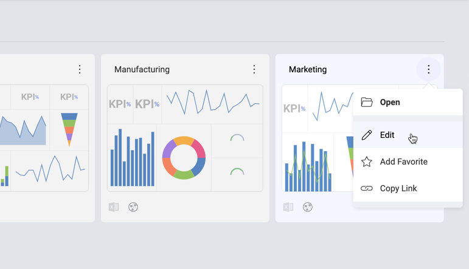

``` js
revealView.canEdit = false;
```

## showEditDataSource
This property can be used to disable the editing of a dashboard datasource.

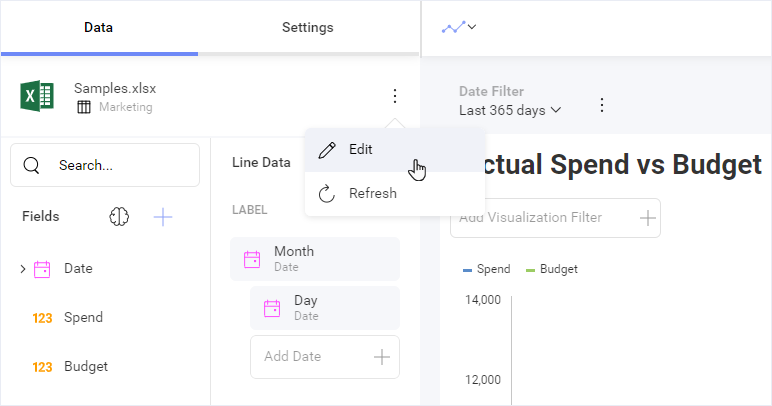

``` js
revealView.showEditDataSource = false;
```

## showExportImage
This property can be used to disable exporting the dashboad to an image.

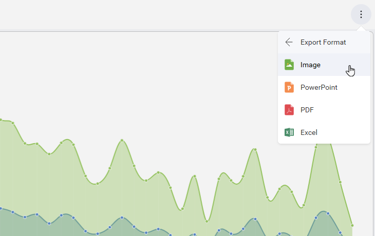

``` js
revealView.showExportImage = false;
```

## showExportToPowerpoint
This property can be used to disable exporting the dashboad to PowerPoint.

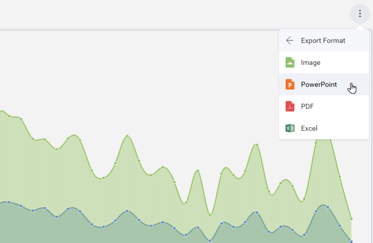

``` js
revealView.showExportToPowerpoint = false;
```

## showExportToPDF
This property can be used to disable exporting the dashboad to PDF.

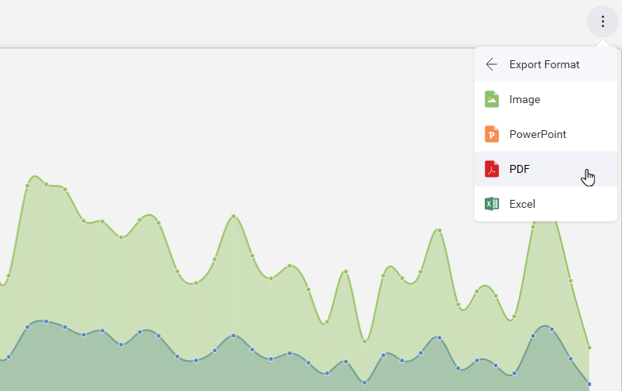

``` js
revealView.showExportToPDF = false;
```

## showExportToExcel
This property can be used to disable exporting the dashboad to Excel.

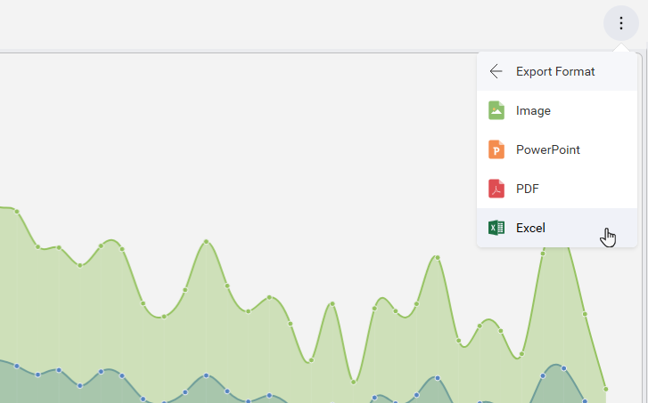

``` js
revealView.showExportToExcel = false;
```

## canCopyVisualization
This property can be used to disable the ability to copy a visualization and later paste it in the current dashboard or a different one.

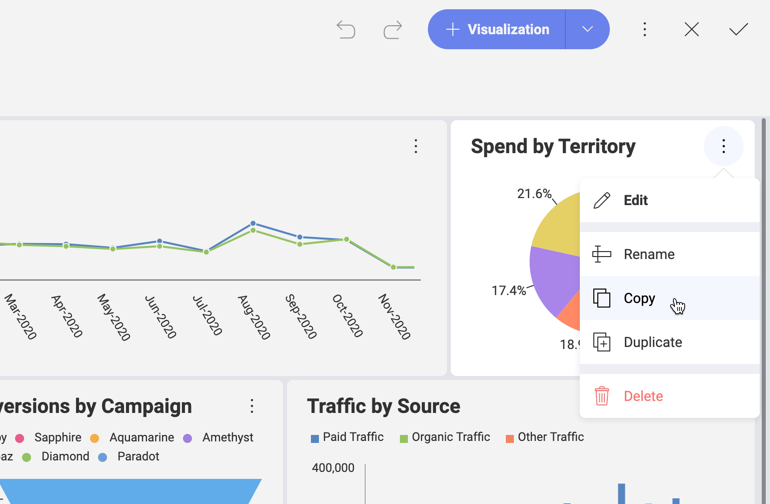

``` js
revealView.canCopyVisualization = false;
```

## canDuplicateVisualization
This property can be used to disable the ability to duplicate a visualization in the current dashboard.

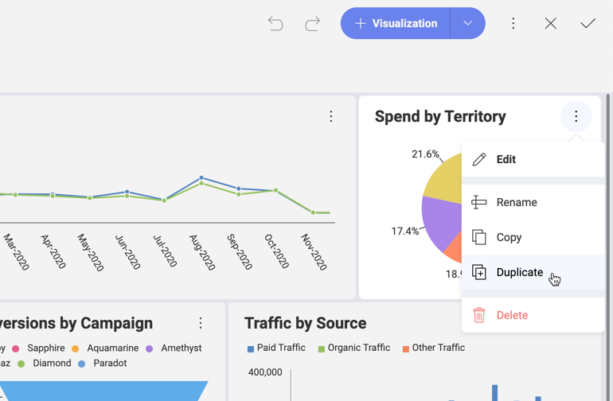

``` js
revealView.canDuplicateVisualization = false;
```

## canAddPostCalculatedFields
This property can be used to disable the ability to add a new post-calculated field in the current dashboard.

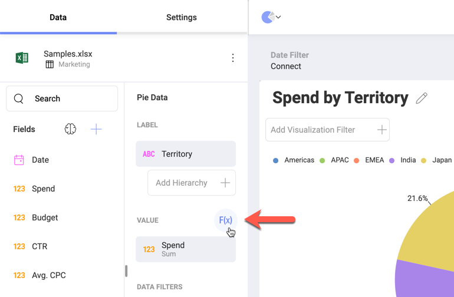

Post-calculated fields are new fields in the data set and are created by applying a formula on already summarized values.  
For further details, please refer to the [Reveal Help](https://help.revealbi.io/en/data-visualizations/fields/calculated-fields/overview.html).

``` js
revealView.canAddPostCalculatedFields = false;
```

## canAddCalculatedFields
This property can be used to disable the ability to add a new pre-calculated field in the current dashboard.

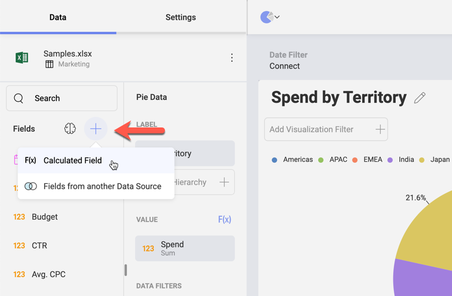

Pre-calculated fields are new fields in the data set and are evaluated before executing data editor aggregations.  
For further details, please refer to the [Reveal Help](https://help.revealbi.io/en/data-visualizations/fields/calculated-fields/overview.html).

``` js
revealView.canAddCalculatedFields = true;
```

## showFilters
This property can be used to show or hide the Dashboard Filters UI to the user.

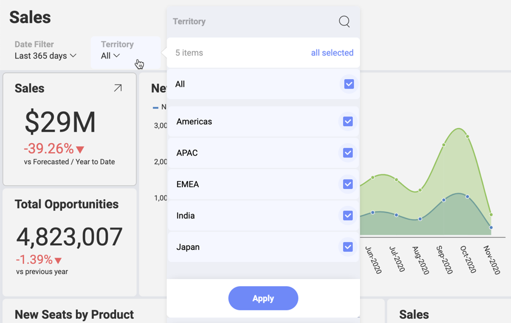

Dashboard filters allow you to slice the contents of the visualizations in a dashboard, all at once.

``` js
revealView.showFilters = true;
```

## canAddDashboardFilter
This property can be used to show or hide the Add Dashboard Filter menu item.

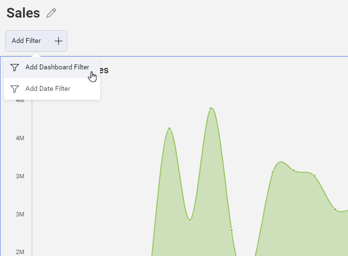

``` js
revealView.canAddDashboardFilter = false;
```
## canAddDateFilter
This property can be used to show or hide the Add Date Filter menu item.

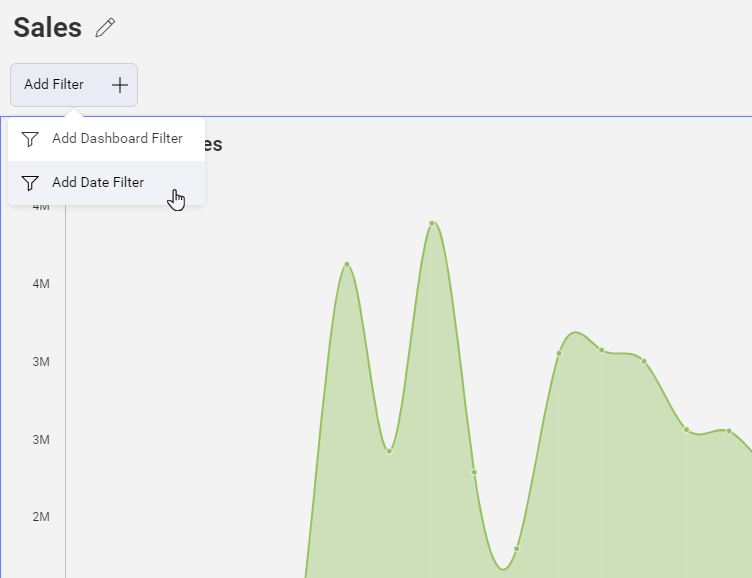

``` js
revealView.canAddDateFilter = false;
```

## Preselected Filters
You can specify which values are initially selected among existing Dashboard Filters when loading a dashboard.

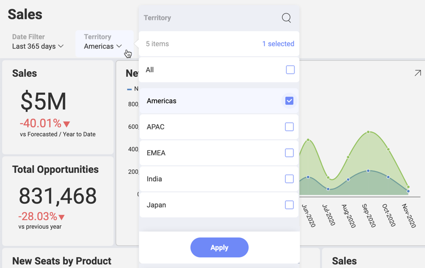

The following code snippet illustrates how to load a dashboard “AppsStats”. By setting the “Territory” dashboard filter’s selected value to be “Americas”, the dashboard will be showing data filtered by “Americas”.

``` js
var dashboardId = "AppsStats";

$.ig.RVDashboard.loadDashboard(dashboardId, function (dashboard) {
    dashboard.filters.getByTitle("Territory").selectedValues = ["Americas"];

    var revealView = new $.ig.RevealView("#revealView");
    revealView.dashboard = dashboard;
}, function (error) {
});
```

## availableChartTypes
This property can be used to filter the visualization types available to the user.

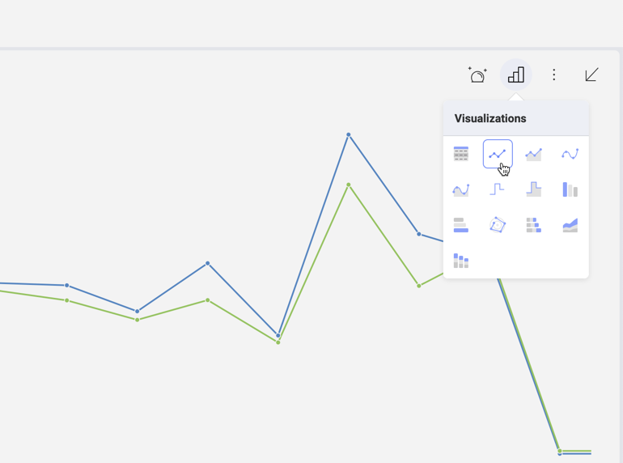

You can, for example, add or remove visualizations as shown below:

``` js
revealView.availableChartTypes.add($.ig.RVChartType.bulletGraph);
revealView.availableChartTypes.remove($.ig.RVChartType.choropleth);
```

In addition, you can use a brand new Array that includes only the visualizations you want to be available:

``` js
revealView.AvailableChartTypes = [$.ig.RVChartType.bulletGraph, $.ig.RVChartType.choropleth];
```
