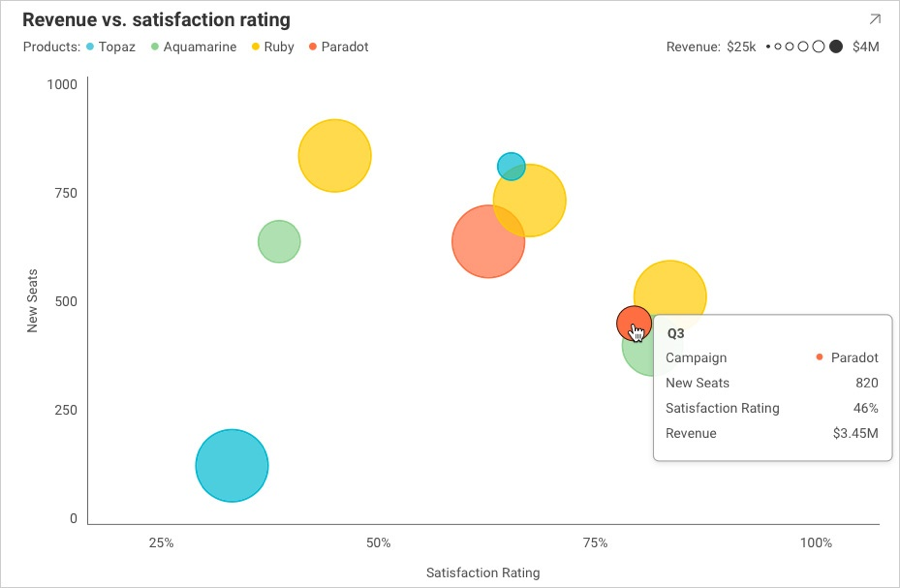

## Working with Tooltips

### Overview

There is an event that is triggered whenever the end-user hovers over a series in a visualization or clicks on the series (as shown in the image below).
This event called __.onTooltipShowing__, gives you more flexibility regarding how you show Tooltips in your visualizations.



### Common Use Cases
You can cancel the Tooltip event or modify what is shown to the user. Most common examples include:

- You want to disable tooltips altogether or only show them for specific visualizations.
- You want to display data in the tooltip that is outside of the RevealView component that might be more valuable to your viewers.

Please note that this event will not be triggered for visualizations that do not support Tooltips, such as grids, gauges, and others.


### Code Example

In the following code snippet, you can see how to disable tooltips for a visualization and still get additional information from the event arguments when the end-user hovers over or clicks on this visualization.


``` js

revealView.onTooltipShowing = function (args) {
    if (args.visualization.title == "NoNeedForTooltips") {
             args.Cancel = true;
    }
    console.log("onTooltipShowing: visualization: " + args.visualization.title() + ",cell: " + args.cell.value + ", row:" + args.row.length);
};

```

The event arguments include information about the visualization that is being hovered over or clicked on, the exact cell of data hovered over or clicked, the whole row of this cell (in case you need information from other columns), and, of course, the Cancel boolean.
