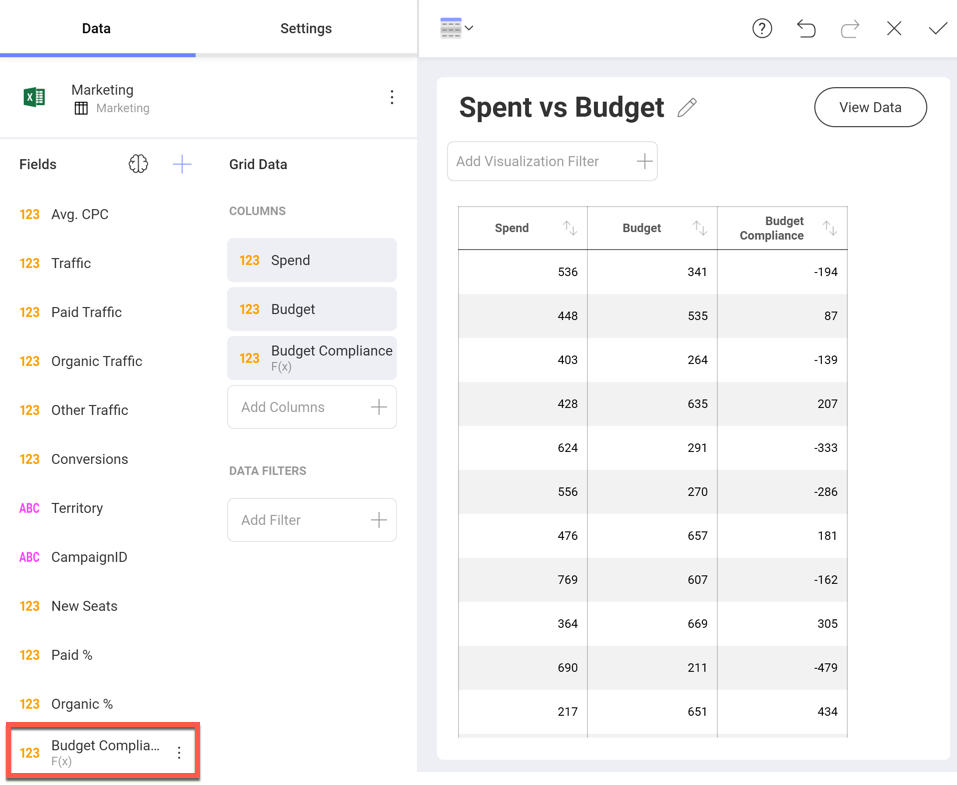

## Calculated Fields

Reveal allows you to define new fields in the data set, named calculated
fields. These fields are created by using expressions (formulas). An
expression can be a combination of existing field(s), constant values
and:

  - [predefined functions](#predefined-functions), and/or

  - [simple math calculations and other functions that are not predefined](#without-predefined-functions).

There are two types of calculated fields:

  - [pre-calculated](#precalculated-fields) (also called "calculated"),
    and

  - [post-calculated](#postcalculated-fields).

### Pre-Calculated Fields

Pre-calculated fields are evaluated before executing data editor
aggregations. This means in order to apply a certain formula, Reveal will go through every record in your field's dataset once or several times. Because of this, pre-calculation is likely to be underperforming in terms of speed when working with large datasets.

To add a new pre-calculated field, click/tap the *+ button* in the
*Fields* panel:

The *New Calculated Field* screen will open:

Here you will need to:

1.  assign a name to your new pre-calculated field;

2.  enter a *formula* (expression). In the *fields* section you will
    find a list of all the existing fields to choose from. You can use
    one or more fields to create the formula by clicking on the selected
    field or typing its name in square brackets. Choose one of the
    predefined functions listed in the *Functions* section or use a
    simple math calculation (as shown above).

The new pre-calculated field will show up at the bottom of your *Fields*
list:

In the example above, the new calculated field is used with a grid
visualization where no aggregation is being applied on the data fields.
Pre-calculated fields can also be used with *Pivot grids*. In this case,
aggregation (e.g. summarization) will be applied to the already
calculated records in the pre-calculated field.

### Post-Calculated Fields

Post-calculated fields can be created when working with *Pivot tables*
and other visualizations, which execute an aggregation on the data
fields in the *Data editor*. Post-calculated fields are always built by
applying a formula on already summarized values.

To create a post calculated field you will need to:

1.  Create a visualization (or a *Pivot table*) by adding fields from
    your data source in the *Data editor*.

    

2.  Click/tap the *F(x)* button next to *Values* to open the *New
    Calculated Field* screen:

    

3.  Give a name to your new calculated field and apply a formula to the
    summarized value(s). Pay attention that the list of *Values*
    includes the data fields you used in your visualization after they
    have been aggregated (*Sum of Spend*, *Sum of Budget*, not: *Spend*,
    *Budget*).

If you need to use other fields from your data source that are not
included in the *Data editor*, you can add them by clicking/tapping on
the *+* button next to *Values*. Since post-calculated fields are
created only by using aggregated values, you will first need to select
an aggregation from the dropdown list to be executed on the data field.

You can also skip *step 1*, create your post-calculated fields first or
use only post-calculated fields in your visualization.

Post-calculation tends to perform better than pre-calculation when
working with large datasets

### Using the Predefined Reveal Functions

For both pre-calculated and post-calculated fields, you can use one of
the available functions within Reveal:

  - [**Aggregation**](aggregation.md):
    [AVERAGE](aggregation.html#average),
    [AVERAGEIF](aggregation.html#averageif),
    [COUNT](aggregation.html#count),
    [COUNTIF](aggregation.html#countif),
    [MAX](aggregation.html#max),
    [MAXIF](aggregation.html#maxif),
    [MIN](aggregation.html#min),
    [MINIF](aggregation.html#minif).

  - [**Date**](date.md):
    [DATE](date.html#date-date),
    [DATEVALUE](date.html#datevalue),
    [DAY](date.html#day),
    [FORMATDATE](date.html#formatdate),
    [FQUARTER](date.html#fquarter),
    [FYEAR](date.html#fyear),
    [HOUR](date.html#hour),
    [MILLISECOND](date.html#millisecond),
    [MINUTE](date.html#minute),
    [MONTH](date.html#month),
    [MONTHNAME](date.html#monthname),
    [MONTHSHORTNAME](date.html#monthshortname),
    [NOW](date.html#now),
    [QUARTER](date.html#quarter),
    [SECOND](date.html#second),
    [TIME](date.html#date-time),
    [TODAY](date.html#today),
    [WEEKDAY](date.html#weekday),
    [WEEKNUM](date.html#weeknum),
    [YEAR](date.html#year).

  - [**Information**](information.md):
    [EMPTY](information.html#empty),
    [ISEMPTY](information.html#isempty).

  - [**Logic**](logic.md):
    [AND](logic.html#and),
    [FALSE](logic.html#false),
    [IF](logic.html#if),
    [NOT](logic.html#not),
    [OR](logic.html#or),
    [TRUE](logic.html#true).

  - [**Lookup & Reference**](lookup-reference.md):
    [PREVIOUS](lookup-reference.html#previous),
    [ROW](lookup-reference.html#row).

  - [**Math**](math.md):
    [ABS](math.html#abs),
    [EXP](math.html#exp),
    [LOG](math.html#log),
    [LOG10](math.html#log10),
    [MOD](math.html#mod),
    [RAND](math.html#rand),
    [RANDBETWEEN](math.html#randbetween),
    [SIGN](math.html#sign),
    [SQRT](math.html#sqrt),
    [TRUNC](math.html#trunc).

  - [**String**](string.md):
    [CONCATENATE](string.html#concatenate),
    [FIND](string.html#find),
    [LEN](string.html#len),
    [LOWER](string.html#lower),
    [MID](string.html#mid),
    [REPLACE](string.html#replace),
    [SORTINTERVAL](string.html#sortinterval),
    [TRIM](string.html#trim),
    [UPPER](string.html#upper).

>[!NOTE] **Limitations to IF Conditions**.
>IF conditions have known limitations when included in aggregation functions in pre-calculated fields. The need to go through every record that many times, trying to check an IF condition within an aggregation formula causes underperformance issues, hence it's not supported.

### Creating Calculated Fields without using the predefined functions

You can also create Calculated Fields without using any of the
predefined functions; for instance, for simple math calculations like
subtractions, divisions, additions or multiplications. In [this table](samples.md), you will find some examples that do
not use the predefined functions.

### What to consider when using the Reveal functions

  - **Text strings should be included between quotation marks**.
    Examples include locale ("en") and date formats ("dd/mm/yyyy").

  - **Fields included in your formula should be included between square brackets**. Examples include [Wage], [BirthDate] and [EmployeeID] for the HR Dataset.
