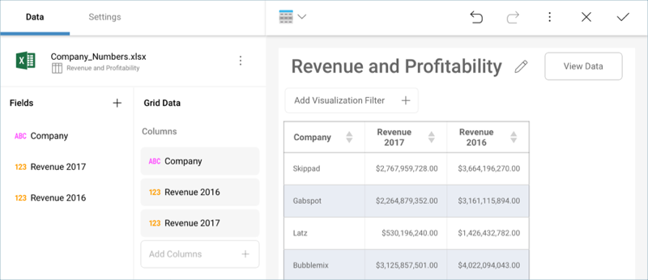

## Samples, Tips, and Useful Cases

This topic includes the following information:

  - [Basic Sample Expressions](#basic-sample-expressions)

  - [Converting Unix TimeStamps to Usable Dates](#converting-unix-timestamps)

  - [YoY Analysis: Comparing Revenue Figures for a 2 Year Period](#yoy-analysis-revenue)

### Basic Sample Expressions

The following are a set of calculated field sample expressions.

| Function Name              | Sample Dataset to Test Function                                                               | Expression                                                        | Sample Output                          |
| -------------------------- | --------------------------------------------------------------------------------------------- | ----------------------------------------------------------------- | -------------------------------------- |
| **Opposite Value**         | [HR Dataset](http://download.infragistics.com/reportplus/help/samples/HR%20Dataset_2016.xlsx) | \-[Wage]                                                          | \-36,452.00 (for Joan Baez)            |
| **Age**                    | [HR Dataset](http://download.infragistics.com/reportplus/help/samples/HR%20Dataset_2016.xlsx) | (today()-[BirthDate])/365                                         | 46.12 (for Joan Baez)                  |
| **Name & Department**      | [HR Dataset](http://download.infragistics.com/reportplus/help/samples/HR%20Dataset_2016.xlsx) | [Fullname]& ", " &[Department]                                    | Joan Baez, Development (for Joan Baez) |
| Sales Percentage           | [Retail Store](http://download.infragistics.com/reportplus/help/samples/Retail_Store.xlsx)    | [Sales]\*100/sum([Sales])                                         | 7,20% (for Alabama)                    |
| Sales Percentage 2         | [Retail Store](http://download.infragistics.com/reportplus/help/samples/Retail_Store.xlsx)    | [Sales2]\*100/sum([Sales2])                                       | 5,05% (for Alabama)                    |
| **Sales Percentage Delta** | [Retail Store](http://download.infragistics.com/reportplus/help/samples/Retail_Store.xlsx)    | [Sales Percentage 2]-[Sales Percentage]/([Sales Percentage]\*100) | 4,05% (for Alabama)                    |
| **Name starts with J**     | [HR Dataset](http://download.infragistics.com/reportplus/help/samples/HR%20Dataset_2016.xlsx) | if(find("j",lower([Fullname]),1)=1,"Starts with J",0)             | Starts with J, 0                       |
| **Deviation from Avg**     | [HR Dataset](http://download.infragistics.com/reportplus/help/samples/HR%20Dataset_2016.xlsx) | [Wage]-average([Wage])                                            | \-50476.71 (for Joan Baez)             |

### Converting Unix TimeStamps to Usable Dates

Unix times, defined in the seconds elapsed since January 1st, 1970
("Epoch" time) are particularly useful because they represent all
timezones at once. You can import data sources with unix timestamps and
convert them into usable dates with the [`date`](Date-Calculated-Fields.md)
formula.

`((([Unix Time Stamp]/60)/60)/24)+DATE(1970,1,1)+([Timezone]/24)`

Where:

  - **Original Field**: [Unix Time Stamp]

  - **Convert to Minutes**: /60

  - **Convert to Hours**: /60

  - **Convert to Day**: /24

  - **Adding Epoch Time**: +DATE(1970,1,1)

  - **Adding Timezone**: +([Timezone]/24)

The timezone can be entered as a number, or you can use one of your
fields with a number. In either case, it must be GMT time.

### YoY Analysis: Comparing Revenue Figures for a 2 Year Period

You can create calculated fields, for example, to carry out a simple YOY
analysis.

Let's take a look at the following dashboard, which has the different
divisions for a company and the revenue they represented during two
different years.

You can compare the two figures by using the following calculated field.
The "-1" is used to substract the total difference for the year.

`([Revenue 2017]/[Revenue 2016])-1`

You can then either keep the number, or [format it as a percentage](~/en/fields/field-settings.html#numeric-fields).

