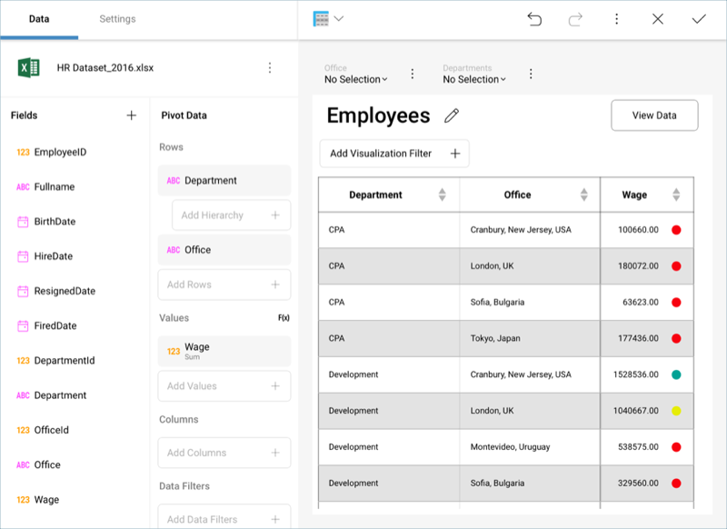
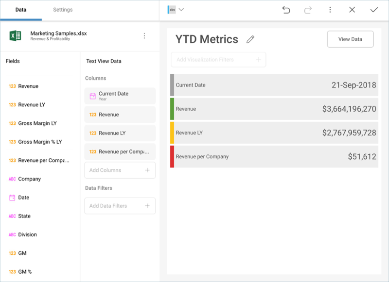
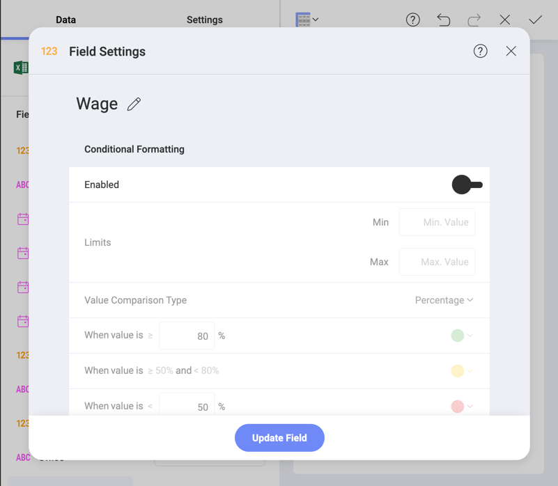

## Conditional Formatting

Conditional formatting allows you to provide different formatting of a
cell (or rows for [Text Views](text-view.md)) depending on the values found
in a numeric column. For instance, values in the lower 50% range of a
grid can be colored with a red adorner to signal very low values.

The conditional formatting configuration allows you to establish styling
rules per ranges of data up to three ranges (typically used for styling,
upper, middle, and lower ranges). Depending on the nature of the
information, low values might be a good or bad signal, so you have the
flexibility to configure the styling in the way that makes the most
sense in your situation.

### Enabling Conditional Formatting

To enable conditional formatting on a numeric column, select field in
the Data Editor to prompt the **Field Settings** dialog. The conditional
formatting configuration is the last option in the settings, and is
disabled by default.

  - **Limits**: these values are automatically set as the lowest and
    highest values in the dataset for the specified column, but can also
    be overridden manually with constant values.

  - **Data Ranges**: the three ranges you will use to style your data.
    For all ranges, you can select one of the pre-defined indicators and
    colors in the dropdown.

      - **Value comparison type**: whether you want the ranges to be
        percentages or numbers.

      - **When value is ≥**: the formatting for values greater than the
        number you enter.

      - **When value is ≥ and \<**: this is a fixed range that depends
        on the values you enter in the first and third range.

      - **When value is \<**: the formatting for values less than the
        number you enter.

### Supported Visualizations

Conditional formatting can be applied to the following visualizations:

  - [Grid View](Grid-View.md)

  - [Pivot Table View](Pivot-Table.md)

  - [Text View](Text-View.md)

>[NOTE!]
>[KPI](KPI-Gauge.md), [Linear](Gauge-Views.hmtl#linear-gauge),
[Circular](Gauge-Views.html#circular-gauge), [Text](Gauge-Views.html#text-gauge), and [Bullet Graph](Gauge-Views.html#bullet-graph) gauges support conditional
formatting in the form of [**visualization band range configurations**](gauge-views.html#bands-configuration).
