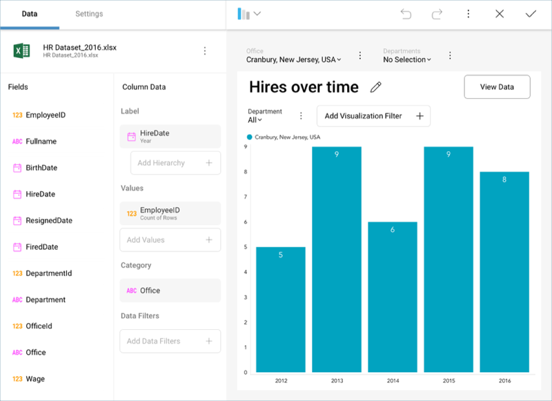

## Fields

This section describes the different options for applying
transformations to the fields in your dataset. By applying filters, the
information in your fields can be optimized for your business analysis.
You can remove any unnecessary noise, highlight the most valuable
aspects, and summarize information in many useful ways.

### Topics Overview

There are several field settings and filtering options:

  - Settings for [date](Field-Settings.html#date-fields),
    [numeric](Field-Settings.html#numeric-fields), and
    [string](Field-Settings.html#abc-fields) fields, including label
    renaming, aggregation, sorting, formatting, and [conditional formatting](Conditional-Formatting.md).

  - Filters for [empty values](Field-Filters-Rules.html#empty-values).

  - Filters to [select specific values](Field-Filters-Rules.html#select-values).

  - Filters by [Rule](Field-Filters-Rules.html#rules).

Field settings and rules are accessible through the [visualizations editor](Visualizations-Editor.md), which is displayed automatically when a
dataset is added to the dashboard canvas.
