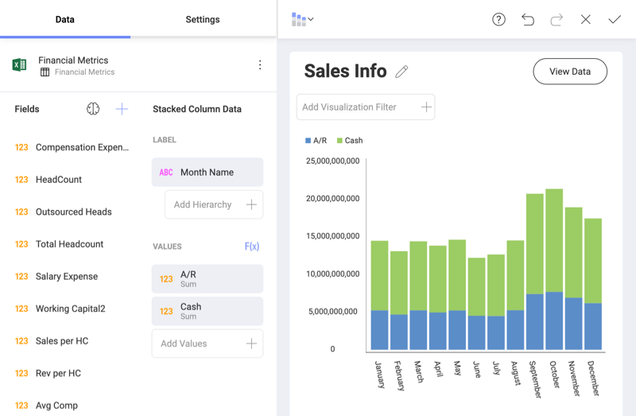
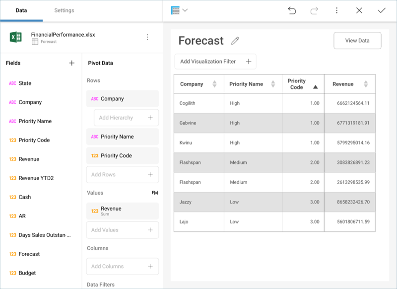
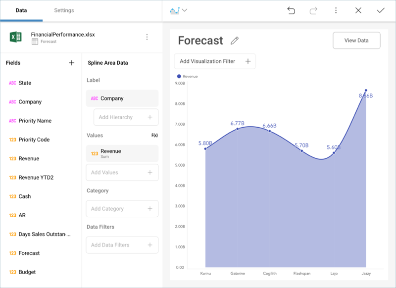

## Sort by Field

Reveal allows you to change how the data in a visualization is displayed
by sorting the data in ascending or descending order. In addition, it is
also possible to sort your string and numeric fields by different fields
in your original data source.

For more practical information, take a look at the following examples
that showcase this functionality:

  - [Ordering String Dates in Chronological Order](#string-date-chr-order)

  - [Ordering Companies by Priority](#by-priority)

### Ordering String Dates in Chronological Order

Let's take a look at the following visualization, where we have plotted
the cash and accounts receivable influxes for a company in a [stacked column chart](~/en/visualization-tutorials/stacked-charts.html#create-stacked-chart).

The values have been ordered by **Month Name** (a string field).
However, the months have been sorted in alphabetical order by default,
so the resulting visualization is not particularly useful for analysis.

You can, however, change how the **Month Name** is displayed by changing
its formatting and choosing to order the information by **Month of
Year**. You might not necessarily want to display the 1-12 numbers in
the Y axis (**Month of Year**), but you still want that order to
prevail. Select the **Month Name** field in the label placeholder of the
data editor, and select your desired sorting.

Once done, select **Update Field**. Your information will now be ordered
in chronological order.

### Ordering Companies by Priority

A different scenario, for example, would be to order a field based on a
custom business logic in your spreadsheet. For example, the following is
another visualization which displays the Revenue forecast for six
companies in a [spline area chart](~/en/visualization-tutorials/simple-charts.html#create-basic-chart).

The names of the companies are ordered A-Z by default. However, the
priority level assigned to them is different.

Organize the information in your chart by priority without actually
dragging and dropping "Priority Code" into the data editor by using the
*Sort By* field.

Your resulting widget, therefore, will place companies with "High"
priority first, ordered A-Z, "Medium" priority companies after those, and, lastly, "Low" priority ones.

