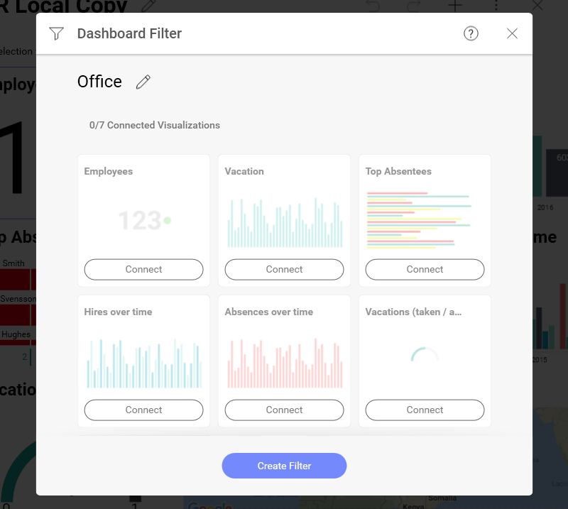
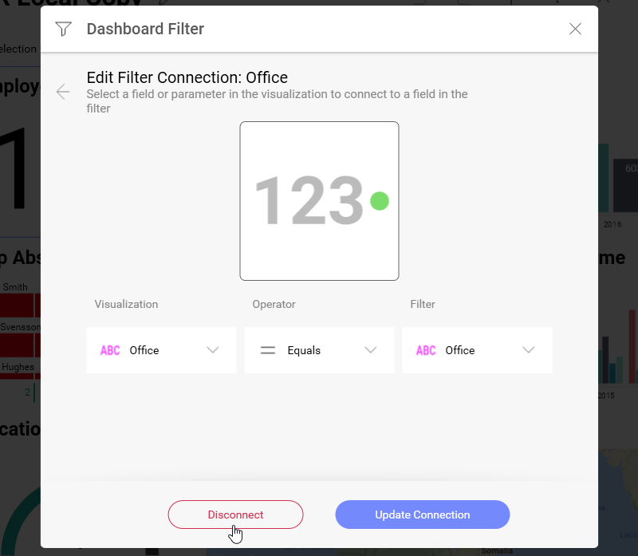
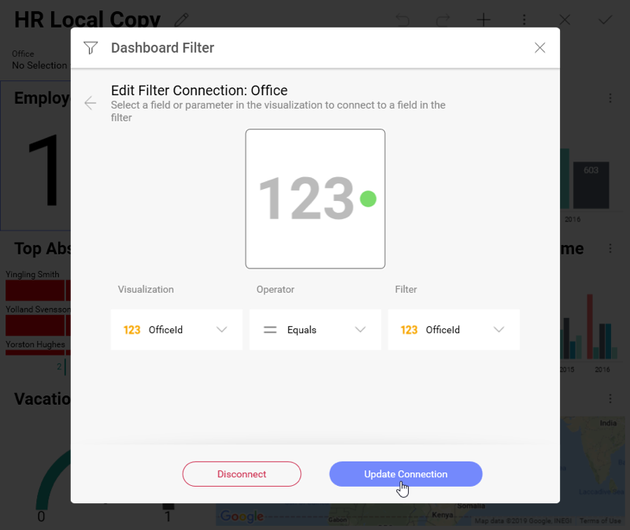

# Connecting Dashboard Filters to a Visualization

Binding the data in a visualization to a dashboard filter can be done in
two ways:

  - **As part of the Dashboard Filter configuration** (as shown above).
    This allows you to centrally configure binding between a dashboard
    filter and all visualizations in the dashboard.

  - **Through the Visualization Editor** so that you can bind an
    individual visualization, even after the dashboard filter has been
    created.

In both cases, binding is defined by adding rules that link a field in
the dashboard filter dataset with a corresponding field in the
visualization's dataset ([**field binding**](#field-binding)). You can
always remove a visualization's binding selecting **Disconnect** in the
Visualizations Editor or the Dashboard Filter menu.

## Field Binding

Field binding allows you to configure a join relationship between the
dashboard filter dataset schema and the visualization's schema. To do
this, select the **Dashboard Filter** you want to use and then
**Connect**.

In the dialog above, you will need to configure:

  - **Visualization**: this represents the column in the visualization's
    dataset that will be used as key to join with the dashboard filter
    dataset. For example, *Office*, *EmployeeID*, *ProductID*, etc.

  - **Operators**: the join operators to use, which can be one of the
    following:

      - **Is Equal**: requires that both the field value and the
        dashboard filter selection be exactly the same.

      - **Contains**: meant to be used with string fields, it returns a
        match that is enabled when the field value contains the
        dashboard filter selection. For instance, Visualization=`FRANCE`
        CONTAINS Filter=`FRA`.

      - **Between**: this is only meant to be used with Date Range
        dashboard filters.

  - **Filter**: the specific dashboard filter from the dashboard filters
    list that will be joined.

## Parameters Binding

For data sources with parameters ([REST](~/en/datasources/supported-data-sources/rest-api.md), [OData](~/en/datasources/supported-data-sources/odata-feed.md)
and Stored Procedures in [MS SQL Server](~/en/datasources/supported-data-sources/microsoft-sql-server.md)) you
might need to connect the dashboard filter to a parameter, so when you
change the filter data for the visualization, it will be refreshed with
the selected value in the connected parameter.

To connect a dashboard filter to a parameter, follow the procedure in
[Field Binding](#field-binding). You will find your data source
parameters at the bottom of the *Vizualization*'s drop-down list in the
*Edit Filter Connection* dialog:

>[!NOTE] **Date Filters**
>You can bind only dashboard filters to parameters. Date filter binding to parameters is not supported.
