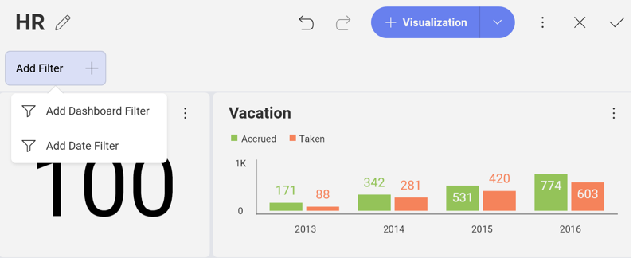

## Date Range Dashboard Filter

Reveal supports enabling a range of dates as dashboard filters to bind
your data to. This enables time-based analysis scenarios, changing one
date range and filtering the whole dashboard. In order to enable the
date range in the dashboard filters section, you will need to select the
**Add Date Filter** option in the **Add Filter** menu.

Once the date dashboard filter is enabled, it becomes available for use
in [visualization binding](connecting-dashboard-filters-visualization.md)
expressions.

### Using Custom Date Ranges

Reveal offers a variety of pre-set date ranges (including Last 30, 7, or
365 days, among others), but you might want to define your range to see
data within a specific date range. Selecting the
**Custom Date Range** in the *Date Filter* dropdown to see a calendar with
personalized day, month, and age options.

